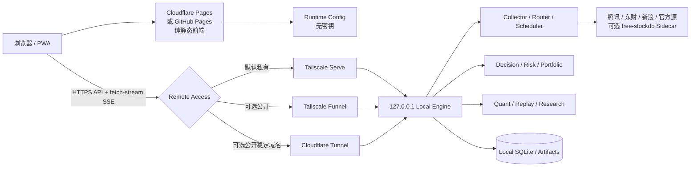

# Stock Tracker 混合部署架构 v1

> 决策日期：2026-08-24
>
> 状态：Design Freeze；Hybrid H0–H5 仓库侧工程合同均已实现并通过本地回归，其中 H3/H4 已通过 API Target/审计/静态构建与双 Origin 真实浏览器验收，H5 公开入口保持失败关闭；真实 Tailscale、两设备、Windows 恢复演练与 Pages 实际部署仍为 operational `PENDING`
>
> 适用范围：个人使用为主，后续最多向少量朋友开放
>
> 核心结论：**本地数据与决策引擎 + 云端静态网页 + 安全远程访问**
>
> 明确排除：Oracle Cloud 不再作为候选路径

---

## 1. 决策摘要

Stock Tracker 不再把“完整后端必须部署到免费云”作为上线前置条件。

默认部署模式调整为：

```text
HYBRID_PRIVATE

云端：
- 只托管 HTML / CSS / JavaScript / 图片等静态资产
- 不保存账户净值、现金、持仓、成本、券商凭据
- 不负责行情采集、策略扫描、模型训练或 SQLite 持久化

本地：
- Collector / Router / Scheduler
- HOT / WARM / COLD
- Data Quality
- Decision Engine
- Quant / Replay / Model Research
- REST / fetch-stream SSE
- SQLite
- 用户账户和持仓事实

远程访问：
- 默认：Tailscale Serve，仅 Tailnet 内设备可访问
- 可选：Tailscale Funnel，公开互联网可访问但必须使用应用层认证
- 可选：Cloudflare Tunnel + 自有域名，适合需要稳定公开域名时
```

纯云部署保留为可选升级，不再是主路线。只有真实数据源可达性、持久化、持续运行和成本门禁全部通过，才允许切换。

### 1.1 平台决策矩阵

| 平台/能力 | 结论 | 角色 |
|---|---|---|
| Cloudflare Pages | `PREFERRED` | 默认云端静态前端，使用 `pages.dev` 即可 |
| GitHub Pages | `FALLBACK` | 静态前端备选，适合最简单 Git 发布 |
| Tailscale Serve | `PREFERRED` | 默认私有远程 API/应用入口 |
| Tailscale Funnel | `OPTIONAL_PUBLIC` | 少量朋友公开访问，必须强认证、限流和审计 |
| Cloudflare Tunnel | `OPTIONAL_PUBLIC` | 有自有域名并需要稳定公开 Hostname 时使用 |
| Render Free | `EXPERIMENTAL` | Demo、Provider 可达性和纯云门禁实验 |
| Cloudflare Workers / Pages Functions | `LIMITED` | 只做轻量无状态辅助，不运行核心 Collector/SQLite |
| Oracle Cloud | `EXCLUDED` | 无法注册，不进入主线或应急依赖 |

---

## 2. 为什么默认改为混合部署

当前产品的主要难点不是静态网页托管，而是：

1. A 股免费或低成本上游接口在海外云节点的可达性和限速不稳定；
2. HOT / WARM / COLD、SSE 和盘中提醒需要持续运行，而许多免费 Web Service 会休眠；
3. SQLite、原始 Artifact、Manifest、模型和持仓事实需要可靠持久化；
4. 账户净值、现金、股数和成本价属于私有数据，默认留在本地更符合产品边界；
5. 研究和模型任务可能消耗较多 CPU、磁盘和运行时间，不适合受限的免费 Serverless；
6. 用户已经接受本地机器运行，因此没有必要为了“纯云”牺牲数据可靠性和安全性。

混合部署的核心取舍是：

```text
以本地机器需要在线为代价，
换取 A 股数据源可达性、持久化、私有数据边界和近零云成本。
```

当本地机器关闭、休眠、断网或 Tunnel 中断时，云端网页仍可打开，但必须明确显示引擎离线或数据过期，不能继续展示为实时可执行建议。

---

## 3. 推荐拓扑



### 3.1 云端静态前端

首选：

```text
Cloudflare Pages
默认域名：*.pages.dev
```

备选：

```text
GitHub Pages
默认域名：*.github.io
```

静态前端只负责：

- 页面结构和样式；
- REST 调用；
- fetch-stream SSE；
- 本地浏览器状态；
- 离线、过期、认证和版本不兼容提示；
- 可选缓存不含私有数据的最后一次公共市场摘要。

静态前端不得包含：

- API Bearer Token；
- Tailscale Auth Key；
- Cloudflare Tunnel Token；
- 数据源密钥；
- 券商凭据；
- 账户净值、现金、持仓或成本；
- Model Registry 写权限；
- 未经独立安全 Review 的第三方脚本、Analytics、Tag Manager 或远程字体。

### 3.2 本地引擎

本地引擎是运行事实和决策事实的权威来源，建议运行在：

```text
优先：长期在线的 Windows 主机 / 小主机 / NAS
可用：日常电脑，但交易时段必须避免休眠
```

本地引擎必须：

- 仅监听 `127.0.0.1`；
- 通过系统服务或任务计划开机自启；
- 崩溃后自动重启；
- 数据库、Artifact 和日志写入持久磁盘；
- 在交易时段检测系统休眠和 Collector 停滞；
- 保留本地同源页面作为 Tunnel 故障时的恢复入口；
- 不要求路由器端口映射或公网 IP。

Hybrid H0 已将 `config/app.toml`、`ServerConfig` 和本地启动脚本统一为 `127.0.0.1`；任何非 loopback 绑定必须同时显式提供目标 Host 与 `--allow-non-loopback`。Docker/Procfile 仅以该双重确认进入 `PURE_CLOUD_EXPERIMENTAL`，`.dockerignore` 排除本地数据库、日志、缓存、构建目录和归档。真实宿主仍需用操作系统监听检查复验该合同。

---

## 4. 部署模式

### 4.1 `LOCAL_ONLY`

用途：开发、调试、Tunnel 故障恢复。

```text
浏览器 → http://127.0.0.1:8080
前端与 API 同源
```

特点：

- 最简单；
- 不支持异地访问；
- loopback 下可沿用现有本地免认证规则；
- 不作为远程主方案。

### 4.2 `HYBRID_PRIVATE`：默认生产模式

```text
Cloudflare Pages / GitHub Pages
        ↓
浏览器设备加入 Tailscale Tailnet
        ↓
Tailscale Serve HTTPS
        ↓
127.0.0.1:8080 Local Engine
```

允许分两条车道落地：

```text
Bootstrap Lane：
Tailscale Serve 直接代理现有本地整站
→ 前端与 API 保持 same-origin
→ 不依赖 CORS，可最快获得私有远程访问

Target Lane：
Cloudflare Pages / GitHub Pages 静态前端
→ 跨域访问 Tailscale Serve API
→ 必须先完成 H1/H2 的 Runtime Config、Origin 固定、CORS 和 Health
```

Bootstrap Lane 是安全的过渡能力，但不能冒充“云端静态网页已完成”。实际使用网络若无法稳定访问 Pages/GitHub Pages，可以长期保留整站经 Tailscale Serve 的同源模式。

要求：

- 访问设备安装并登录 Tailscale；
- 使用 Tailnet ACL 限制用户和设备；
- Backend 仍保留 `STOCK_TRACKER_PRIVATE_ACCESS` 作为纵深防御，直到完成并审查 Tailscale Identity Header 认证；
- 云端前端 Origin 必须进入本地 API 的精确 CORS Allowlist；
- 后端不向公网开放。

适合：

- 用户本人多设备访问；
- 少量可信朋友；
- 不希望公开 API；
- 不购买域名。

### 4.3 `HYBRID_PUBLIC_AUTH`：可选公开访问

#### 方案 A：Tailscale Funnel

优点：

- 不需要自有域名；
- 自动提供 `*.ts.net` HTTPS 地址；
- 不暴露家庭公网 IP；
- 适合小流量试用和少量朋友访问。

限制：

- Funnel 是公开入口；
- 不提供 Serve 的身份 Header；
- 必须启用强 Bearer Token、限流、精确 CORS 和审计；
- 属于 Beta 能力；
- 带宽限制不可配置；
- 不作为大规模公开服务承诺。

#### 方案 B：Cloudflare Tunnel + 自有域名

优点：

- 稳定的公开 Hostname；
- 出站建连，不需要公网 IP 或端口映射；
- 可叠加 Cloudflare Access、WAF 和限流；
- 适合后续更稳定地分享给朋友。

限制：

- 发布稳定公开应用需要将自有域名接入 Cloudflare；
- 域名注册本身可能产生成本；
- 需要配置并维护 Tunnel、DNS、Access Policy 和 Token 轮换。

#### 禁止方案：Quick Tunnel 用于生产

`trycloudflare.com` Quick Tunnel 只允许开发测试：

- URL 重启后可能变化；
- 无 SLA；
- 不支持 SSE；
- 不能成为正式远程访问入口。

### 4.4 `HYBRID_SNAPSHOT`：后续非默认能力

用途：当 Local Engine 暂时离线时，仅提供脱敏、只读、明确过期的公共市场摘要；它不是实时决策链，也不能替代 `HYBRID_PRIVATE`。

要求：

- 由 Local Engine 生成版本化字段白名单，不允许云端任意读取 SQLite；
- Snapshot 必须签名、带短 TTL、只读、可撤销并支持删除；
- 默认不得包含账户净值、现金、持仓、股数、成本、建议买入股数、Token 或券商事实；
- 上传失败不得阻断本地采集、计算或决策；
- UI 必须将 `SNAPSHOT_ONLY`、`SNAPSHOT_EXPIRED` 与 Engine/Tunnel/Auth 故障分开显示；
- 过期 Snapshot 不得生成新的 `EXECUTABLE`、`EXIT` 或伪实时建议；
- 该能力不属于 Stage 1.5 H0–H5 的上线前置条件，只有出现明确的离线只读需求后才单独立项、安全 Review 和验收。

### 4.5 `PURE_CLOUD_EXPERIMENTAL`

保留现有 Docker / Render 配置作为可选实验，但不再代表默认生产架构。

免费 Render Web Service 不满足持续 Collector 的默认要求：

- 空闲后会休眠；
- 唤醒存在冷启动；
- 本地文件系统为临时存储；
- 免费实例不提供持久磁盘；
- 休眠期间行情采集和扫描会停止。

Cloudflare Workers / Pages Functions 也不承担核心 Collector、SQLite 和模型任务；它们只可用于轻量静态辅助、短请求或未来的无状态 Relay。

---

## 5. 前端运行时配置合同

当前前端不能继续把所有请求写死为相对路径 `/api/...`。目标合同：

```javascript
window.STOCK_TRACKER_RUNTIME = Object.freeze({
  deploymentMode: "HYBRID_PRIVATE",
  apiBaseUrl: "https://device.tailnet-name.ts.net",
  allowedApiOrigins: ["https://device.tailnet-name.ts.net"],
  ssePath: "/api/stream",
  frontendBuild: "<commit-sha>",
  expectedApiMajor: 1,
  expectedEngineId: "<local-engine-id>",
  allowApiOriginOverride: false,
  allowPrivateBrowserCache: false
});
```

规则：

1. `apiBaseUrl`、`allowedApiOrigins` 和 `expectedEngineId` 不是密钥；
2. 任何 Token 不得写入该文件；
3. 未提供 `apiBaseUrl` 时才允许回退到同源；
4. 生产构建的 `apiBaseUrl` 必须属于 `allowedApiOrigins`，默认禁止任意 Origin Override；
5. REST、SSE 和健康检查必须统一经过 URL Builder；
6. 前端必须验证 API Major Version、部署 Commit 和 Engine ID；
7. Bearer Token 必须按规范化 API Origin 分区保存，Origin 变化时清除旧 Token 并要求重新输入；
8. 只有开发模式可以显式启用 API Origin Override，且必须同时受 CSP `connect-src` 和可见确认保护；
9. 配置错误不能静默回退到其他后端，也不能把 Token 发送到未固定的 Origin。

推荐解析：

```text
effective_api_url =
    normalize(runtime.apiBaseUrl)
    + normalize(api_path)
```

禁止在多个 JavaScript 文件中分别拼接不同 Hostname。

---

## 6. 跨域 API 与 SSE 合同

混合部署意味着前端和 API 默认跨域，因此 Backend 必须实现正式 CORS，而不是使用 `*`。

### 6.1 CORS

必须支持：

```text
OPTIONS preflight
Access-Control-Allow-Origin: 精确匹配的前端 Origin
Access-Control-Allow-Methods: GET, POST, PUT, PATCH, DELETE, OPTIONS
Access-Control-Allow-Headers: Authorization, Content-Type, Accept
Access-Control-Max-Age: 有界值
Vary: Origin
```

约束：

- 私有 API 不得返回 `Access-Control-Allow-Origin: *`；
- Origin 不在 Allowlist 时失败关闭；
- Allowlist 来源于本地配置，不由请求参数决定；
- `null` Origin 默认拒绝；
- 预检响应不得绕过后续认证；
- 开发环境 localhost Origin 与生产 Pages Origin 分开配置。

### 6.2 私有认证

现阶段继续使用：

```text
Authorization: Bearer <STOCK_TRACKER_PRIVATE_ACCESS>
```

要求：

- 至少 32 个可见字符，建议随机生成 48 字节以上；
- 只保存在浏览器当前 `sessionStorage`；
- 不写入 URL、日志、HTML、JavaScript Bundle、Git 或云端环境公开变量；
- 支持主动轮换；
- 认证失败与 Backend 离线必须显示不同状态；
- Funnel 模式下必须启用认证和请求限流；
- Serve 模式下仍保留认证，直到 Tailscale 身份验证实现并独立 Review。

### 6.3 SSE

继续使用：

```text
fetch + ReadableStream + Authorization Header
```

不回退到原生 `EventSource`，因为私有流需要发送认证 Header。

要求：

- 支持跨域；
- 15 秒左右心跳；
- 指数退避重连；
- 401 不应无限高速重试；
- Backend Offline 和 Network Offline 分开显示；
- Tunnel 重连后能够恢复；
- 不因 SSE 断开将旧数据继续标为 LIVE。

---

## 7. 数据与隐私边界

### 7.1 必须留在本地

```text
account_equity
available_cash
positions
average_cost
optional_notes
private watchlist
private DecisionBrief
private TradePlan shares
SQLite
raw artifacts
model registry write path
broker credentials（未来）
```

### 7.2 云端可保存

仅允许：

- 静态前端资源；
- 无密钥 Runtime Config；
- 前端 Commit / Build Metadata；
- 公开文档；
- 不含用户持仓的公开市场说明。

### 7.3 浏览器缓存

默认：

- 可缓存不含账户和持仓的最后一次公共市场摘要，并明确 `as_of`；
- 私有账户和持仓数据只保留在当前页面内存或当前会话；
- 不默认持久化私有 API 响应到 `localStorage`、IndexedDB 或 Service Worker Cache；
- 未来如增加私有离线缓存，必须单独设计加密、过期和清除规格。

---

## 8. 在线、离线与过期状态

云端网页“能打开”不代表本地决策引擎在线。

前端必须区分：

```text
ONLINE
DEGRADED
STALE
ENGINE_OFFLINE
NETWORK_OFFLINE
AUTH_REQUIRED
AUTH_FAILED
CORS_BLOCKED
API_VERSION_MISMATCH
TUNNEL_UNAVAILABLE
```

### 8.1 Runtime Health

新增目标端点：

```text
GET /api/runtime/health
```

至少返回：

```text
engine_id
engine_version
commit_id
deployment_mode
started_at
last_heartbeat_at
last_collection_at
data_as_of
scheduler_state
provider_summary
database_state
sse_available
api_major
```

### 8.2 离线显示规则

当本地引擎不可达：

- 页面顶部显示明显红色或灰色离线状态；
- 不显示“当前可执行”；
- 旧机会必须降级为 `STALE` 或 `DATA_BLOCKED`；
- 可展示最后一次公共摘要，但必须显示时间；
- 不展示最后一次私有持仓建议作为当前建议；
- 禁止用云端页面时间伪造数据更新时间。

---

## 9. 本地可用性要求

本地引擎需要承担 24/7 或至少交易时段的可用性。

### 9.1 自动启动

必须提供并验证一种受支持方式：

- Windows Task Scheduler；
- Windows Service Wrapper；
- Docker Desktop 自动启动；
- Linux systemd；
- NAS Container Service。

### 9.2 休眠和断电

- 交易时段应禁止主机自动休眠；
- 启动后必须检测上次非正常退出；
- 数据库使用安全事务和备份；
- 断电恢复后自动启动 Collector 和 Tunnel；
- Tunnel 上线前 API 仍只能监听 loopback；
- 允许用户手动执行一键健康检查。

### 9.3 备份

- SQLite 和关键配置定期本地备份；
- 备份不自动上传公开云盘；
- 备份文件必须排除 Token；
- 恢复过程必须经过 schema 与 migration dry-run；
- 生产数据库继续保留修改前后 SHA-256 审计。

---

## 10. 纯云升级门禁

纯云部署只有同时满足以下条件才允许成为主生产模式：

1. 至少连续 10 个 A 股交易日运行验证；
2. 主要 Provider 在目标区域真实可达；
3. HOT/WARM/COLD 在交易时段不休眠；
4. 数据库和 Artifact 使用可靠持久存储；
5. 重启、重部署和节点迁移不会丢失数据；
6. `/api/provider_health` 和 `/api/runtime/health` 满足门槛；
7. 私有 API、CORS、认证、日志脱敏和备份通过安全 Review；
8. 真实端到端延迟不显著差于本地；
9. 月成本符合“几十元级且价值可证明”的原则；
10. 有从纯云回退到本地的恢复方案。

以下任一成立时，纯云保持 `EXPERIMENTAL`：

```text
Provider 经常 OPEN
服务会自动休眠
SQLite / Artifact 不持久
无法稳定运行 Scheduler
无法证明数据源授权
无法隔离私有持仓
成本明显高于实际收益
```

---

## 11. 成本方案

### 11.1 零云成本基线

```text
Cloudflare Pages 静态前端
+
Tailscale Personal + Serve
+
现有本地电脑
```

直接云服务费用目标：

```text
0 元/月
```

实际成本仍包括：

- 本地电脑电费；
- 本地网络；
- 设备维护；
- 可选域名；
- 可选专用低功耗小主机。

### 11.2 小额升级

只有在明确改善稳定性后才考虑：

- 自有域名 + Cloudflare Tunnel；
- 低功耗常开小主机；
- 小型中转服务；
- 不休眠的付费云实例；
- 持久化云数据库或对象存储；
- 付费行情或事件源。

Oracle Cloud 不再进入成本矩阵，也不作为应急依赖。

---

## 12. 实施顺序

### Hybrid H0：私有同源 Bootstrap

- Local Engine 显式监听 `127.0.0.1`；
- Tailscale Serve 直接代理现有本地整站；
- 前端与 API 继续 same-origin，不新增 CORS；
- 远程私有 API 继续要求强 Bearer Token；
- Tailnet ACL 仅允许本人和明确授权设备；
- 两台不同网络设备验证页面、REST、SSE 和 Portfolio CRUD；
- 明确标记为 Bootstrap Lane，不声称 Cloudflare Pages/GitHub Pages 已完成。

2026-08-24 实现状态：

```text
ENGINEERING_IMPLEMENTATION = PASSED
LOCAL_REMOTE_STYLE_ACCEPTANCE = PASSED
REAL_TAILSCALE_SERVE = PENDING_HOST_INSTALL_AND_LOGIN
TWO_DISTINCT_TAILNET_DEVICES = PENDING
```

工程实现包括：

- `scripts/hybrid_h0.py` 的 `preflight / enable / status / disable`；
- Serve target 固定为 `http://127.0.0.1:<port>`；
- Token 只从 `STOCK_TRACKER_PRIVATE_ACCESS` 进程环境读取，不进入命令行或证据；
- 启用前读取现有 Serve JSON，发现其他 backend target 时失败关闭；停用也只接受与 H0 target 匹配的配置，不执行全局 `serve reset`；
- `scripts/run_hybrid_h0_acceptance.py local` 使用临时 SQLite 验证静态页、REST、Bearer 拒绝/放行、fetch-stream SSE、Profile PUT 和 Position POST/PATCH/DELETE；
- `server/client` 模式要求随机 fixture ID、临时数据库 marker 和不同主机名，只有 marker 严格匹配时才允许 Portfolio 写入。

当前执行宿主没有 Tailscale CLI，因此上述真实 Serve 和两设备状态必须保持 `PENDING`，不得用本地模拟结果替代。

### Hybrid H1：前端 API Base 解耦

状态：`ENGINEERING_IMPLEMENTED_VERIFIED`。本地同源兼容与 `127.0.0.1 → localhost` 双 Origin 浏览器验收均已通过；真实云静态站点 Origin 注入留给 H4。

- 新增无密钥 Runtime Config；
- 固定 `allowedApiOrigins` 与 `expectedEngineId`；
- REST、SSE 和 Health 使用统一 URL Builder，并拒绝 query、fragment、反斜杠及 dot-segment 越界；
- Bearer Token 按 API Origin 分区，Origin 改变时清除；旧全局 session key 也会移除；
- 生产模式禁止任意 API Origin Override；HTTP 仅允许 loopback，远程 API Origin 必须 HTTPS；
- 保留 same-origin 兼容；
- UI 显示当前 API Host、Engine ID 和 Commit；
- 加入 API Major / Engine / Commit 版本握手；Major、Engine、Build mismatch 均为硬阻断并清除当前 Origin 的访问值。

### Hybrid H2：后端 CORS 与 Runtime Health

状态：`ENGINEERING_IMPLEMENTED_VERIFIED`。Exact CORS、OPTIONS、Bearer CRUD、SSE、metadata-only Health、动态 STALE 与非法 Health hard block 已通过单测和真实浏览器双 Origin 验收。

- 精确 Origin Allowlist；
- OPTIONS；
- Authorization Header；
- `/api/runtime/health`，动态重算数据 freshness，Provider/Scheduler/DB 缺口诚实降级；
- 错误状态区分，并对非法 Health 字段、枚举、时间戳、Provider 计数执行 `RUNTIME_HEALTH_INVALID` 硬阻断；
- CORS、安全和回归测试；
- 未通过私有数据加载前不启动 SSE，SSE 401/403 停止热重试。

### Hybrid H3：Tailscale Serve Target Lane 与运行加固

状态：`ENGINEERING_IMPLEMENTED_LOCAL_VERIFIED`。双 loopback Listener、API-only Target、metadata-only 远程写审计、exact H0/H3 Serve ownership、双向事务式恢复、Token 轮换计划、Windows Task dry-run 与可选交易时段 Power Guard 已通过专项测试；真实 Tailscale 与主机恢复演练待执行。

- `127.0.0.1:8080` 保留本地整站/H0 recovery，`127.0.0.1:8081` 只提供 API；
- Serve 迁移只接受 EMPTY、exact H0 whole-site 或 exact H3 API Target，冲突配置失败关闭且禁止 `serve reset`；
- H0→H3 和 H3→H0 失败时只清理重新证明为 H0/H3 独占的 Target；并发变为冲突配置时拒绝清理；
- remote-style 写请求必须先成功落 metadata-only JSONL 审计，否则返回 `REMOTE_AUDIT_UNAVAILABLE` 且不修改 Repository；
- Windows Task 与 Power Guard 默认不修改主机/默认关闭，Token 不进入 XML、命令行或日志；
- 代理身份 Header 不能替代 Bearer Token。

### Hybrid H4：Cloudflare Pages / GitHub Pages

状态：`STATIC_BUILD_AND_LOCAL_BROWSER_ACCEPTANCE_PASSED`。确定性构建、公开文件 allowlist、UTF-8/LF、manifest、no-secret scan、exact CSP/Header、旧构建恢复、在线 CRUD/SSE 与 Engine Offline Shell 已通过；真实 Pages URL 部署仍待执行。

- 生成无密钥 Runtime Config、Cloudflare `_headers`、GitHub `.nojekyll`/404 fallback 与内容哈希 manifest；
- `connect-src` 只允许 `'self'` 与精确 API Origin，禁止 `*`；
- symlink、未知静态文件类型、数据库、日志、解释器缓存、私钥标记和实际会话 Token 失败关闭；
- 激活新产物后再次验证，失败则恢复上一 verified build；
- GitHub Pages manifest 明确 `response_headers_supported=false`，不冒充 Cloudflare 响应 Header；
- Backend Offline 时静态 Shell 可加载且不保留新的 `EXECUTABLE` 动作。

### Hybrid H5：可选公开路径

状态：`TRUSTED_TAILNET_ELIGIBLE_PUBLIC_PATH_BLOCKED`。当前只提供只读 preflight，不提供 Funnel/Tunnel enable 动作；公开模式即使给出确认和 Review ID，也继续被公开限流缺口阻断。

优先顺序：

```text
可信朋友加入 Tailnet
→ 独立公开安全切片补齐 Rate Limit/Auth 后再评估 Tailscale Funnel
→ 自有域名 + Cloudflare Tunnel
→ 通过门禁后才考虑纯云后端
```

`HYBRID_SNAPSHOT` 不在 H0–H5 主线内；只有明确需要“Engine 离线时仍展示脱敏只读摘要”时，才作为独立后续切片进入设计、安全 Review 和实现。

---

## 13. 验收标准

### 功能

- 云端页面在 Backend 关闭时仍能加载；
- Backend 在线后 REST 自动恢复；
- fetch-stream SSE 跨域可用；
- Portfolio CRUD 只在认证后可用；
- 本地同源模式继续工作；
- 页面明确显示 Engine Host、Commit、数据时间和状态。

### 安全

- 后端不监听公网网卡；
- 家庭路由器无端口转发；
- 私有 API 无 `Access-Control-Allow-Origin: *`；
- 非 Allowlist Origin 被拒绝；
- Token 不进入 Git、页面源码和日志；
- Funnel 未配置强认证时启动失败；
- 云端无持仓、账户和成本持久化。

### 可用性

- Windows 重启后引擎和远程访问自动恢复；
- Tunnel 中断后自动重连；
- 断线时状态在规定时间内变为 Offline/Stale；
- 数据过期后不输出可执行动作；
- 交易时段不因系统休眠停止采集。

### 成本

- 默认方案不依赖 Oracle；
- 默认方案不要求购买域名；
- 默认方案不要求付费云后端；
- 任何付费升级都有前后对比证据。

---

## 14. 官方平台事实基线（截至 2026-08-24）

本设计使用以下官方平台事实作为当前决策依据，实施时仍需重新核对：

- [Cloudflare Pages Pricing](https://developers.cloudflare.com/pages/functions/pricing/) 说明纯静态资源请求在免费和付费计划均免费且不限量；[Pages Limits](https://developers.cloudflare.com/pages/platform/limits/) 当前列出免费计划每月 500 次构建；
- [GitHub Pages Limits](https://docs.github.com/en/pages/getting-started-with-github-pages/github-pages-limits) 当前列出源仓库建议不超过 1 GB、发布站点不超过 1 GB、每月 100 GB 软带宽限制；
- [Tailscale Pricing](https://tailscale.com/pricing) 当前说明 Personal 计划为个人非商业用途免费，最多 6 个用户；
- [Tailscale Serve CLI](https://tailscale.com/docs/reference/tailscale-cli/serve) 说明 Serve 只在 Tailnet 内安全共享本地服务，反向代理目标只支持 `http://127.0.0.1`，使用后台模式时可在重启后自动恢复；
- [Tailscale Funnel](https://tailscale.com/docs/features/tailscale-funnel) 向互联网公开，当前为 Beta，只能使用 Tailnet 的 `*.ts.net` 域名，并受不可配置带宽限制；
- [Cloudflare Tunnel](https://developers.cloudflare.com/cloudflare-one/networks/connectors/cloudflare-tunnel/) 使用出站连接且无需公开可路由的 Origin IP；[发布应用文档](https://developers.cloudflare.com/cloudflare-one/networks/connectors/cloudflare-tunnel/get-started/create-remote-tunnel/) 说明稳定公开 Hostname 需要先将网站/域名加入 Cloudflare；
- [Cloudflare Quick Tunnels](https://developers.cloudflare.com/cloudflare-one/networks/connectors/cloudflare-tunnel/do-more-with-tunnels/trycloudflare/) 明确只用于测试和开发、无 SLA、随机域名、最多 200 个 in-flight 请求且不支持 SSE；
- [Render Free](https://render.com/docs/free) 明确免费 Web Service 空闲 15 分钟会休眠、唤醒约一分钟、本地文件系统为临时存储且免费实例不能挂载持久磁盘；
- [Cloudflare Workers Limits](https://developers.cloudflare.com/workers/platform/limits/) 当前列出免费计划每日 100,000 请求、每个 HTTP 请求 10 ms CPU；该模型适合轻量短请求，不适合持续 Python Collector、SQLite 和长时间研究任务。

---

## 15. 最终决定

```text
DEFAULT_DEPLOYMENT_MODE = HYBRID_PRIVATE
DEFAULT_STATIC_HOST = CLOUDFLARE_PAGES
STATIC_HOST_FALLBACK = GITHUB_PAGES
DEFAULT_REMOTE_ACCESS = TAILSCALE_SERVE
OPTIONAL_PUBLIC_ACCESS = TAILSCALE_FUNNEL | CLOUDFLARE_TUNNEL
OPTIONAL_OFFLINE_SNAPSHOT = HYBRID_SNAPSHOT | DEFERRED_UNTIL_NEEDED
PURE_CLOUD = EXPERIMENTAL_UNTIL_GATED
ORACLE_CLOUD = EXCLUDED
PRIVATE_DATA_AUTHORITY = LOCAL_ENGINE
```
