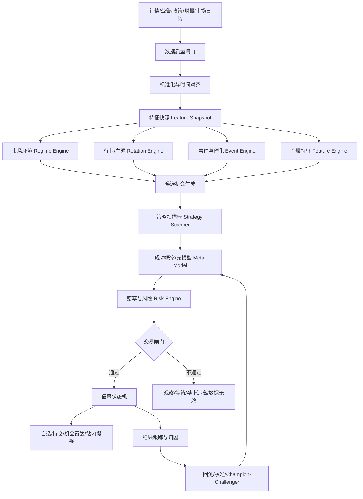
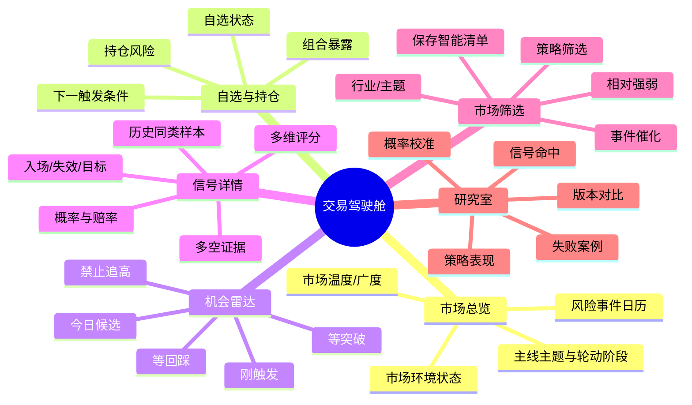
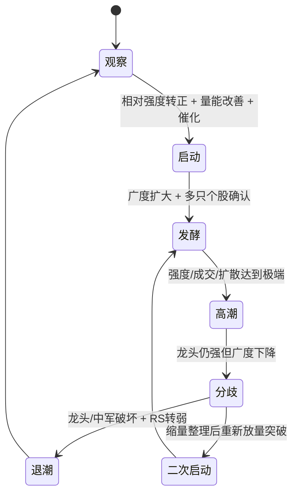
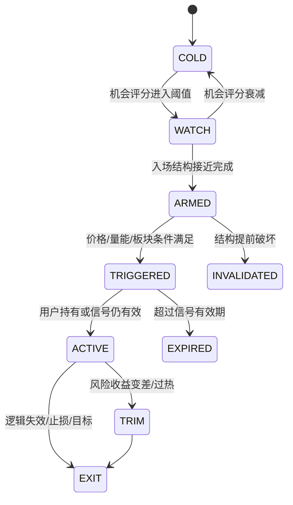

# 产品需求与交易决策引擎设计书（PRD）｜股票辅助判断与交易参考网站

> 文档版本：v0.3（决策引擎 + 近零成本低延迟版）  
> 产品经理：许清楚（Xu）  
> 覆盖市场：A股 / 港股 / 美股  
> 定位：个人 + 小团队内部使用的系统化交易辅助工具，不对外、不商业化、不直接下单  
> 当前约束：**0 成本或接近 0 成本优先，在此前提下尽可能降低延迟**；免费公开数据优先、免登录、站内提醒优先  
> 当前视觉：夜航玻璃拟态 / 深色交易驾驶舱，移动端优先、桌面端增强  
> 核心交易周期：A股/港股以 1—20 个交易日短线与短波段为主；美股以 4—12 周中线为主，可延长至 3—6 个月  

---

## 0. 本次 v0.3 升级摘要

v0.2 已经把产品从简单指标共振升级为系统化决策引擎；v0.3 在保留全部算法设计的基础上，新增硬约束：**0 成本或接近 0 成本优先，并在此前提下尽可能压低数据与信号延迟。**

最初 v0.1 的核心是“MA / MACD / 成交量 / RSI 多指标加权共振”。该方案适合做可点击 Demo，但不足以作为真实交易决策引擎，因为它会出现以下问题：

1. **指标高度相关却被重复计分**：MA、MACD、RSI 都主要来自价格序列，同向并不等于三份独立证据。
2. **没有先判断市场和板块环境**：弱市里的金叉与强势主线里的金叉，胜率完全不是一回事。
3. **没有处理事件与政策驱动**：短线交易真正的大波动经常来自政策、公告、财报、订单、涨价、并购等事件，而非技术指标本身。
4. **没有相对强弱概念**：上涨 3% 不一定强；如果板块涨 6%，它反而是弱股。
5. **“强买—强卖”对称模型不合理**：入场和退出的决策逻辑不同，不能只把买入总分乘以 -1 得到卖出信号。
6. **没有可执行性过滤**：高分但涨停附近、严重高开、流动性差、停牌、临近重大财报，都可能根本不适合追。
7. **没有风险收益比**：即使上涨概率较高，如果潜在利润只有 3%、止损要 8%，也不值得做。
8. **没有概率校准**：0—100 分只是排序分，不应伪装成“80 分 = 80% 会涨”。
9. **没有防止回测过拟合**：如果反复调参数直到历史曲线最好，实盘很容易失效。
10. **没有记录信号生命周期**：用户需要知道“刚出现”“等待触发”“已经太晚”“失效”，而不仅是一张静态分数卡。

因此 v0.2 将产品升级为：

> **市场环境 → 主题/行业 → 个股机会 → 入场时机 → 赔率与风险 → 概率校准 → 信号状态机 → 实盘结果反馈** 的分层决策系统。

系统的目标不是“神预测”，而是：

- 提高高质量机会的发现率；
- 降低追高、弱势反弹、假突破等常见误判；
- 对每个信号给出明确的触发条件、失效条件、预期持有周期和风险收益比；
- 用真实历史与实时结果持续校准信号，而不是凭主观感觉调权重。

---

## 1. 产品目标与边界

### 1.1 一句话目标

**把全市场复杂信息压缩成“现在市场在交易什么、哪只股票值得看、什么条件下能买、什么情况下不能追、错了在哪里退出”的可执行交易计划。**

### 1.2 产品核心输出

每只股票不再只输出一个“强买/强卖”，而是至少输出以下信息：

| 输出 | 示例 | 作用 |
|---|---|---|
| 机会评分 Opportunity Score | 82/100 | 这只股票是否值得进入候选池 |
| 时机评分 Timing Score | 74/100 | 现在是不是较好的入场时刻 |
| 风险评分 Risk Score | 38/100（越高越危险） | 波动、追高、流动性、事件风险 |
| 模型置信度 Confidence | 71/100 | 数据质量、模型一致性、历史样本是否支持 |
| 成功概率（独立字段） | P(目标先于止损)=63% | 经历史样本校准后的概率，不等同于机会评分 |
| 交易状态 | 等回踩 / 已触发 / 禁止追高 | 直接指导下一步 |
| 入场区间 | 18.20—18.55 | 避免“高分但不知道怎么买” |
| 触发条件 | 放量突破 18.55 且板块强度维持 | 条件单式思维 |
| 失效位 | 17.62 下方 | 逻辑失效，而非拍脑袋止损 |
| 第一目标 / 第二目标 | 19.80 / 21.10 | 评估赔率 |
| 预期风险收益比 | 2.2R | 决定是否值得交易 |
| 信号新鲜度 | 87/100，半衰期 2 天 | 防止把旧信号当新机会 |
| 核心理由 | 板块发酵 + 个股相对强 + 回踩缩量 | 可解释性 |
| 反方理由 | 距 MA20 已 2.1 ATR | 明确为什么不能盲目追 |

### 1.3 非目标

- 不承诺准确预测未来价格；
- 不做自动下单；
- 不把大语言模型的自然语言判断直接作为买卖分数；
- 不依赖单一免费数据源做关键决策；
- 不以“胜率最高”为唯一目标；
- 不鼓励因为单日暴涨、涨停、盘后大涨直接追入。

---

## 2. 三大市场的策略配置必须分开

系统底层可共享数据结构与算法框架，但**阈值、持有周期、风险模型、事件类型、可交易性规则必须按市场独立配置**。

### 2.1 A股策略画像：短线 / 短波段

- 默认持有：1—20 个交易日；
- 核心逻辑：热点主线、政策催化、板块轮动、龙头/中军、放量突破、趋势回踩、二次启动；
- 重点特征：市场情绪、涨跌家数、涨停/跌停结构、板块广度、成交额、相对强弱、换手、公告、业绩预告、订单、并购重组、解禁等；
- 重点风控：涨跌停可交易性、停复牌、异常高开、ST/风险警示、次新特殊交易阶段、流动性、连续加速后的拥挤度；
- 默认不把“RSI 超卖”单独当买入信号。

### 2.2 港股策略画像：短线 / 波段

- 默认持有：2—20 个交易日；
- 核心逻辑：A/H 联动、互联网/科技/医药等主题轮动、公司公告、业绩预告、南向偏好、成交额和相对强度；
- 重点风控：小盘股流动性、跳空、买卖价差、VCM 状态、异常成交、停牌和事件后流动性塌陷；
- 不使用 A股式“涨停连板”逻辑硬套港股。

### 2.3 美股策略画像：中线 4—12 周

- 默认持有：20—60 个交易日，优秀趋势可延长到 3—6 个月；
- 核心逻辑：行业趋势、盈利/业绩事件后的持续性、相对强弱、趋势质量、资金偏好、盈利能力与增长质量作为中线过滤；
- 重点风控：财报前隔夜跳空、盘后事件、宏观事件、波动率、流动性、行业集中度；
- 不因为单日大涨或盘后暴涨直接给“可买”。

### 2.4 策略配置对象

```text
StrategyProfile
- market: A | HK | US
- horizon_days: [min, base, max]
- benchmark_set
- feature_weights_initial
- entry_strategy_enabled[]
- risk_thresholds
- liquidity_thresholds
- event_blackout_rules
- retrain_frequency
- calibration_window
- transaction_cost_model
```

---

## 3. 产品总体决策架构



### 3.1 核心原则：先过滤，再评分，再预测

不要对全市场每一只股票每天直接“预测涨跌”。推荐采用三阶段：

1. **高召回候选生成**：规则快速扫描出可能的突破、回踩、事件驱动、二次启动等候选；
2. **元模型筛选**：判断“这个候选是否值得执行”，降低假突破和弱反弹；
3. **风险闸门**：即便模型认为上涨概率高，赔率或可交易性不合格也不发买入信号。

这比“让一个模型直接预测明天涨不涨”更符合交易需求，也更容易解释、回测和迭代。

---

## 4. 信息架构与页面升级

现有 5 个核心页面保留，但逻辑升级。



### 4.1 首页：从“行情展示”升级为“今天该不该做”

首页最上方先显示：

- 当前市场：开市 / 休市 / 数据异常；
- 市场环境：Risk-On / 震荡轮动 / Risk-Off / 恐慌修复 / 过热；
- 建议进攻度：20%—100%；
- 今日最强 3 个板块及其阶段：启动 / 发酵 / 高潮 / 分歧 / 退潮 / 二次启动；
- 今日风险：重大宏观、财报密集、解禁、停复牌等；
- 与上次扫描相比发生了什么变化。

### 4.2 自选/持仓页：增加“下一步动作”

每只股票显示：

- 当前状态：持有 / 等回踩 / 触发买入 / 减仓观察 / 退出；
- 今日变化：评分 +8、板块从发酵转分歧等；
- 下一触发条件；
- 失效位；
- 距失效位多少 % / ATR；
- 持仓风险贡献；
- 同板块持仓是否过度集中。

### 4.3 机会雷达：替代简单“种草推荐”

机会按可执行程度分层，而非只按总分排序：

1. **已触发，可执行**；
2. **已武装，等一个条件**；
3. **高质量，等回踩**；
4. **强势但禁止追高**；
5. **早期观察**；
6. **风险/数据异常，不建议动作**。

### 4.4 信号详情页

详情页第一屏必须回答 6 个问题：

1. 为什么值得看？
2. 为什么是现在？
3. 市场和板块支持吗？
4. 什么价格/条件下才执行？
5. 错了在哪里认错？
6. 赚到哪里赔率开始变差？

---

## 5. 数据层：准确率首先取决于数据，而不是模型

### 5.1 数据优先级

| 数据类型 | 优先级 | 说明 |
|---|---:|---|
| OHLCV / 成交额 / 换手 | P0 | 所有技术与结构特征基础 |
| 交易日历 / 开休市状态 | P0 | 三市场必须独立判断 |
| 复权因子 / 拆股 / 分红 | P0 | 避免技术指标断裂 |
| 停牌 / 特殊交易状态 / 风险警示 | P0 | 可交易性闸门 |
| 行业/概念归属 | P0 | 板块轮动与相对强弱 |
| 官方公告与披露 | P0 | 事件驱动核心 |
| 财报 / 业绩预告 / 经营数据 | P1 | 事件与中线质量过滤 |
| 龙虎榜 / 融资融券 / 大宗等 | P1 | A股情绪与资金辅助 |
| 港股卖空/市场公开数据 | P1 | 港股辅助 |
| 美股 SEC filings / XBRL | P1 | 公司事件与基本面 |
| 新闻/政策 | P1 | 主题催化 |
| 社交热度 | P3 | 噪声高，只能低权重辅助 |

### 5.2 数据质量闸门 Data Quality Gate

**任何模型之前都必须经过质量闸门。**

检查项：

- `freshness`：数据是否达到该市场与频率的时效要求；
- `completeness`：关键字段是否缺失；
- `duplicate`：是否重复 K 线/公告；
- `cross_source_diff`：主备行情是否异常偏离；
- `corporate_action_ok`：复权是否正确；
- `market_status_ok`：是否真实开市、是否停牌；
- `timestamp_ok`：公告发布时间是否正确映射到可用交易时点；
- `future_data_leak`：任何未来字段必须阻断；
- `symbol_mapping_ok`：代码、市场、上市状态映射正确。

输出：

```text
DataQualityScore = 0..100
DataStatus = VALID | DEGRADED | STALE | INVALID
```

规则建议：

- `INVALID`：禁止产生新交易信号；
- `STALE`：仅显示旧状态，并醒目标注“行情已过期”；
- `DEGRADED`：降低 Confidence，不允许“强执行”级别；
- `VALID`：正常参与评分。

### 5.3 复权原则

- 历史趋势和收益计算：使用经过正确公司行为处理的连续价格；
- 实际入场、止损、目标位：必须映射回真实可交易价格；
- 保存调整因子，保证历史信号可复现。

### 5.4 时间点原则 Point-in-Time

对每条特征记录：

```text
known_at = 这条信息真实可被系统知道的时间
usable_from = 最早可以用于交易决策的时间
```

例如收盘后发布的公告，不能用于当天收盘前的回测信号。

---

## 6. 市场环境引擎 Market Regime Engine

### 6.1 为什么需要 Regime

同一个突破策略在趋势强市、震荡市和恐慌市的胜率不同。因此所有个股分数必须条件化在市场状态下。

### 6.2 市场环境五状态

| 状态 | 含义 | 默认策略倾向 |
|---|---|---|
| RISK_ON_TREND | 指数、广度、流动性同步改善 | 允许趋势/突破/回踩 |
| ROTATION | 指数震荡但板块轮动活跃 | 聚焦强行业，降低追高 |
| RISK_OFF | 指数与广度恶化 | 减少新仓、提高门槛 |
| PANIC_REBOUND | 极端下跌后的修复 | 仅做高质量修复，不当新主升 |
| OVERHEATED | 广度、换手、涨幅过热 | 强势但提高拥挤惩罚 |

### 6.3 市场环境特征族

#### A. 趋势 25%

- 主要指数在 MA20/MA60 上下；
- MA20 / MA60 斜率；
- 指数 20 日新高/新低位置；
- 趋势强度。

#### B. 市场广度 25%

- 上涨股票比例；
- 位于 MA20 / MA60 上方股票比例；
- 新高 / 新低数量；
- A股可额外看涨停/跌停、连板高度等结构。

#### C. 波动与风险 20%

- 指数 ATR%；
- 已实现波动率分位数；
- 跳空/大阴大阳频率；
- 极端尾部事件。

#### D. 流动性 15%

- 市场成交额相对 20/60 日分位数；
- 换手变化；
- 活跃股票覆盖率。

#### E. 情绪与拥挤 15%

- 强势股扩散程度；
- 高位股分歧；
- 极端上涨股票数量；
- 过热/恐慌指标。

### 6.4 市场环境分数

```text
MarketScore = Trend*0.25
            + Breadth*0.25
            + VolatilityQuality*0.20
            + Liquidity*0.15
            + Sentiment*0.15
```

注意：上述仅是**初始先验权重**，后续必须使用 walk-forward 历史表现校准，禁止为了历史曲线最好而无限调参。

---

## 7. 行业 / 主题轮动引擎 Rotation Engine

短线系统必须先回答：**市场现在在交易什么？**

### 7.1 板块评分

```text
SectorScore = 0.25 * RelativeStrength
            + 0.20 * Breadth
            + 0.20 * VolumeLiquidity
            + 0.15 * LeaderQuality
            + 0.15 * Catalyst
            + 0.05 * Persistence
            - CrowdingPenalty
```

### 7.2 关键指标

- 5/10/20 日相对基准收益；
- 板块内上涨比例；
- 板块内位于 MA20 上方比例；
- 成交额/换手分位数；
- 高评分股票数量；
- 龙头是否继续创新高；
- 中军是否稳定；
- 板块内部是否出现“龙头强、跟风全跌”的分歧；
- 是否存在明确政策、产品涨价、财报、产业事件催化。

### 7.3 板块生命周期状态机



### 7.4 重要产品字段

每个板块显示：

- `stage`：启动/发酵/高潮/分歧/退潮/二启；
- `score`：0—100；
- `leader[]`：龙头、中军、补涨候选；
- `breadth_change_3d`；
- `relative_strength_rank`；
- `crowding`；
- `catalyst`；
- `stage_changed_at`。

---

## 8. 个股特征引擎：避免指标重复计分

### 8.1 从“指标”升级为“独立证据族”

过去的 MA + MACD + RSI 共振容易重复计算同一价格信息。v0.2 按信息来源聚合：

| 特征族 | 典型指标 | 作用 |
|---|---|---|
| 趋势 Trend | MA、EMA、MACD、ADX、斜率 | 趋势方向与质量 |
| 动量 Momentum | 5/10/20 日收益、突破距离 | 趋势速度 |
| 相对强弱 Relative Strength | 相对行业/指数超额表现 | 是否是真强股 |
| 成交与流动性 Volume/Liquidity | 量比、成交额分位、换手 | 资金确认与可执行性 |
| 价格结构 Structure | 突破、回踩、平台、压缩 | 入场形态 |
| 市场/板块 Context | MarketScore/SectorScore | 顺势还是逆势 |
| 事件催化 Catalyst | 政策、公告、财报、订单等 | 为什么现在有重新定价可能 |
| 风险 Risk | ATR、跳空、拥挤、流动性、事件 | 是否值得承担风险 |

### 8.2 去相关规则

同一个证据族内部先聚合，再进入总分。

例如：

```text
TrendFamily = aggregate(MA_state, MACD_state, ADX, MA_slope)
```

而不是：

```text
总分 += MA金叉 + MACD金叉 + RSI上涨 + EMA金叉
```

这样可以避免“同一份价格趋势被算四次”。

### 8.3 鲁棒标准化

不同股票的成交量、波动率、换手率不可直接比较。建议优先使用：

- 同市场横截面百分位；
- 同行业百分位；
- 个股自身历史百分位；
- Median + MAD 的鲁棒 z-score；
- 对极端值 winsorize / clip。

示例：

```text
robust_z = (x - median) / (1.4826 * MAD)
robust_z = clip(robust_z, -3, 3)
normalized_score = 50 + 15 * robust_z
```

### 8.4 相对强弱比绝对涨幅更重要

```text
RS_stock_market_h = Return(stock,h) - Return(market,h)
RS_stock_sector_h = Return(stock,h) - Return(sector,h)
```

可进一步按历史波动率归一化。

核心逻辑：

- 市场跌 4%，股票只跌 0.5%，可能是强；
- 股票涨 3%，板块涨 7%，可能是弱；
- 真正优先的是“板块强 + 个股在板块里也强”。

---

## 9. 事件与催化引擎 Event / Catalyst Engine

### 9.1 原则

**自然语言模型不直接给股票打买卖分。**

LLM/NLP 只能做：

1. 提取结构化事件；
2. 判断事件类型；
3. 提取金额、同比、时间、对象、是否正式落地；
4. 识别来源与是否为传闻；
5. 生成人话解释。

最终分数由结构化规则/统计模型计算，并保留原始来源。

### 9.2 事件结构

```text
Event
- id
- market
- symbol / sector
- event_type
- source_type
- source_url
- published_at
- usable_from
- confirmed: true/false
- direction: positive/negative/mixed
- authority_score
- materiality_score
- novelty_score
- specificity_score
- surprise_score
- price_confirmation_score
- decay_half_life
- extraction_confidence
```

### 9.3 事件评分

```text
EventScoreRaw = Direction
              * Authority
              * Materiality
              * Novelty
              * Specificity
              * Confirmation

EventScore(t) = EventScoreRaw * exp(-age / half_life)
```

`PriceConfirmation` 不应完全乘入事件本身，避免“已经涨了才证明事件好”的循环，可作为独立确认项。

### 9.4 事件优先级示例

高价值事件：

- 正式财报/业绩预告大幅改善；
- 大额订单、合同、产能/价格变化；
- 回购/增持/并购重组等资本动作；
- 官方产业政策明确落地且受益对象清晰；
- 港股盈利预告；
- 美股财报与 SEC 披露的重要变化。

低可信事件：

- 无来源社交传闻；
- 二次转载、旧闻翻炒；
- 没有明确受益路径的宏大叙事；
- 标题很强但正文没有实质内容。

**未确认传闻可以提示，但默认不允许把股票推到“可执行买入”。**

---

## 10. 策略库：不是一个万能模型，而是一组可验证的交易模式

每个策略都必须有：

- 候选条件；
- 触发条件；
- 禁止条件；
- 入场区间；
- 失效条件；
- 目标/赔率；
- 信号半衰期；
- 适用市场环境；
- 历史独立回测表现。

### 10.1 S1 放量突破 Breakout Continuation

适用：启动/发酵阶段的强板块。

候选：

- 价格接近 20/55 日高位；
- 相对行业强度高；
- 量能或成交额分位提升；
- SectorScore 高；
- 非严重超买扩张。

触发：

- 突破关键阻力；
- 成交确认；
- 板块同步维持强势。

禁止：

- 距中期均线已过度扩张；
- 大幅跳空直接越过合理入场区；
- 赔率 < 最低阈值；
- 流动性不足或接近不可交易价格边界。

输出可以是：

> “突破成立，但高开过多，状态=强势但禁止追高；等回踩 0.5—1.0 ATR 再评估。”

### 10.2 S2 趋势回踩 Trend Pullback

候选：

- MA20/MA60 趋势向上；
- 个股/行业相对强度仍高；
- 回撤到 MA10/20、前高、平台、锚定 VWAP 等支撑；
- 回踩阶段成交缩小。

触发：

- 支撑附近止跌；
- 重新放量、反包或突破短期确认位。

该策略通常比直接追突破更有赔率优势。

### 10.3 S3 事件驱动延续 Event Continuation

候选：

- 高可信正面事件；
- 事件后异常成交与价格确认；
- 所属行业同步强化；
- 事件不是纯预期落空。

核心过滤：

- 首日已经极端涨幅时不直接追；
- 等事件后 1—3 个交易日确认“承接”与“回踩不破事件锚点”。

### 10.4 S4 板块龙头 / 中军 Second-Wave Leader

用于热点“二次启动”。

候选：

- 板块曾发酵；
- 经 3—10 个交易日整理；
- 成交收缩但相对强度保持；
- 龙头/中军重新突破；
- 板块广度重新上升。

### 10.5 S5 低位反转 / 超卖修复 Reversal

**权重必须低于趋势类策略。**

RSI<30 只表示状态，不是买入理由。

至少要求：

- 极端下跌后波动收敛；
- 关键支撑成立；
- 市场/板块出现修复；
- 出现价格确认；
- 下跌催化没有继续恶化。

### 10.6 S6 中线趋势（美股）

适用 4—12 周：

- 行业相对强；
- 个股 20/60 日趋势向上；
- 财报/经营事件后价格不回吐；
- 回调时量能收缩；
- 相对指数持续超额；
- 临近财报时单独评估隔夜风险。

### 10.7 Exit Engine：退出策略独立设计

退出不使用 `-EntryScore`。

退出条件包括：

- 原始逻辑失效；
- 关键支撑跌破；
- 趋势破坏且成交确认；
- 板块从分歧转退潮；
- 重大负面事件；
- 达到时间止损；
- 达到目标后风险收益显著变差；
- 浮盈较大后使用 ATR / 结构追踪止盈。

---

## 11. 评分体系：一只股票至少有四个分数

### 11.1 Opportunity Score（机会质量）0—100

代表“值不值得研究/进入候选”，不是买点。

A/H 初始权重建议：

```text
Opportunity = 0.20 * RelativeStrength
            + 0.15 * TrendMomentum
            + 0.15 * SectorContext
            + 0.15 * Catalyst
            + 0.10 * VolumeLiquidity
            + 0.10 * PriceStructure
            + 0.10 * MarketRegimeFit
            + 0.05 * Persistence
            - RiskPenalty
```

美股中线初始权重可提高趋势/事件/基本面质量，降低极短期情绪权重。

### 11.2 Timing Score（入场时机）0—100

重点看：

- 距触发价的位置；
- 回踩是否完成；
- 突破是否有确认；
- 量价是否匹配；
- 是否过度扩张；
- 当前风险收益比。

典型情况：

- Opportunity 90、Timing 45 → **很好，但不能现在买**；
- Opportunity 76、Timing 84 → **质量略低但现在更可执行**。

### 11.3 Risk Score（风险）0—100，越高越危险

组成：

- ATR% / 波动率；
- 流动性；
- 买卖价差；
- 隔夜跳空风险；
- 距均线/支撑过远；
- 拥挤程度；
- 事件不确定性；
- 市场状态；
- 重大财报/解禁/停复牌等日历风险。

### 11.4 Confidence（置信度）0—100

置信度不等于上涨概率，主要衡量“这个结论可信不可信”。

建议：

```text
Confidence = 0.20 * DataQuality
           + 0.20 * IndependentFactorAgreement
           + 0.20 * ModelCalibrationQuality
           + 0.15 * SimilarSampleStrength
           + 0.15 * EnsembleAgreement
           + 0.10 * RegimeCoverage
           - UncertaintyPenalty
```

### 11.5 Success Probability（成功概率）

单独输出：

```text
P_target_before_stop = 0..1
```

必须经过历史样本概率校准后才能展示为百分比。

**不要把 Opportunity Score 直接除以 100 当成功概率。**

---

## 12. “预测股市”的正确目标：预测交易结果分布，而不是猜收盘价

比“明天收盘 18.73 元”更实用的是：

- 未来 H 日先到目标还是先到止损的概率；
- 未来 H 日收益的中位数与分位区间；
- 最大不利波动 MAE；
- 最大有利波动 MFE；
- 预期达到目标所需时间；
- 当前赔率是否值得参与。

### 12.1 波动率自适应标签

对于每个候选信号定义：

```text
entry = 下一可执行价格
TP = entry + k_tp * ATR20
SL = entry - k_sl * ATR20
H = 最大持有交易日
```

标签：

- `+1`：H 日内 TP 先于 SL 被触发；
- `-1`：SL 先被触发；
- `0`：到期未触发，视策略定义为 timeout。

优点：

- 与真实交易目标一致；
- 自动适应股票波动率；
- 可直接训练 `P(TP before SL)`。

### 12.2 多周期预测

A/H：

- 3 日、5 日、10 日、20 日；

US：

- 20 日、40 日、60 日，必要时 120 日。

同一只股票可以出现：

> 5 日胜率一般，但 20 日趋势胜率较好 → 不适合追短线，可作为波段观察。

---

## 13. 机器学习与统计模型设计

### 13.1 推荐路线：规则候选 + Meta-Label 模型

不要一开始就上深度学习。

第一层：策略规则产生候选，例如“趋势回踩已经进入支撑区”。

第二层模型只回答：

> **这次候选信号值得执行吗？**

优点：

- 数据标签清晰；
- 更容易解释；
- 降低模型对噪声日的学习；
- 可以分别统计每种策略的真实胜率。

### 13.2 模型梯队

#### Baseline

- Logistic Regression；
- 简单规则打分。

作用：建立可解释、难以过拟合的基线。

#### Non-linear

- Gradient Boosted Trees（LightGBM / XGBoost / HistGradientBoosting 等任选其一）；

作用：学习“强板块 + 回踩 + 成交收缩 + 事件”这类非线性交互。

#### Ensemble

```text
P_final = weighted_average(P_logistic, P_tree, P_strategy_prior)
```

权重按照最近独立样本中的 Brier / LogLoss / 净期望值动态但缓慢调整。

### 13.3 暂不优先的模型

- LSTM；
- Transformer 直接预测价格；
- 纯新闻情绪模型直接买卖；
- 强化学习直接下单。

原因：当前数据规模、免费数据质量、市场非平稳性与过拟合风险，不足以证明这些模型比简单模型稳定。

### 13.4 概率校准

模型输出 0.72 不代表真实成功率就是 72%。

采用：

- Sigmoid / Platt calibration；或
- Isotonic calibration（样本足够时）。

评估：

- Brier Score；
- Log Loss；
- Calibration Curve；
- Expected Calibration Error（辅助）。

产品中可显示：

> “过去所有预测 60%—70% 的同类信号，实际成功率 64%。”

这比单纯展示“模型置信度 88%”更可信。

---

## 14. 交易闸门：高分不等于允许买

### 14.1 Buy Gate

只有同时满足关键条件才从“观察”升级为“可执行”：

```text
DataStatus == VALID
Opportunity >= threshold_opportunity
Timing >= threshold_timing
Confidence >= threshold_confidence
P_target_before_stop >= threshold_probability
RewardRisk >= threshold_rr
Liquidity == PASS
MarketRule == PASS
EventRisk != BLOCK
Crowding != EXTREME
```

参数按市场/策略独立配置。

### 14.2 风险收益比 R 倍数

```text
Risk = Entry - Stop
Reward = Target - Entry
R_multiple = Reward / Risk
```

如果一只股票高分但：

- 入场 20；
- 合理止损 18；
- 第一目标 21.5；

则：

```text
R = 1.5 / 2 = 0.75R
```

即使方向可能正确，也不应给“可执行买入”。

### 14.3 追高惩罚 Overextension Penalty

建议综合：

- `distance_to_MA20 / ATR`；
- 3/5 日涨幅历史分位；
- 跳空幅度 / ATR；
- 换手极值；
- 板块所处高潮阶段。

输出独立状态：

> **强势，但禁止追高。**

这是产品必须具备的“反 FOMO”功能。

---

## 15. 信号状态机：从“静态标签”升级为交易生命周期



### 15.1 人话映射

| 后端状态 | UI 文案 |
|---|---|
| COLD | 暂无机会 |
| WATCH | 值得观察 |
| ARMED_BREAKOUT | 等突破 |
| ARMED_PULLBACK | 等回踩确认 |
| TRIGGERED | 已触发，可执行 |
| ACTIVE | 持有逻辑仍在 |
| TRIM | 考虑减仓 |
| EXIT | 退出/逻辑失效 |
| OVEREXTENDED | 强势但禁止追高 |
| INVALIDATED | 计划失效 |
| DATA_INVALID | 数据异常，不给信号 |

### 15.2 信号半衰期与过期

```text
Freshness = exp(-age / half_life)
```

不同信号不同半衰期：

- 日内/短突破：短；
- 回踩：短；
- 财报驱动：相对长；
- 政策主题：按落地与扩散动态调整。

旧信号不允许一直挂“强买”。

---

## 16. 支撑、阻力、入场和失效算法

### 16.1 支撑候选

- 最近有效 swing low；
- MA10 / MA20 / MA60；
- 前高突破位；
- 成交密集区；
- 事件日/突破日锚定 VWAP；
- 缺口边缘。

### 16.2 阻力候选

- 前高；
- 近期高成交密集区；
- 波动率目标；
- 结构投影目标。

### 16.3 结构化止损

优先级：

1. 逻辑失效位；
2. 支撑下方 + ATR buffer；
3. 最大风险预算约束。

不建议固定所有股票统一“跌 5% 止损”。

### 16.4 入场区间而非单点

示例：

```text
support = 18.00
ATR20 = 0.60
entry_zone = 18.05 .. 18.35
invalidation = 17.65
```

产品应告诉用户：

- 进入区间；
- 需要什么确认；
- 高于多少价格就不追。

---

## 17. A股专属增强逻辑

### 17.1 交易规则必须配置化

不要把“ST 一定 5%”“所有股票都一样涨跌幅”等规则写死在代码里。

交易所规则会变化，因此建立：

```text
market_rule_version
instrument_rule
- effective_from
- effective_to
- price_limit_type
- price_limit_pct
- special_listing_period
- risk_warning
- board
- trading_session
```

2026 年沪深交易规则已有制度更新，产品必须根据生效日期版本化，而不是依赖旧常识。

### 17.2 涨停/连板结构只作为情绪和可交易性特征

可使用：

- 涨停家数；
- 跌停家数；
- 最高连板；
- 炸板比例；
- 首板晋级率；
- 高位股负反馈；
- 板块涨停扩散。

但：

> “连续涨停 = 直接买”绝对不是策略规则。

### 17.3 主力资金字段谨慎使用

很多免费行情平台的“主力净流入”是供应商根据逐笔/大单口径估算，并不等于真实机构资金。

因此：

- 只能作为低/中权重辅助；
- 必须保存来源与口径；
- 不能成为强买的单点触发器。

### 17.4 龙虎榜

用途：

- 识别高关注度与资金博弈；
- 观察营业部集中度；
- 事件后的异常参与。

不应简单解读为“机构买入 = 明天涨”。

### 17.5 北向资金：禁止使用已经不存在的“盘中实时净流入”字段

沪深交易所自 **2024-08-19** 起调整沪深港通信息披露机制。对于沪股通/深股通，盘中不再公开过去常见的实时买入金额、卖出金额和成交总额；收市后披露当日成交总额、成交笔数、ETF 成交总额和前十大成交活跃证券等，单只证券持有数量按季度披露。

因此产品必须：

- 删除“北向实时净流入突然放大 → 盘中强买”的设计；
- 不从第三方页面抓一个旧口径字段后继续当成真实北向净买入；
- 将沪/深股通数据定位为**盘后确认因子 / 季度持仓因子**；
- 盘中资金与情绪判断改用可稳定获得的市场宽度、板块成交额占比、ETF/指数强弱、涨跌停结构、成交额扩散、相对强弱等代理变量；
- 港股通相关数据也严格按照交易所当前实际披露粒度使用，不假设所有字段都实时可得。

这一条属于数据真实性硬规则：**宁可缺一个因子，也不能使用已经失真的“实时资金”字段。**

---

## 18. 港股专属增强逻辑

- 根据 HKEX 市场交易机制维护交易时段；
- 对适用证券记录 VCM 相关状态；
- 将买卖价差、日成交额、成交活跃度放入 RiskScore；
- 小盘/低流动性股票提高最低赔率要求；
- 港股公告优先使用 HKEXnews；
- A/H 同公司可加入“跨市场相对强弱”和隔夜传导特征；
- 避免把单日无涨跌停限制的大波动直接解释为持续趋势。

---

## 19. 美股专属增强逻辑

### 19.1 财报风险日历

所有中线候选必须显示：

- 距下次财报预计还有多少天；
- 是否选择“持仓穿越财报”；
- 历史财报日跳空波动；
- 财报前是否降低 Confidence 或仓位建议。

### 19.2 财报后持续性

模型关注：

- 财报日跳空方向；
- 当日/次日是否回吐；
- 成交额异常；
- 行业同步；
- 20/60 日趋势；
- 后续相对强弱。

### 19.3 SEC 披露

使用官方 EDGAR / data.sec.gov 获取：

- 10-K / 10-Q / 8-K；
- XBRL 公司事实；
- 关键公司事件。

自然语言只做结构提取与解释，数值以结构化字段为主。

---

## 20. 回测框架：准确率必须建立在“没有作弊”的历史测试上

### 20.1 禁止随机 K-Fold

金融时间序列不能把未来样本随机分到训练集，再去预测过去。

使用：

- expanding walk-forward；或
- rolling walk-forward；
- 对标签窗口重叠的样本使用 gap / purge / embargo 思路。

### 20.2 回测必须模拟真实可执行价格

如果信号使用当日收盘数据生成：

- 不能假设在同一个收盘价成交；
- 应使用下一可执行时点，如次日开盘/限定滑点后的价格；
- 对涨跌停、停牌、跳空、流动性不足做真实处理。

### 20.3 防止生存者偏差

历史股票池必须包含：

- 已退市股票；
- 当时尚未上市的股票不能提前出现；
- 行业成分按当时状态；
- 指数成分尽量 point-in-time。

### 20.4 交易成本

至少包括：

- 佣金；
- 印花税等市场费用（按市场配置）；
- 买卖价差；
- 滑点；
- 对低流动性股票增加冲击成本。

### 20.5 回测结果必须按维度拆分

- 市场；
- 年份；
- 牛/熊/震荡 Regime；
- 行业；
- Strategy ID；
- Score bucket；
- 持有周期；
- 大盘/小盘；
- 流动性分组。

不要只显示一个“历史胜率 68%”。

---

## 21. 评估体系：什么才叫“信号更准确”

### 21.1 主指标

#### A. Net Expectancy

```text
Expectancy = WinRate * AvgWin
           - LossRate * AvgLoss
           - AvgCost
```

比单纯胜率更重要。

#### B. Precision@K

每天只推荐 Top K，统计 Top K 中真正达到目标的比例。

它与产品的“每日机会雷达”最贴近。

#### C. Profit Factor

```text
GrossProfit / GrossLoss
```

#### D. Brier Score / LogLoss

衡量概率预测是否可信。

#### E. Max Drawdown / Worst 5% Trade

防止用极端尾部风险换高胜率。

### 21.2 辅助指标

- 命中率；
- 平均盈亏比；
- 中位收益；
- MAE / MFE；
- 平均持有日；
- 信号覆盖率；
- 换手率；
- 过期率；
- 假突破率；
- 禁止追高后实际回踩率；
- 不同行情下的稳定性。

### 21.3 分数桶校准

例如：

| Score | 样本数 | 实际目标命中 | 平均 R | 结论 |
|---:|---:|---:|---:|---|
| 90—100 | 143 | 68% | +0.72R | 有区分度 |
| 80—89 | 421 | 61% | +0.41R | 可用 |
| 70—79 | 822 | 54% | +0.12R | 观察 |
| <70 | 2100 | 48% | -0.06R | 不应推送 |

系统的目标是让高分组在独立样本中**持续比低分组更好**。

---

## 22. 防止“越优化越假”：研究治理

### 22.1 每次参数实验都记账

新增：

```text
strategy_trial
- trial_id
- strategy_id
- parameter_hash
- feature_set_version
- train_period
- test_period
- created_at
- metric_result
- promoted: true/false
```

目的：避免试了 500 组参数，只展示最好的一组。

### 22.2 Champion / Challenger

- Champion：当前正式信号版本；
- Challenger：新算法只在影子模式运行；
- Challenger 必须经过足够新的独立样本后才可替换 Champion；
- 新模型失败不会污染正式信号。

### 22.3 过拟合风险指标

研究室建议记录：

- Out-of-sample / in-sample degradation；
- Deflated Sharpe Ratio（研究指标）；
- Probability of Backtest Overfitting / 多重试验风险；
- 参数稳定区间，而不是只有单一最优点。

### 22.4 参数稳定性优先

如果：

- MA20=19 时很好；
- MA20=20 时极好；
- MA20=21 时直接失效；

说明策略很可能不稳。

优先选择在一片参数区域都不错的策略，而不是尖峰最优。

---

## 23. 仓位与组合风险：单股信号正确，也可能组合很危险

### 23.1 单笔风险预算

可选启用：

```text
position_size = account_risk_budget / (entry - stop)
```

例如用户可设：

- 单笔最多承担账户净值 0.5% / 1% 风险；
- 系统只给建议仓位，不下单。

### 23.2 Portfolio Heat

```text
PortfolioHeat = Σ 每个持仓到止损的预估损失 / 账户净值
```

超过阈值时，即使出现新高分信号，也提示：

> “组合风险已高，不建议继续加仓。”

### 23.3 相关性与主题集中

例如持有多只：

- AI 芯片；
- 光模块；
- 服务器；

表面是 3 只股票，实际上可能是同一个主题风险。

系统需要：

- 行业集中度；
- 主题集中度；
- 近 60 日收益相关性聚类；
- 同一事件因子暴露。

---

## 24. 新增高价值功能：真正能帮助交易，而不只是“更多数据”

### 24.1 “为什么现在不能买”卡片【高优先级】

即使机会分很高，也显示阻止执行的最主要原因：

- 太高了；
- 赔率太差；
- 板块已经高潮；
- 量没有确认；
- 财报隔夜风险；
- 数据异常。

这比多一个技术指标更有价值。

### 24.2 下一触发条件 Next Trigger【高优先级】

每个 WATCH / ARMED 信号都生成：

> “若回踩 24.10—24.40 缩量止跌，或放量站上 25.30，则重新评估为可执行。”

用户不必一直盯盘。

### 24.3 What Changed Since Last Scan【高优先级】

只展示变化：

- SectorScore +13；
- 从“发酵”转“分歧”；
- 新出现正式订单公告；
- 风险收益从 1.3R 改善至 2.0R；
- 信号从 WATCH → ARMED。

减少信息疲劳。

### 24.4 信号战绩卡 Strategy Scoreboard【高优先级】

按策略显示最近：

- 样本数；
- 命中率；
- 平均 R；
- Profit Factor；
- 最大回撤；
- 当前 Regime 下表现；
- 是否处于“降权观察”。

### 24.5 信号失效复盘【高优先级】

每个失败信号自动归因：

- 假突破；
- 板块退潮；
- 大盘突发；
- 事件反转；
- 追高；
- 流动性；
- 模型高估。

最终可以回答：

> “过去 30 个失败信号中，40% 来自板块已经进入高潮后仍追突破。”

然后才有依据调整策略。

### 24.6 拥挤度 / 追高风险仪表【高优先级】

单独显示：

- 近期涨幅分位；
- 距 MA20 / ATR；
- 换手极值；
- 连续加速天数；
- 板块高潮度。

### 24.7 事件日历【P1】

未来 1—20 个交易日：

- 财报；
- 业绩预告窗口；
- 股东大会；
- 解禁；
- 分红除权；
- 宏观政策节点；
- 美股财报；
- 用户自定义事件。

### 24.8 组合雷达【P1】

用户录入持仓与成本后：

- 哪些股票风险最大；
- 哪个主题暴露最高；
- 哪只接近失效位；
- 哪些股票可以继续持有，哪些“高分已变低分”。

### 24.9 影子策略 A/B【P2】

任何新参数先不影响正式信号，只后台记录：

- 原策略发了什么；
- 新策略会发什么；
- 30/60/120 个新样本后的差异。

### 24.10 信号冲突解释【P2】

例如：

> 技术面强 + 板块强，但事件风险极高 → Opportunity 82 / Timing 76 / Risk 81 → “不执行”。

产品要明确告诉用户：**为什么高分仍然不买。**

### 24.11 场景回放 Replay【P2】

选择历史某一天，只展示当时能知道的信息，逐日回放：

- 当时市场状态；
- 当时信号；
- 后续如何发展。

用于训练用户与检查算法是否偷看未来。

### 24.12 反事实检查 Counterfactual【P3】

对信号问：

- 如果没有板块强度，这只股票还会入选吗？
- 如果去掉事件催化，概率降多少？
- 如果开盘高 1 ATR，还值得买吗？

帮助理解真正驱动信号的因素。

---

## 25. 推荐排序算法

不要简单按 OpportunityScore 从高到低。

建议：

```text
RankScore = ExpectedR
          * CalibratedSuccessProbability
          * Freshness
          * LiquidityQuality
          * RegimeFit
          * ConfidenceFactor
          - CrowdingPenalty
          - PortfolioConcentrationPenalty
```

其中：

```text
ExpectedR = P(win) * AvgWinR - P(loss) * AvgLossR
```

### 25.1 Top K 多样性

每日 Top 10 不应全部来自同一板块。

可加最大暴露：

- 单板块最多 3 只；
- 同一高度相关主题最多 4 只；
- 其余按 RankScore 补齐。

这样推荐清单更接近可交易组合，而不是“某板块今天大涨，所以首页全是它”。

---

## 26. 实时/定时扫描设计：近零成本条件下尽量低延迟

### 26.1 先区分“数据源延迟”和“系统内部延迟”

免费行情最大的延迟往往来自上游数据源，本系统能真正控制的是：

```text
TotalLatency = SourceLatency
             + CollectorLatency
             + FeatureLatency
             + ModelLatency
             + PushLatency
```

产品不允许只写“实时”两个字，而要对每个实时/准实时字段保存：

```text
source_timestamp
received_at
computed_at
displayed_at
observed_age_ms = now - source_timestamp
```

如果上游本身延迟 15 分钟，内部计算再快也不能包装成秒级实时。

### 26.2 低成本采集采用“热池 + 温池 + 冷池”三级频率

不要对全市场几千只股票每 2 秒暴力轮询。免费接口非常容易限频、断连或封禁，应把延迟预算花在真正需要盯的股票上。

#### 热池 HOT：持仓 + 自选 + ARMED/TRIGGERED 候选

- 目标股票数量：通常几十只，最多控制在 100—200 只；
- A股：上游支持时目标 2—5 秒刷新；
- 港股：按实际数据源新鲜度刷新，若源延迟 15 分钟则不做虚假的高频轮询；
- 美股：中线策略默认 30—60 秒展示已足够，重大事件单独触发；
- 每次新报价到达后只增量更新受影响特征，不重算全市场。

#### 温池 WARM：高分候选 / 强板块成分股

- A股目标 5—15 秒；
- 只在开市且数据源健康时启用；
- 当候选进入 ARMED 后自动晋级 HOT。

#### 冷池 COLD：全市场

- A股全市场快照目标 30—60 秒一次；
- 用批量接口一次拉取，而不是逐股票请求；
- 主要负责发现新的板块、异动和候选，不负责最终秒级触发；
- 发现高质量候选后再加入 WARM/HOT。

这种架构比“所有股票同频实时”更快、更稳，也更符合免费源限制。

### 26.3 A股盘中更新目标

在免费数据源可用时，建议目标：

| 数据 | 目标刷新 | 用途 |
|---|---:|---|
| HOT 报价 | 2—5 秒 | 持仓风险、触发位、止损距离 |
| WARM 报价 | 5—15 秒 | 接近触发条件的候选 |
| 全市场快照 | 30—60 秒 | 板块广度、异动发现、横截面排序 |
| 1 分钟 K | 新 bar 后尽快 | 日内确认、量价特征 |
| 5/15/60 分钟 K | bar 完成后 | 策略确认 |
| 公告/政策 | 30—120 秒轮询，重要源优先 | 事件触发 |
| 收盘最终数据 | 收盘后重新核对 | 当日最终回测/训练快照 |

**内部处理目标：** 从一条新行情进入 collector 到 HOT 股票的信号状态更新，`p95 < 1 秒`；因此绝大多数可见延迟应只来自上游源，而不是自己的计算链路。

### 26.4 港股盘中更新目标

免费公开行情要诚实面对延迟。当前常见免费聚合接口对港股可能明确标注约 **15 分钟延迟**，因此：

- UI 必须显示 `Delayed 15m` 或真实 `observed_age`；
- 延迟行情不允许产生“刚刚突破 30 秒，可以立即买”这类秒级信号；
- 仍可用于 2—20 日波段的趋势、板块、相对强弱和日内大结构，但 Timing / Confidence 自动打折；
- 若用户已有券商/行情终端且其本身提供无需额外付费的实时权限，可通过独立 Adapter 接入，作为**可选的零增量成本升级**；
- 任何 Adapter 都不能改变算法定义，只改变 `source_timestamp / quality / latency`。

### 26.5 美股更新目标

美股默认是 4—12 周中线，因此不为了“看起来实时”浪费免费接口额度：

- 日线、行业相对强弱、财报、SEC 事件是主链；
- 盘中报价用于展示、风险距离和极端波动提醒；
- 若免费报价存在延迟，明确显示 observed age；
- 财报、8-K 等正式事件的时效优先级高于把报价从 60 秒降到 5 秒；
- 重大盘后事件触发一次重算，不等待第二天例行任务。

### 26.6 本地常驻优先于免费 Serverless

近零成本且低延迟的默认部署不是“免费云函数每分钟定时”，而是：

1. 用户自己的 Windows 电脑 / 小主机 / NAS 常驻 Collector；
2. Collector 与 Feature Engine 尽量同机；
3. 本地 SQLite / DuckDB / Parquet 存储；
4. Web 后端通过 SSE 向页面推送状态变化；
5. 只有需要外网访问时才增加轻量隧道/反向代理层。

原因：很多免费云服务会休眠、有运行时长/请求次数限制，而且跨区域网络本身也增加延迟。内部 ≤10 人场景，本地常驻通常是**成本最低 + 延迟最低 + 最可控**的组合。

### 26.7 免费源保护：自适应限频而不是固定暴力请求

每个 Provider 维护：

```text
ProviderHealth
- latency_p50 / latency_p95
- error_rate_1m / 15m
- timeout_rate
- rate_limit_hits
- cross_source_deviation
- stale_ratio
- last_success_at
- circuit_state
```

采集器规则：

- 优先批量接口；
- 同一 URL / symbol 使用 request coalescing，避免多个页面重复拉；
- 增加 5%—15% jitter，避免整分钟所有任务同时请求；
- 遇到错误使用指数退避；
- Provider 连续失败后 circuit-break；
- 备用源不是每个 tick 都同时请求，平时低频抽样校验，主源异常时快速接管；
- 不用几十线程/协程对公开网页接口做无上限高并发。

这样能显著降低被临时封 IP 或接口主动断连接的概率。

### 26.8 计算增量化

低延迟的关键不是更强服务器，而是**不要重复计算**：

- MA/EMA 使用 rolling update；
- ATR、成交额 z-score 使用滚动窗口增量；
- 只有新 1m bar 完成时更新 1m 结构特征；
- 只有 Sector 成分股变化达到阈值时重算 SectorScore；
- Meta Model 只对 HOT/WARM 候选运行；
- 全市场 COLD 先用便宜规则筛一遍，再进较贵模型。

### 26.9 去重与冷却

同一个信号不要每 5 分钟重复提醒。

```text
signal_fingerprint = symbol + strategy + trigger_level + model_version
```

只有：

- 状态变化；
- 分数跨重要阈值；
- 新事件；
- 入场/失效位变化；

才重新提醒。

### 26.10 延迟降级状态机

```text
LIVE       observed_age <= market_live_threshold
DELAYED    observed_age <= delayed_threshold
STALE      observed_age > delayed_threshold
UNKNOWN    缺少可靠 source timestamp
```

行为：

- `LIVE`：完整 Timing 与盘中触发逻辑；
- `DELAYED`：保留 Opportunity，Timing/Confidence 降权，禁止秒级触发文案；
- `STALE`：冻结新买入信号；
- `UNKNOWN`：不得标“实时”。

---

## 27. 人话解释生成规则

LLM 只基于已计算的结构化结果写解释。

输入：

```json
{
  "market_regime": "ROTATION",
  "sector_stage": "SECOND_WAVE",
  "opportunity": 84,
  "timing": 72,
  "risk": 44,
  "probability": 0.63,
  "rr": 2.1,
  "positive_factors": ["相对行业强度前10%", "回踩缩量", "政策催化已确认"],
  "negative_factors": ["距前高仅1.2%", "板块成交偏拥挤"],
  "state": "ARMED_PULLBACK"
}
```

输出模板：

> **值得盯，但还没到最舒服的买点。** 板块处于二次启动，个股相对强度靠前，回踩时成交在缩；不过离前高太近，直接追的赔率一般。优先等 18.20—18.45 区间止跌确认，跌破 17.70 则这套逻辑失效。

LLM 不允许自行添加不存在的数据或新闻。

---

## 28. 数据模型建议

### 28.1 instrument_master

```text
symbol
market
exchange
name
industry
sector_tags
listing_date
delisting_date
board
risk_warning
currency
lot_size
```

### 28.2 bars

```text
symbol
timestamp
interval
open/high/low/close
volume
amount
turnover
source
adjustment_factor
quality_status
```

### 28.3 feature_snapshot

```text
snapshot_id
symbol
as_of
market_regime
sector_score
trend_features
relative_strength_features
volume_features
structure_features
risk_features
feature_version
```

### 28.4 signal

```text
signal_id
symbol
strategy_id
model_version
feature_snapshot_id
generated_at
actionable_from
state
opportunity_score
timing_score
risk_score
confidence
p_target_before_stop
entry_low
entry_high
trigger_price
invalidation_price
target_1
target_2
reward_risk
freshness
positive_reasons[]
negative_reasons[]
```

### 28.5 signal_outcome

```text
signal_id
entry_price_actual
exit_price_actual
entry_time
exit_time
max_favorable_excursion
max_adverse_excursion
realized_r
result_label
transaction_cost
outcome_reason
```

### 28.6 model_registry

```text
model_version
market
strategy
feature_version
train_range
validation_range
calibration_method
metrics
status: challenger|champion|retired
```

---

## 29. 系统组件建议

```text
/collector
  market-data
  official-disclosures
  calendar
  corporate-actions

/data-quality
  freshness
  dedupe
  cross-source-check
  point-in-time

/features
  technical
  relative-strength
  market-regime
  sector-rotation
  event
  risk

/strategies
  breakout
  pullback
  event-continuation
  second-wave
  reversal
  us-medium-trend

/models
  baseline
  meta-label
  calibration
  registry

/risk
  entry-stop-target
  position-sizing
  portfolio-heat

/signals
  orchestrator
  lifecycle
  notifier

/research
  backtest
  walk-forward
  experiment-ledger
  attribution
```

---

## 30. 技术实现优先级

### P0：先把“不会骗人”的基础打牢

1. 三市场独立交易日历与开休市判断；
2. 数据质量闸门；
3. 复权与时间点对齐；
4. 市场 Regime；
5. 板块强度与相对强弱；
6. 独立证据族评分；
7. 3—5 个明确策略扫描器；
8. Opportunity / Timing / Risk / Confidence 分离；
9. 入场、失效、目标与 R 倍数；
10. 信号状态机和“禁止追高”；
11. 可复现的信号记录；
12. walk-forward 回测框架。

### P1：提高短线实用度

1. 官方公告/财报事件引擎；
2. 板块生命周期；
3. What Changed；
4. Next Trigger；
5. 策略战绩卡；
6. 持仓/组合风险；
7. 事件日历；
8. 策略失败自动归因；
9. Top K 推荐与板块多样性。

### P2：从规则评分进化到概率模型

1. Triple-barrier / target-before-stop 标签；
2. Logistic baseline；
3. Gradient Boosting meta-label；
4. 概率校准；
5. Champion / Challenger；
6. 影子策略；
7. 多重试验与过拟合治理。

### P3：高级研究功能

1. 事件 NLP 本地化抽取；
2. 概率分布/分位数预测；
3. Replay；
4. Counterfactual；
5. 更高级的组合优化；
6. 用户行为个性化，但不得为了“用户喜欢”而牺牲真实信号质量。

---

## 31. 零/近零成本数据策略

### 31.1 核心原则

- 行情可使用免费公开源做主/备；
- 官方披露尽量直接抓官方；
- 关键字段做交叉验证；
- 数据源失败时降级，而不是静默使用旧数据；
- 不为了“免费”牺牲对数据新鲜度的明确标注。

### 31.2 官方优先的事件来源

A股：

- 巨潮资讯等法定/官方披露平台；
- 沪深交易所公开信息；
- 政策部门官网。

港股：

- HKEX / HKEXnews。

美股：

- SEC EDGAR / data.sec.gov；
- 公司 Investor Relations 作为辅助。

### 31.3 免费行情源的定位

第三方免费行情适合：

- 实时/准实时展示；
- K 线与成交数据；
- 辅助板块数据。

不适合把某供应商自定义的“主力资金”“情绪值”直接当成不可质疑的事实。

### 31.4 低延迟优先的数据源路由

在近零成本约束下，不选“唯一正确的数据源”，而是做 Provider Adapter + Health Router。

| 市场 | 免费/近零成本主路线 | 典型延迟定位 | 产品策略 |
|---|---|---|---|
| A股 | 腾讯 / 东方财富 / 新浪等公开行情的 Adapter；可通过 AKShare 等开源接口层快速接入 | 可做到准实时，但稳定性/限频需实测 | HOT 高频、全市场低频；主备切换 |
| 港股 | 免费东财/新浪等公开聚合行情 | 常见免费接口明确存在约 15 分钟延迟 | 显式 DELAYED；波段可用，秒级 Timing 禁用 |
| 美股 | 免费公开行情 + 官方 SEC 事件；若已有终端权限可接现有行情 | 不同源差异很大，必须逐源记录 observed age | 中线不追求 tick；事件优先 |

重要：公开网页/非授权接口属于 best-effort 能力。系统必须把 Adapter 当成**可随时失效的外部依赖**，不能把某个 URL 写死成产品核心假设。

### 31.5 A股推荐 Provider 策略

初版建议至少实现 3 个可替换 Adapter：

```text
Provider A: 腾讯类实时行情
Provider B: 东方财富类实时行情
Provider C: 新浪类实时行情
```

路由方式：

1. 启动时做 10—20 次小样本测速；
2. 计算 `health_score = latency + success_rate + freshness + agreement`；
3. 选一个 primary；
4. secondary 每 30—60 秒抽样校验 HOT 股票；
5. primary 连续错误/过期即自动切换；
6. 收盘后用另一来源做 OHLCV reconciliation。

这样比“每次同时请求三个源取中位数”更省接口额度、延迟也更低。

### 31.6 开源库的定位

AKShare 等开源项目可以作为：

- 快速验证免费数据是否可取；
- 参考字段映射和数据源覆盖；
- 历史研究 / 低频采集的便利层。

正式低延迟 Collector 建议逐步把最关键的 HOT 路径收敛成自己的轻量 Adapter，减少 DataFrame 构造、全市场重复下载和第三方库内部变化带来的额外开销。

同时需要接受现实：免费源会出现临时连接异常、接口变化、访问限制。因此**多源健康路由 + 本地缓存**比“选一个据说最快的源”更重要。

### 31.7 本地缓存策略

```text
L1 Memory Cache      2—60 秒，报价/热特征
L2 SQLite/DuckDB     当日快照、信号、事件
L3 Parquet           历史 K 线、特征、回测数据
```

原则：

- 页面刷新不触发上游刷新；页面只读本地最新状态；
- Collector 是唯一上游访问者，避免 10 个用户 = 10 倍接口请求；
- 同一时刻多个策略共享一份 Feature Snapshot；
- 历史数据只增量补，不重复下载全历史。

### 31.8 低延迟不是高频交易

产品追求“看到变化后尽快更新决策”，但不做亚秒级撮合型高频交易：

- 免费公开数据不适合微秒/毫秒级策略；
- 本系统的优势来自更快完成**过滤、解释、状态变化提醒和风险控制**；
- A股 1—20 日、港股 2—20 日、美股 4—12 周的目标周期，不需要为 100ms 和 300ms 的差别牺牲稳定性。

因此成本/延迟优化优先级是：

> **数据不旧 > HOT 股票几秒更新 > 全市场一分钟内发现 > 内部计算 1 秒内完成 > 再考虑更极端的高频。**

### 31.9 已有券商行情权限：优先做“零增量成本”升级

如果用户现有券商账户已经包含实时行情 / 量化终端权限，可增加 `BrokerQuoteAdapter`，优先使用合法、稳定、低延迟的账户内行情，而不是继续加大公开网页抓取频率。

以东吴证券为例，其官网当前提供东吴 QMT 极速策略交易系统，并描述快速行情和 Python 策略能力，但需要申请/审核。产品设计只把它作为**可选 Adapter**：

- 不假设所有用户都能开通；
- 不假设一定免费；
- 只有确认“账户已具备、无额外成本或成本可接受”后才启用；
- 即使接入券商行情，也保持统一 `Quote/Bar` 数据协议和 Data Quality Gate；
- 本产品当前仍不自动下单，行情能力与交易执行能力分离。

如果该路径可用，它通常是 A股从“公开源准实时”升级到“更稳定低延迟”的首选，而不是购买另一套重复数据源。

---

## 32. 关键产品 KPI

### 32.1 产品核心 KPI

1. **Top-K 净期望值（扣成本）**；
2. **P(target before stop) 的概率校准质量**；
3. **不同 Regime 下策略稳定性**。

### 32.2 驱动指标

- 高分组与低分组的结果分离度；
- 假突破率；
- 追高被拦截后的收益改善；
- Next Trigger 从 ARMED → TRIGGERED 的命中率；
- 信号新鲜度；
- 数据有效率。

### 32.3 Guardrails

- 最大回撤不能因提高胜率明显恶化；
- 信号数量不能被优化到接近 0；
- 单一板块不能贡献绝大多数收益；
- 模型不能依赖未来数据；
- 新版本必须有独立样本验证；
- 概率不能严重失准。

---

## 33. 重要设计决策

| # | 决策 | 结果 |
|---|---|---|
| D1 | 是否保留单一“强买—强卖”作为核心？ | 否。改为多分数 + 状态机，旧五级仅可作为 UI 简化映射 |
| D2 | MA/MACD/RSI 是否独立计三份共振？ | 否。先归入趋势/价格特征族，避免重复计分 |
| D3 | 是否直接用 AI/LLM 预测股票？ | 否。LLM 用于事件抽取和解释，核心分数必须结构化、可复现 |
| D4 | 是否一开始上深度学习？ | 否。先规则 + Logistic + 树模型 + 概率校准 |
| D5 | 是否统一三市场参数？ | 否。市场独立配置与校准 |
| D6 | 是否以胜率作为最高目标？ | 否。优先净期望值、赔率、回撤与概率校准 |
| D7 | 高分是否等于立即买？ | 否。必须通过 Timing / RR / Risk / Liquidity / Event 等交易闸门 |
| D8 | 退出是否反向使用买入分数？ | 否。独立 Exit Engine |
| D9 | 是否记录每次策略试验？ | 是。防止回测过拟合和选择性汇报 |
| D10 | 数据异常时是否继续给信号？ | 否。质量闸门可直接阻断 |
| D11 | 是否接券商自动下单？ | 暂不接，仅辅助判断 |
| D12 | 是否保持近零成本？ | 是，官方公开数据 + 免费行情为主，未来再按收益决定是否升级数据 |
| D13 | 近零成本时如何尽量低延迟？ | HOT/WARM/COLD 分层刷新 + 本地常驻 + 增量计算 + SSE + Provider Health Router；先优化热点/持仓延迟，不暴力高频扫全市场 |
| D14 | 是否利用已有券商行情权限？ | 若账户已有且无额外成本则优先接 BrokerQuoteAdapter；未确认权限/费用前不作为必需依赖 |

---

## 34. 对现有 Demo 的产品迁移建议

当前 Demo 可以保留视觉、导航和交互，但数据字段需要升级。

### 34.1 旧字段

```text
signalLevel: 1..5
reasons[]
tags[]
```

### 34.2 新字段

```text
opportunityScore
timingScore
riskScore
confidence
successProbability
state
strategyId
sectorStage
marketRegime
entryZone
triggerCondition
invalidation
targets
rewardRisk
freshness
positiveReasons
negativeReasons
dataStatus
```

### 34.3 UI 兼容

旧 `signalLevel` 可以临时从新状态映射生成，保证 Demo 不需要立即重写：

```text
TRIGGERED + low risk       -> 强买
ARMED                      -> 关注买
WATCH / OVEREXTENDED       -> 观察
TRIM                       -> 关注卖
EXIT / INVALIDATED         -> 强卖
```

但正式版应优先显示更精确的状态文案。

---

## 35. 研发验收标准

一个“可用”的信号引擎必须满足：

### 数据

- [ ] 三市场独立开休市判断；
- [ ] 数据新鲜度可见；
- [ ] 每条实时/准实时行情保存 source timestamp 与 observed age；
- [ ] A股 HOT 股票在上游数据可用时达到 2—5 秒级刷新目标；
- [ ] A股全市场发现扫描目标 30—60 秒；
- [ ] 从新行情进入 Collector 到 HOT 信号状态更新内部 p95 < 1 秒；
- [ ] 港股/美股若源本身延迟，UI 明确显示 DELAYED，禁止伪装实时；
- [ ] 免费源有限频、退避、circuit breaker 和主备路由；
- [ ] 公司行为处理正确；
- [ ] 公告按真实发布时间参与计算；
- [ ] 数据异常自动阻断信号。

### 算法

- [ ] MA/MACD/RSI 不重复当独立共振；
- [ ] 有 Market Regime；
- [ ] 有 Sector Stage；
- [ ] 有 Relative Strength；
- [ ] 有 Risk / RR Gate；
- [ ] 有追高过滤；
- [ ] 有至少 3 种独立策略；
- [ ] Entry / Exit 独立；
- [ ] 信号有生命周期。

### 回测

- [ ] 无随机时间泄漏；
- [ ] 使用下一可执行价格；
- [ ] 包含交易成本；
- [ ] 包含已退市/历史股票池处理；
- [ ] 结果按 Regime/策略/年份拆分；
- [ ] 记录所有参数试验；
- [ ] 有独立样本与概率校准。

### 产品

- [ ] 每个信号告诉用户“为什么”；
- [ ] 每个信号告诉用户“为什么不能买”；
- [ ] 有 Next Trigger；
- [ ] 有失效位；
- [ ] 有赔率；
- [ ] 有 What Changed；
- [ ] 有策略历史战绩，而非模糊“AI 推荐”。

---

## 36. 研究与规则参考

本设计强调：不要把任何研究结论当作永远有效的真理，而是把成熟研究用于约束研发方法，并在 A股/港股/美股自己的 point-in-time 数据中做独立验证。

### 36.1 回测与过拟合

- Bailey, Borwein, López de Prado, Zhu — *The Probability of Backtest Overfitting*：强调投资策略反复试验带来的回测过拟合风险。
- Bailey & López de Prado — *The Deflated Sharpe Ratio*：用于修正多重尝试、非正态收益下的绩效高估。
- Halbert White — *A Reality Check for Data Snooping*：数据窥探 / 多重测试是策略研究的重要风险。

### 36.2 动量与相对强弱

- Jegadeesh & Titman (1993) — *Returns to Buying Winners and Selling Losers*：中期动量是构建相对强弱与趋势策略的重要研究基础之一，但产品仍需在目标市场和目标周期重新验证。

### 36.3 概率模型

- 概率输出必须进行 calibration，并使用 Brier Score / LogLoss / Calibration Curve 验证；不能把分类器原始分数直接解释为真实概率。

### 36.4 当前市场规则与官方数据源

- 上海证券交易所《上海证券交易所交易规则（2026年修订）》，2026-07-06 起实施；
- 深圳证券交易所《深圳证券交易所交易规则（2026年修订）》，2026-07-06 起实施；
- HKEX Securities Market / VCM 官方规则；
- 巨潮资讯：深交所法定信息披露平台，可用于 A股官方公告；
- HKEXnews：港股上市公司公告；
- SEC EDGAR / data.sec.gov：美股官方申报与 XBRL 数据；
- 上海证券交易所《关于沪港通交易信息披露机制调整相关事项的通知》（上证发〔2024〕106号）：自 2024-08-19 起调整沪港通披露机制，盘中不再提供旧口径的沪股通实时买入/卖出/成交总额信息；相关北向数据改按收盘后/季度披露使用；
- AKShare 当前股票数据文档可作为免费数据能力参考：A股存在腾讯/东财等实时行情接口；港股东财/新浪免费行情明确标注约 15 分钟延迟。该类接口只作为 best-effort Adapter，不作为交易所授权实时行情承诺；
- 东吴证券官方网站当前列有 QMT 极速策略交易系统，并说明快速行情与 Python 策略能力、采用申请审核方式；是否对具体账户免费开放需单独确认，因此只作为零增量成本候选 Adapter。

这些变化进一步说明：**交易规则、事件来源与交易日历必须版本化，不能在算法里写死。**

---

## 37. 最终产品原则

最终产品不应该让用户看到：

> “MACD 金叉 + RSI 低位，所以 88 分，强买。”

而应该让用户看到：

> **机会质量 84｜时机 76｜风险 41｜校准成功概率 64%｜预期 2.1R**  
> **状态：等回踩确认**  
> 板块处于二次启动，个股相对板块强度前 10%，回踩量能收缩，正式事件催化仍有效。当前价格略偏高，直接追的赔率只有 1.3R；若回踩 18.20—18.45 后止跌，赔率可改善到约 2R。17.70 下方逻辑失效。  
> **不买的理由：** 板块拥挤度正在上升，若直接高开超过 0.8 ATR，则本次机会取消。

这才是本产品真正的核心价值：

> **不是告诉用户“它会不会涨”，而是系统化回答“这个机会值不值得做、什么时候做、错了怎么办、概率和赔率是否匹配”。**

---

## 38. 已验证策略 / ML 库与研发分工

更深入的现成算法、论文证据、开源框架、生产采用等级、模型晋级制度，以及 Codex / WorkBuddy + hy3 的任务边界，统一维护在：

`docs/VALIDATED-STRATEGY-ML-LIBRARY.md`

该文档是本 PRD 的算法研究附录。研发时：

- **生产 Baseline / Champion**：优先 Rule + Logistic + LightGBM + time-respecting probability calibration；
- **Challenger**：DoubleEnsemble / TRA，后期可研究 DoubleAdapt；
- **Shadow Research**：HIST / MASTER / LSTM/Transformer / FinRL-RL；
- 新算法不得仅因为论文指标或历史回测漂亮直接进入正式信号；
- 所有模型必须在本项目自己的 point-in-time A/H/US 数据上通过独立 walk-forward、真实交易成本、概率校准和 shadow 新样本验证；
- 涉及 label、point-in-time、backtest、model/calibration、market rules、核心 scoring/risk/sector algorithm 的修改必须由 Codex 主做或至少 Codex Review；
- 规格冻结后的普通 Provider、CRUD、前端、SSE、日志、配置、批量测试和运维脚本可由 WorkBuddy + hy3 并行实现。
