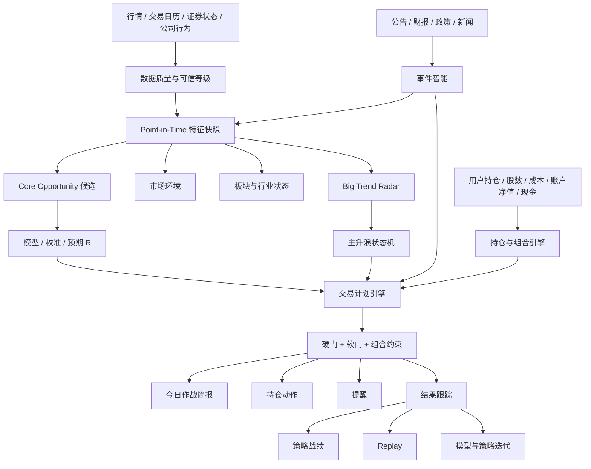
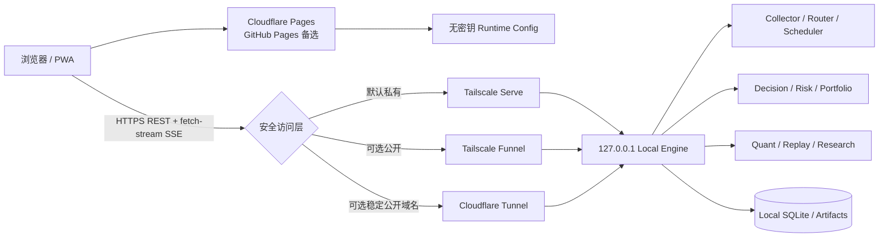

# Stock Tracker v1.1 产品需求、决策引擎与混合部署设计书

> **副标题：A 股优先的个人交易决策驾驶舱**
>
> 文档版本：v1.1（Grill 对齐 + 混合部署重构版）
>
> 文档状态：Design Freeze（v1.1 产品与混合部署合同已冻结；实现验收按 Stage 路线继续）
>
> 对齐日期：2026-08-24
>
> 产品定位：个人交易辅助系统；不承诺收益，当前不直接下单
>
> 市场优先级：**A 股第一；港股通第二；美股第三**
>
> 成本原则：**先按零成本或接近零成本实现；只有在数据质量、覆盖率或时效性得到明确提升时，才考虑每月几十元级升级**
>
> 部署原则：**默认采用“本地数据与决策引擎 + 云端静态网页 + 安全远程访问”；纯云后端是可选升级，不是上线前置条件；Oracle Cloud 不再作为候选路径**
>
> 本文档是产品需求与交付优先级的主来源。量化正确性、Point-in-Time、数据可信等级、回测、模型晋级和失败关闭细节，继续受 `docs/VALIDATED-STRATEGY-ML-LIBRARY.md`、`docs/CODEX-QUANT-FOUNDATION-INTEGRATION.md` 和现有 Quant Foundation 合同约束。

---

## 0. 文档目的与重构结论

本次重构不再把 PRD 写成“能做什么技术的大全”，而是围绕用户每天真正要完成的工作重新组织：

> **今天该怎么操作？有哪些真正值得看的机会？现在能不能买？买多少？什么价格不追？错了在哪里退出？哪些持仓要处理？有没有正在形成的大行情？**

本产品同时坚持两条同等重要的主线：

1. **模型与算法准确率持续提升**：候选识别、排序、概率、趋势状态、事件延续和退出判断都必须不断用真实样本迭代。
2. **把准确率转化为可执行决策**：准确的模型输出必须经过交易计划、风险预算、持仓约束、事件解释和可交易性闸门，才能形成用户动作。

两者不是二选一。产品闭环为：

```text
可信数据
  ↓
独立证据族 / 事件 / 市场与板块上下文
  ↓
规则候选 + 统计/机器学习模型
  ↓
概率校准 + 预期收益/风险评估
  ↓
交易计划 + 持仓与组合闸门
  ↓
今日动作 / 提醒 / 退出管理
  ↓
真实结果、策略战绩、失败归因、Replay
  ↓
下一轮特征、策略与模型迭代
```

旧 v0.4 中有价值的底层算法、数据治理和研究约束没有被否定；它们由算法库、Quant 合同、架构和 Git 历史继续保存。v1.x 的变化是重新确定产品中心、市场优先级、Feature 优先级、部署形态和开发顺序。

---

# 1. 产品 North Star

## 1.1 一句话目标

**把市场、板块、个股、事件、模型与持仓信息压缩成一份可信、可解释、可执行的“今日作战简报”，帮助用户提高扣除成本后的决策质量，同时尽可能识别并持有真正的大级别行情。**

## 1.2 用户的核心任务

产品按以下顺序解决问题：

1. **今天总体应该进攻、防守还是等待？**
2. **现有持仓里，哪些继续持有，哪些预警、减仓或退出？**
3. **今天全市场真正值得看的新机会只有哪些？**
4. **每个机会现在能不能执行？**
5. **执行时买多少、买在哪里、什么价格以上不追、错了在哪里退出？**
6. **有没有板块或个股正在从普通上涨升级成主升浪？**
7. **系统过去同类判断是否真的有效？**
8. **在历史某一天，系统只用当时信息会做出什么判断？**

## 1.3 核心价值排序

以下能力都重要，但交付优先级不同。

### P0：必须同时做好

- 决策动作的实用性；
- 模型和算法准确率；
- 数据真实性与时间正确性；
- 风险与可交易性；
- 大行情识别和持有能力；
- 可解释性与证据链。

### P1：形成长期优势

- 事件智能；
- 策略真实战绩；
- 历史 Replay；
- 失败归因；
- 持仓和组合风险；
- Shadow / Champion-Challenger 迭代闭环。

### P2：在核心链路成熟后增强

- 个性化风险模式；
- 券商只读行情；
- 更多市场；
- 更高级模型；
- 自动执行。

## 1.4 非目标

当前版本明确不做：

- 承诺“预测必涨”或保证收益；
- 将 0—100 分直接解释成胜率；
- 让 LLM 自行生成买卖结论；
- 自动下单；
- 全市场毫秒级或高频交易；
- A/H/US 三市场同时做到同等深度；
- 用大量高度相关指标堆出“高分”；
- 因为模型名字高级就默认更准确；
- 用缺少 Point-in-Time、公司行为、历史 Universe 或成本的数据声称真实策略有效；
- 为了首页好看而伪造实时性、概率或数据完整性；
- 为追求“纯云”强行使用会休眠、无持久化或无法稳定访问 A 股上游的免费服务；
- 将 Oracle Cloud 注册成功作为产品上线依赖。

---

# 2. 目标用户与默认使用画像

## 2.1 市场与交易周期

### A 股：核心市场

- 资源投入最高；
- 主要交易周期为 1—20 个交易日；
- 同时支持持续数周的主升浪持有；
- 重点关注板块主线、龙头/中军、趋势回踩、突破延续、二次启动、政策与公告事件；
- 盘中可能根据提示操作，但不做超短线和高频交易。

### 港股通：机会型补充市场

- 只优先覆盖港股通可交易标的；
- 有明确高质量机会时参与，没有机会可以不交易；
- 不追求与 A 股完全相同的扫描密度；
- 必须考虑延迟行情、价差、流动性、跳空、交易单位和港股交易规则；
- 不照搬 A 股涨停、连板和情绪模型。

### 美股：低频辅助市场

- 仓位和使用频率较低；
- 以 4—12 周中线为主；
- 重点关注行业趋势、财报后延续、相对强弱和事件；
- 不为美股盘中报价消耗与 A 股相同的资源。

## 2.2 用户操作习惯

默认画像：

- 盘中会查看系统并可能执行；
- 不做超短，但好机会希望在数秒至数十秒内获知；
- 同时持有约 5—10 只，必要时可超过 10 只；
- 愿意手动提供：
  - 账户净值；
  - 可用现金；
  - 持仓股票；
  - 持仓股数；
  - 成本价；
- 不要求录入完整历史成交记录；
- 可选录入买入日期、买入理由和对应策略，便于后续复盘；
- 当前不连接券商；
- 未来如果券商能提供行情接口，可优先做只读接入，再单独评估自动执行。

## 2.3 默认风险偏好

默认使用 **BALANCED（平衡）模式**：

- 主方案以风险收益、可执行性和组合约束为准；
- 当某机会只触发“软性阻断”时，可同时显示激进方案；
- 激进方案必须明确更小仓位、更严格失效条件和额外风险；
- 数据无效、停牌、不可成交、关键市场事实缺失等硬阻断永远不能被风险模式绕过。

未来允许用户选择：

```text
CONSERVATIVE
BALANCED
AGGRESSIVE
```

风险模式只能调整软阈值，不能关闭数据、安全和可交易性硬门。

---

# 3. 产品总体架构



## 3.1 两类机会必须分开

产品不得把所有机会混成一个榜单。

### Core Opportunity Radar

目标：

- 少而精；
- 当前或近期可执行；
- 优先优化扣成本净期望、风险和 Precision@K；
- 首页通常只展示 3—5 个。

### Big Trend Radar

目标：

- 识别板块和个股是否正在形成持续数周的大行情；
- 允许早期存在更多误报；
- 重点优化大行情捕获率、提前量和持有质量；
- `EMERGING` 只代表观察，不能单独触发买入。

## 3.2 模型与规则的职责

```text
规则：
- 高召回候选生成
- 市场规则
- 数据硬门
- 风险硬门
- 可交易性
- 明确的结构失效

模型：
- 候选质量排序
- 非线性交互
- P(Target before Stop)
- Expected R
- 主升浪持续概率
- 事件延续概率
- 趋势破坏风险

校准：
- 把模型分数映射为可信概率
- 判断模型是否过度自信
```

模型不能替代市场规则和数据质量；规则也不能因为可解释就拒绝持续的模型改进。

## 3.3 部署架构决策

本项目默认采用：

```text
HYBRID_PRIVATE
=
本地数据与决策引擎
+
云端静态网页
+
安全远程访问
```

完整规格见 `docs/HYBRID-DEPLOYMENT-ARCHITECTURE-v1.md`。

该决策的含义是：

- 本地机器是行情、调度、SQLite、Artifact、模型、持仓和决策事实的权威来源；
- 云端只托管 HTML、CSS、JavaScript 和无密钥 Runtime Config；
- 云端网页可始终打开，但本地引擎离线时必须显示 `ENGINE_OFFLINE` 或 `STALE`；
- 纯云部署保留为实验和未来升级，不作为 v1.1 上线前置条件；
- Oracle Cloud 因实际注册不可用，明确从候选方案中移除。

## 3.4 默认部署拓扑



### 云端静态网页

首选 Cloudflare Pages 的 `pages.dev` 默认域名，GitHub Pages 作为备选。静态网页不得包含任何 Token、账户、持仓、成本、券商凭据或 Model Registry 写权限；默认不加载未经独立安全 Review 的第三方脚本、Analytics、Tag Manager 或远程字体。

### 本地引擎

本地引擎必须：

- 默认只监听 `127.0.0.1`；
- 不要求公网 IP、家庭路由器端口映射或直接监听 `0.0.0.0`；
- 在 Windows Task Scheduler、Windows Service、systemd 或 NAS 容器中开机自启；
- 交易时段避免休眠；
- 崩溃、断电或网络恢复后自动启动 Collector 和访问层；
- 使用持久磁盘保存 SQLite、Artifact、Manifest、模型和日志；
- 保留本地同源页面作为远程访问故障时的恢复入口。

## 3.5 支持的部署模式

| 模式 | 前端 | API/引擎 | 访问范围 | 产品定位 |
|---|---|---|---|---|
| `LOCAL_ONLY` | 本地同源 | 本地 | 单机/LAN 恢复 | 开发、调试、应急 |
| `HYBRID_PRIVATE` | 云端静态 | 本地 | Tailnet 内 | **默认生产模式** |
| `HYBRID_PUBLIC_AUTH` | 云端静态 | 本地 | 公开互联网 | 少量朋友、强认证 |
| `PURE_CLOUD_EXPERIMENTAL` | 云端 | 云端 | 公开/私有 | 通过门禁后才可升级 |

### 默认远程访问：Tailscale Serve

`HYBRID_PRIVATE` 优先使用 Tailscale Serve：

- 只有加入 Tailnet 且通过 ACL 的设备和用户才能连接；
- 不需要购买域名；
- 后端仍保留 `STOCK_TRACKER_PRIVATE_ACCESS` 作为纵深防御，直到 Tailscale 身份认证完成独立 Review；
- 适合用户本人多设备和少量可信朋友。

允许先落地 Bootstrap Lane：Tailscale Serve 直接代理现有本地整站，使前端与 API 保持 same-origin，不需要等待 CORS 即可获得私有远程访问。完成 H1/H2 后再进入 Target Lane，把静态前端部署到 Cloudflare Pages/GitHub Pages，并跨域连接同一 Local Engine。Bootstrap Lane 不能冒充云端静态部署已完成；实际网络若无法稳定访问 Pages/GitHub Pages，也可以长期使用 Tailscale Serve 整站同源模式。

### 可选公开访问

当朋友不方便加入 Tailnet 时，可以选择：

1. Tailscale Funnel：无需自有域名，但入口公开，必须启用强 Bearer Token、精确 CORS、限流和审计；
2. Cloudflare Tunnel + 自有域名：适合需要稳定公开 Hostname 时使用，可叠加 Cloudflare Access；
3. Quick Tunnel 只能开发测试，不得用于生产，因为 URL 不稳定且不支持 SSE。

## 3.6 前端与 API 解耦合同

当前前端不能长期依赖写死的相对路径 `/api/...`。目标 Runtime Config：

```javascript
window.STOCK_TRACKER_RUNTIME = Object.freeze({
  deploymentMode: "HYBRID_PRIVATE",
  apiBaseUrl: "https://device.tailnet-name.ts.net",
  allowedApiOrigins: ["https://device.tailnet-name.ts.net"],
  ssePath: "/api/stream",
  frontendBuild: "<commit-sha>",
  expectedApiMajor: 1,
  expectedEngineId: "<local-engine-id>",
  allowApiOriginOverride: false,
  allowPrivateBrowserCache: false
});
```

要求：

- `apiBaseUrl`、`allowedApiOrigins` 和 `expectedEngineId` 不是密钥；
- Token 不得进入 Runtime Config；
- 未配置 `apiBaseUrl` 时才回退到同源；
- 生产构建的 API Origin 必须被固定在 `allowedApiOrigins`，默认禁止任意覆盖；
- REST、SSE 和健康检查使用同一个 URL Builder；
- Token 按规范化 API Origin 分区保存在当前会话，Origin 变化时清除并重新认证；
- UI 明确显示当前 Engine Host、Engine ID、Commit、数据时间和连接模式；
- 前端必须验证 API Major、Engine ID 和部署 Commit；
- 配置或版本不兼容时失败关闭，不静默连接其他后端，也不把 Token 发往未固定 Origin。

## 3.7 CORS、认证与 SSE

混合部署默认跨域，Backend 必须提供正式 CORS：

```text
OPTIONS preflight
精确 Access-Control-Allow-Origin
Vary: Origin
允许 Authorization / Content-Type / Accept
允许 GET / POST / PUT / PATCH / DELETE / OPTIONS
```

约束：

- 私有 API 不得使用 `Access-Control-Allow-Origin: *`；
- 非 Allowlist Origin、`null` Origin 和未知 Host 默认拒绝；
- Allowlist 只能来自本地配置；
- 家庭路由器不得做端口转发；
- Token 只保存在当前浏览器 `sessionStorage`，不得进入 URL、日志、Git 或静态 Bundle；
- SSE 继续使用 `fetch + ReadableStream + Authorization Header`，不回退到无法发送 Header 的原生 `EventSource`；
- 401、CORS、Backend Offline、Tunnel Offline 和数据过期必须显示不同状态。

## 3.8 私有数据边界

以下数据默认只能留在本地引擎：

```text
account_equity
available_cash
positions
average_cost
optional_notes
private watchlist
private DecisionBrief / TradePlan
SQLite
raw artifacts
model registry write path
broker credentials（未来）
```

云端只允许保存：

- 静态前端资源；
- 无密钥 Runtime Config；
- Build/Commit Metadata；
- 不含账户与持仓的公开说明。

浏览器默认不得把私有 API 响应持久化到 `localStorage`、IndexedDB 或 Service Worker Cache。最后一次公共市场摘要可以本地缓存，但必须带 `as_of`，并且不能被当成当前可执行建议。

## 3.9 离线与过期语义

云端网页“能打开”不等于引擎在线。前端必须区分：

```text
ONLINE
DEGRADED
STALE
ENGINE_OFFLINE
NETWORK_OFFLINE
AUTH_REQUIRED
AUTH_FAILED
CORS_BLOCKED
API_VERSION_MISMATCH
TUNNEL_UNAVAILABLE
```

当本地引擎不可达或数据过期时：

- 页面顶部显示明显状态；
- 所有 `EXECUTABLE` 降级为 `DATA_BLOCKED` 或 `STALE`；
- 不继续展示上一次私有持仓建议为当前建议；
- 可以显示最后公共摘要，但必须显示真实时间；
- 禁止用云端页面时间伪造数据更新时间。

目标健康端点：

```text
GET /api/runtime/health
```

至少返回 `engine_id`、`engine_version`、`commit_id`、`deployment_mode`、`started_at`、`last_collection_at`、`data_as_of`、`scheduler_state`、`provider_summary`、`database_state`、`sse_available` 和 `api_major`。

## 3.10 纯云升级门禁

纯云只有同时满足以下条件，才允许从 `EXPERIMENTAL` 升级为主模式：

1. 至少连续 10 个 A 股交易日真实运行验证；
2. 目标区域内主要 Provider 可达，错误率和延迟符合配置门槛；
3. HOT/WARM/COLD 在交易时段不会休眠；
4. SQLite、Artifact、Manifest 和模型使用可靠持久存储；
5. 重启、重部署和节点迁移不丢数据；
6. 私有 API、CORS、认证、日志脱敏和备份通过安全 Review；
7. 端到端延迟不显著差于本地；
8. 月成本符合“几十元级且价值可证明”的原则；
9. 有从纯云回退到本地的恢复方案。

Render 免费 Web Service、Cloudflare Workers/Pages Functions 等仍可用于 Demo 或轻量无状态能力，但不能直接承担持续 Collector、SQLite 和完整研究任务。

---

# 4. 首页：今日作战简报

首页采用已经确认的 **A + D 混合设计**：

- A：结构化“今日作战简报”；
- D：AI 交易参谋式摘要；
- 自然语言只解释结构化结果，不自行制造结论。

## 4.1 第一屏必须回答

用户在 60 秒内应能回答：

1. 今天总体应进攻、防守还是等待？
2. 哪些持仓需要处理？
3. 今天真正值得看的新机会是哪 3—5 个？
4. 哪些机会还不能买，差什么条件？
5. 有没有正在形成的大行情？
6. 今天最需要避免什么？

## 4.2 第一屏结构

```text
今日作战简报
├── AI 参谋摘要
├── 市场姿态
│   ├── Regime
│   ├── 建议进攻度
│   ├── 最强主线
│   └── 今日主要风险
├── 今天建议你做
│   ├── 可执行机会
│   ├── 等回踩
│   ├── 等突破
│   └── 持仓处理
├── Core Opportunities（3—5）
├── Big Trend Radar
├── 今日不要做
├── 未来事件风险
└── 数据与模型证据状态
```

## 4.3 首页文案示例

> **今天建议以持仓管理为主，只选择性开新仓。**
> A 股处于震荡轮动，机器人方向仍强，但部分高位股拥挤。现有持仓中 1 只需要减仓观察；全市场只有 2 个新机会达到可执行条件。机器人板块的主升浪状态由 `EMERGING` 升级为 `CONFIRMING`，但不建议追高，优先等待第一次有效回踩。

## 4.4 视觉权重

采用已经确认的 **动作/状态为主，数字为辅**：

首页优先显示：

```text
A级机会
当前可执行
等回踩
风险中等
模型证据较强
主升浪确认中
```

数字放在辅助位置：

```text
Opportunity 84
Timing 76
Risk 41
Model Score 0.78
Calibrated Probability 64% / 暂不可用
Expected R 2.1
```

详情页再展示完整计算、证据、版本和历史表现。

---

# 5. 统一决策输出合同

## 5.1 动作状态

系统不使用模糊的单一“强买—强卖”作为核心。

```text
WATCH
WAIT_PULLBACK
WAIT_BREAKOUT
EXECUTABLE
HOLD
WARNING
TRIM
PARTIAL_TAKE_PROFIT
TREND_RUNNER
EXIT
AVOID
DATA_BLOCKED
```

### 推荐的人话映射

| 状态 | UI 主文案 |
|---|---|
| WATCH | 值得观察 |
| WAIT_PULLBACK | 等回踩确认 |
| WAIT_BREAKOUT | 等突破确认 |
| EXECUTABLE | 当前具备执行条件 |
| HOLD | 继续持有 |
| WARNING | 风险上升，密切观察 |
| TRIM | 建议降低仓位 |
| PARTIAL_TAKE_PROFIT | 建议部分止盈 |
| TREND_RUNNER | 保留趋势仓 |
| EXIT | 原逻辑失效，建议退出 |
| AVOID | 当前不值得参与 |
| DATA_BLOCKED | 数据或可交易性不足，禁止决策 |

最强信号的标准表达为：

```text
当前状态：可执行
机会等级：A
建议动作：允许开仓
```

不使用 `Strong Buy` 作为产品核心措辞。

## 5.2 每个机会必须包含

```text
symbol
market
as_of
action_state
opportunity_grade
strategy_id
market_regime
sector_state
big_trend_state

model_tendency
model_score
calibrated_probability | null
probability_evidence_level
confidence

entry_zone
trigger_condition
no_chase_above
invalidation_price
target_1
target_2
expected_r
suggested_risk_budget
suggested_position_pct
suggested_shares

positive_reasons[]
negative_reasons[]
hard_blockers[]
soft_blockers[]
next_trigger
freshness
data_status
evidence_id
model_version
strategy_version
```

## 5.3 主方案与激进方案

默认展示：

### 主方案：BALANCED

- 使用正常仓位上限；
- 要求标准确认；
- 软风险较高时等待。

### 激进方案：仅在允许时展示

只允许在以下条件同时满足时出现：

- 没有任何硬阻断；
- 数据有效；
- 标的可交易；
- 最低赔率仍成立；
- 激进方案仓位显著低于主方案；
- 失效位明确；
- UI 明确标记额外风险。

例如：

```text
主方案：等待 24.10—24.40 回踩止跌
激进方案：24.80 上方放量确认后轻仓试错，最大风险预算减半
```

---

# 6. Core Opportunity Radar

## 6.1 产品目标

从全市场高召回扫描中，筛出少量真正值得用户投入注意力的机会。

后台可以保留 10—20 个候选，首页通常只展示 3—5 个。

## 6.2 候选来源

首版优先：

- S1 放量突破；
- S2 趋势回踩；
- S3 事件延续；
- 板块龙头/中军；
- 二次启动；
- Big Trend 状态升级后的可执行候选。

低位反转默认低优先级，不能因 RSI 超卖单独入选。

## 6.3 三阶段筛选

```text
Stage 1：高召回规则候选
Stage 2：模型与证据质量排序
Stage 3：交易计划、风险和组合闸门
```

## 6.4 排序原则

有可信校准概率时：

```text
ExpectedR
× CalibratedProbabilityQuality
× Freshness
× RegimeFit
× LiquidityQuality
× Confidence
- Crowding
- PortfolioConcentration
```

校准概率不可用时：

- `success_probability = null`；
- 进入 `RULE_EVIDENCE` 排序模式；
- 不得把 `Opportunity / 100` 当概率；
- UI 显示模型倾向和证据等级；
- 不能声称历史成功率。

## 6.5 Top-K 多样性

默认约束：

- 单一板块不能占满首页；
- 同一高度相关主题需要去重；
- 同一股票多策略命中时合并展示；
- 合并后保留主策略、辅策略和共同证据；
- Core Opportunity 与 Big Trend 不重复占两个位置，除非它们表达不同动作。

## 6.6 Core Radar KPI

- Precision@3 / Precision@5；
- 扣成本 Net Expectancy；
- Expected R 与实际 R 的误差；
- 假突破率；
- 触发后最大不利波动；
- 最大回撤；
- Score bucket 单调性；
- 不同 Regime 下稳定性；
- 被“禁止追高”拦截后的结果改善。

---

# 7. Big Trend Radar / 主升浪雷达

## 7.1 产品目标

持续回答：

> **哪些板块和个股正在从普通上涨演变成可能持续数周的大级别行情？**

该模块用于弥补普通高胜率策略容易错过早期大行情的问题。

## 7.2 首版覆盖

按照已确认的优先级，首版实现：

1. **板块大行情识别**；
2. **个股大行情识别**；
3. **龙头/中军识别**；
4. **二次启动识别**。

低位最早期启动作为 `Early Radar` 研究能力，先观察，不直接形成可执行信号。

## 7.3 状态机

```text
NONE
  ↓
EMERGING
  ↓
CONFIRMING
  ↓
TRENDING
  ↓
MATURE
  ↓
DISTRIBUTING
  ↓
BROKEN
```

允许状态回退，但必须记录原因和时间。

### 状态语义

| 状态 | 含义 | 产品动作 |
|---|---|---|
| NONE | 无明显大趋势证据 | 不展示或普通观察 |
| EMERGING | 早期证据出现，误报可能较高 | 加入早期观察，不直接买 |
| CONFIRMING | 广度、相对强弱、量能或事件得到更多确认 | 提升优先级，寻找交易计划 |
| TRENDING | 趋势具备持续性，多证据共振 | 允许 Core Radar 优先，支持趋势仓 |
| MATURE | 趋势仍强但拥挤和后期风险上升 | 不追高，已有仓分批管理 |
| DISTRIBUTING | 扩散减弱、龙头/中军分歧、派发迹象 | WARNING / TRIM |
| BROKEN | 趋势核心结构失效 | 关闭 Trend Runner，评估 EXIT |

## 7.4 独立证据族

Big Trend 不得只是把突破分数放大。至少使用：

- 板块相对强弱持续性；
- 板块广度扩张；
- 板块成交额占比；
- 龙头强度；
- 中军稳定性；
- 跟随股扩散；
- 个股相对板块强弱；
- 趋势质量；
- 突破后保留率；
- 回踩质量；
- 事件或产业催化；
- 拥挤和加速；
- 分歧/派发特征；
- 不同 Regime 的适配度。

## 7.5 与 Core Radar 的冲突处理

| Core | Big Trend | 动作 |
|---|---|---|
| 不可执行 | EMERGING | 只观察 |
| 等回踩 | CONFIRMING | 提高关注，等待计划条件 |
| 可执行 | CONFIRMING/TRENDING | 高优先级候选 |
| TRIM | TRENDING | 部分止盈 + 保留 Trend Runner |
| HOLD | DISTRIBUTING | WARNING，收紧保护 |
| 任意 | BROKEN | 关闭趋势仓逻辑，重新评估退出 |

Big Trend 永远不能绕过数据、停牌、流动性、赔率和组合风险硬门。

## 7.6 主升浪 KPI

模型必须同时评估：

- `BigMoveCapture@H`：真实大行情中提前被发现的比例；
- `LeadTime`：从首次识别到大行情确认的提前量；
- `FalseDiscoveryRate`：早期雷达误报率；
- `StageTransitionAccuracy`；
- `MaxAdverseExcursionBeforeTrend`；
- `RunnerContribution`：趋势仓对总收益的贡献；
- `PrematureExitRate`：过早退出真正大趋势的比例；
- `MatureChaseRate`：趋势后期追高比例。

---

# 8. Event Intelligence / 事件智能

## 8.1 定位

事件引擎是核心能力，不是新闻列表。

它必须回答：

1. 发生了什么？
2. 来源是否权威？
3. 是新增信息还是旧闻？
4. 影响哪些公司、板块和产业链？
5. 影响程度有多大？
6. 市场是否已经 Price-in？
7. 现在应观察、等待确认，还是进入交易计划？

## 8.2 事件来源优先级

```text
官方交易所 / 法定披露
公司公告 / 财报 / IR
政府与监管部门
高可信新闻源
普通新闻聚合
社交或传闻
```

传闻只能提示，默认不能把机会升级为 `EXECUTABLE`。

## 8.3 首批事件类型

A 股优先：

- 业绩预告与财报；
- 大额订单/合同；
- 回购与增持；
- 并购重组；
- 股权激励；
- 产能与价格变化；
- 政策与产业支持；
- 风险警示、监管、减持、解禁；
- 停复牌与重大交易状态；
- 行业供需变化。

港股通：

- 盈利预告；
- HKEX 公告；
- 配股、供股、回购；
- 停牌及流动性事件；
- A/H 联动事件。

美股：

- 财报；
- Guidance；
- 8-K、10-Q、10-K；
- 产品、监管和诉讼；
- 行业与宏观事件。

## 8.4 结构化事件合同

```text
event_id
source_type
source_uri
published_at
known_at
usable_from
market
symbols[]
sectors[]
event_type

authority
materiality
novelty
surprise
specificity
direction
confirmed
extraction_confidence

price_reaction
volume_reaction
sector_confirmation
price_in_state
decay_half_life

raw_artifact_id
parser_version
evidence_id
```

## 8.5 事件处理策略

采用已经确认的分级策略：

- 普通事件：只提高关注，必须等待价格和板块确认；
- 高可信、高影响事件：可以更快从 `WATCH` 升级为 `ARMED`；
- 极强事件仍不能绕过：
  - 数据有效性；
  - 可交易性；
  - 追高限制；
  - 最低赔率；
  - 流动性；
  - 组合集中度。

## 8.6 LLM 使用边界

LLM 可以：

- 结构化抽取；
- 实体映射；
- 事件分类；
- 摘要；
- 对比新旧公告；
- 生成自然语言解释。

LLM 不可以：

- 自行给买卖分；
- 添加原文不存在的数据；
- 将未经确认的信息标为事实；
- 绕过确定性规则；
- 直接改变生产模型状态。

---

# 9. 持仓、仓位与 Exit Engine

## 9.1 用户输入

用户可以手动维护：

```text
account_equity
available_cash

position:
- symbol
- market
- shares
- average_cost
- optional_entry_date
- optional_strategy_id
- optional_notes
```

默认由本地引擎保存，不上传券商凭据。混合部署下，账户净值、现金、持仓、股数、成本、备注、私有 Watchlist、私有 DecisionBrief 和建议股数均不得进入云端静态站点、公开日志或默认浏览器持久缓存。

## 9.2 持仓页必须回答

- 继续持有还是处理？
- 当前盈利/亏损；
- 原始交易逻辑是否仍成立；
- 距失效位多少；
- 当前风险贡献；
- 板块/主题是否过度集中；
- 是否应该移动保护位；
- 是否适合部分止盈；
- 是否应保留 Trend Runner；
- 新机会出现时账户是否还有风险容量。

## 9.3 仓位计算

用户选择“按风险计算”，因此采用：

```text
per_trade_risk_amount = account_equity × risk_budget_pct

raw_shares =
    per_trade_risk_amount
    / abs(entry_price - invalidation_price)

suggested_shares =
    min(
        raw_shares,
        max_position_pct_limit,
        available_cash_limit,
        liquidity_limit,
        portfolio_heat_limit
    )
```

必须同时给出：

- 建议仓位百分比；
- 建议股数；
- 最大预估损失；
- 失效位；
- 滑点和费用假设；
- 因资金或交易单位取整后的实际风险。

最大仓位设置为可配置硬上限，模型不能自行突破。

## 9.4 Exit Engine 独立于 Entry

退出不能使用 `-EntryScore`。

标准生命周期：

```text
HOLD
  ↓
WARNING
  ↓
TRIM
  ↓
EXIT
```

严重事件或核心逻辑直接失效时，允许：

```text
HOLD → EXIT
```

但必须记录明确原因。

## 9.5 部分止盈 + Trend Runner

按照已确认的策略：

- 普通目标或过热出现后，可建议部分止盈；
- 剩余仓位转为 Trend Runner；
- Trend Runner 根据趋势结构、板块状态和事件状态退出；
- 不因普通短期波动轻易清仓；
- 当 Big Trend 进入 `DISTRIBUTING` 时收紧；
- 当 Big Trend 进入 `BROKEN` 时关闭趋势仓逻辑。

示例：

```text
初始仓位 100%
  ↓
目标 1 或拥挤上升
  ↓
止盈 30%—50%
  +
保留 50%—70% Trend Runner
  ↓
趋势破坏 / 板块退潮 / 重大负面 → EXIT
```

具体比例由市场、策略、波动和用户上限配置，不在 PRD 中写死单一最优值。

## 9.6 成本价的正确使用

成本价用于：

- 真实盈亏；
- 已实现/未实现 R；
- 盈利保护；
- 用户执行复盘。

成本价不能改变市场结构的客观判断。不能因为用户被套就自动把无效策略继续标为 HOLD。

## 9.7 组合风险

至少计算：

- Portfolio Heat；
- 单股风险贡献；
- 行业集中；
- 主题集中；
- 高相关持仓；
- 同一事件风险暴露；
- 可用现金；
- 新机会加入后的边际风险。

当组合风险已高时，即使个股可执行，也可以输出：

```text
个股条件通过，但组合风险容量不足，暂不建议加仓
```

---

# 10. “为什么不能买”与交易计划

## 10.1 这是核心产品，不是附属解释

每个机会必须同时生成：

- 为什么值得看；
- 为什么是现在；
- 为什么还不能买；
- 什么条件满足后重新评估；
- 什么情况下机会永久失效。

## 10.2 常见阻断原因

```text
数据过期或来源异常
停牌 / 不可交易
价格过度扩张
跳空过大
赔率不足
流动性不足
板块进入高潮或退潮
成交没有确认
事件风险过高
财报/公告时间风险
组合集中度过高
模型证据不足
概率未校准
```

## 10.3 完整交易计划

```text
主动作
机会等级
当前状态
入场区间
触发条件
不追价
失效位
目标 1
目标 2
预期 R
建议风险预算
建议仓位
建议股数
持有周期
部分止盈规则
Trend Runner 规则
下一触发条件
硬阻断
软阻断
```

---

# 11. Strategy Scoreboard / 策略战绩

## 11.1 产品目标

用户必须知道：

> **这套策略过去是否真的有效？最近是否正在失效？当前市场状态下是否仍值得信任？**

## 11.2 统计维度

按以下身份严格拆分：

```text
market
strategy_id
strategy_version
horizon
model_version
regime
sector_group
data_trust_tier
time_window
```

A 股、港股通和美股不得共享一个模糊胜率。

## 11.3 必须展示

- 独立样本数；
- 命中率；
- 平均 R；
- 中位 R；
- Net Expectancy；
- Profit Factor；
- 最大回撤；
- Worst 5%；
- Precision@K；
- 假突破率；
- 平均持有周期；
- Brier / LogLoss / ECE；
- 分数桶单调性；
- 最近窗口与长期窗口差异；
- 当前 Regime 下表现；
- 数据可信等级；
- 状态：
  - ACTIVE；
  - WATCH；
  - DOWNWEIGHTED；
  - SHADOW；
  - BLOCKED；
  - RETIRED。

## 11.4 降权和停用

当最近独立样本出现以下问题时：

- 净期望显著转负；
- 校准恶化；
- 高分桶不再优于低分桶；
- 假突破率异常；
- 最大回撤明显恶化；
- 某 Regime 持续失效；
- 数据覆盖变化；

系统应自动建议：

```text
ACTIVE → WATCH → DOWNWEIGHTED → BLOCKED
```

自动降权规则必须版本化；模型不能静默改写生产权重。

---

# 12. Replay / 历史场景回放

## 12.1 产品目标

Replay 同时服务两个目标：

1. 用户学习：理解当时为什么应该做或不做；
2. 系统审计：确认没有偷看未来。

## 12.2 回放内容

用户选择历史日期后，系统只展示当时已知信息：

- 市场 Regime；
- 板块状态；
- Core Opportunities；
- Big Trend 状态；
- 公告和事件；
- 持仓动作；
- 交易计划；
- 数据健康；
- 模型版本；
- 当时可见的概率和证据；
- 后续逐日发展。

## 12.3 严格约束

- 不使用未来修订；
- 不使用当前行业成分回填过去；
- 不使用后续公告；
- 不使用未来公司行为信息；
- 只显示当时实际可交易的 Universe；
- Replay 使用的 commit、模型、配置和数据快照可复现；
- 一旦发现未来信息，回放标为 INVALID。

## 12.4 Replay 交互

```text
选择日期
→ 查看当日作战简报
→ 按交易日逐步前进
→ 查看状态变化
→ 显示系统原判断与后续结果
→ 查看失败归因
```

---

# 13. 模型准确率与持续迭代体系

## 13.1 模型准确率是核心竞争力

模型准确率必须持续迭代，但“准确”不能只用一个胜率描述。

不同模块有不同目标。

### Core Opportunity Model

预测：

```text
P(Target before Stop)
Expected R
Expected MAE / MFE
```

重点：

- 校准；
- Precision@K；
- 扣成本净期望；
- 回撤；
- 稳定性。

### Big Trend Model

预测：

```text
P(进入持续趋势 | 当前状态)
P(未来 H 日出现大级别 MFE)
P(当前趋势继续)
```

重点：

- 大行情捕获率；
- 提前量；
- 误报率；
- 过早退出率。

### Event Continuation Model

预测：

```text
P(事件后趋势延续)
```

而不是简单预测事件“利好/利空”。

### Exit / Trend Break Model

预测：

```text
P(趋势结构在未来窗口内失效)
```

退出模型独立训练，不是入场模型取负。

## 13.2 推荐生产梯队

```text
Rule-only baseline
Logistic Regression baseline
LightGBM / 等价树模型 Champion Candidate
DoubleEnsemble / TRA Challenger
复杂深度模型 Shadow Research
```

只有复杂模型在相同数据、标签、成本、Universe 和切分下稳定击败简单基线，才有资格晋级。

## 13.3 概率显示采用双层结构

按照已确认的方案：

```text
模型倾向：强 / 中性 / 弱
Model Score：0..1

历史校准成功概率：0..1 | null
概率证据等级：LOW / MEDIUM / HIGH
```

当样本或校准不足：

```text
success_probability = null
UI：真实样本或校准证据不足，暂不展示概率
```

模型分数仍可用于研究和排序，但不能伪装成胜率。

## 13.4 训练与验证

必须使用：

- Point-in-Time 数据；
- next executable price；
- Triple Barrier / Target-before-stop；
- expanding 或 rolling walk-forward；
- purge / gap / embargo；
- 完整交易成本；
- 历史 Universe；
- 退市样本；
- 公司行为；
- Frozen Holdout；
- time-respecting calibration；
- 负面对照；
- multiple-testing 记录。

禁止随机 KFold 作为金融时序模型的正式验收。

## 13.5 准确率迭代闭环

每次迭代必须明确：

```text
hypothesis
feature_change
label_change
data_snapshot
market
strategy
horizon
training_window
validation_window
holdout
costs
number_of_trials
baseline
result
promotion_decision
```

评估顺序：

1. 数据和标签是否正确；
2. 是否比 Rule / Logistic 基线好；
3. 是否来自新增信息，而不是已有趋势因子的变体；
4. 概率是否更准；
5. 净期望是否改善；
6. 回撤和尾部风险是否恶化；
7. 不同 Regime 是否稳定；
8. 是否通过全新 Shadow 样本。

## 13.6 特征优先级

优先增加独立信息：

- Market Regime；
- Sector Breadth；
- Sector Stage；
- Stock vs Market RS；
- Stock vs Sector RS；
- Leader / Medium-core / Follower；
- Turnover-conditioned momentum/reversal；
- Crowding；
- Overextension；
- Event；
- Earnings；
- Liquidity；
- Gap；
- Price-limit structure；
- Data Quality；
- Portfolio concentration。

不优先增加第 N 个高度相关 RSI/MA 变体。

---

# 14. 数据架构与可信等级

## 14.1 准确率的前提是数据正确

“接口返回成功”不等于“可用于模型训练”。

系统维持两条车道：

```text
运行车道
- 页面展示
- 候选发现
- 盘中状态
- 持仓提醒

研究车道
- 原始字节
- Manifest
- 确定性解析
- PIT Snapshot
- 回测
- 校准
- 模型晋级
```

运行缓存不能自动升级为正式训练数据。

混合部署增加一条同等重要的边界：

```text
云端静态网页 = 展示与控制入口
本地引擎 = 运行事实、私有数据与决策事实权威来源
```

云端网页成功加载不能升级数据可信等级，也不能证明 Collector 在线。只有本地引擎返回的 `as_of`、`data_status`、`freshness`、`evidence_id` 和 Runtime Health 才能决定页面是否允许显示当前动作。

## 14.2 数据可信等级

| Tier | 含义 | 允许用途 |
|---|---|---|
| T0 UNKNOWN | 来源、时间或身份不完整 | 故障排查 |
| T1 BEST_EFFORT | 来源和基本字段可追踪 | UI、候选发现 |
| T2 OPERATIONAL_VERIFIED | 多源/收盘核对、状态和新鲜度可靠 | 规则信号、Paper/Shadow |
| T3 RESEARCH_GRADE | 原始数据、Manifest、PIT 日历/Universe/证券状态/公司行为完整 | 回测、训练、校准 |
| T4 FROZEN_HOLDOUT | T3 + 首次暴露前冻结 | 最终模型晋级 |

概率和真实策略战绩必须明确引用 Tier。

## 14.3 A 股优先数据顺序

### 第一组：立即影响产品可用性

- 实时/准实时报价；
- 日线与必要分钟线；
- 交易日历；
- 停复牌和风险警示；
- 复权与公司行为；
- 指数；
- 行业和板块；
- 港股通可交易名单；
- 官方公告。

### 第二组：提升信号质量

- 历史行业/概念成分；
- 市场广度；
- 板块成交额占比；
- 涨跌停结构；
- 解禁和重要事件日历；
- 财报与经营指标；
- 龙虎榜等辅助数据。

供应商自定义“主力资金”只能作为低权重特征，不能成为单点触发。

## 14.4 港股通和美股的数据策略

港股通：

- 只覆盖可交易标的；
- 显示真实延迟；
- 延迟数据不能产生秒级 Timing 文案；
- 价差、流动性和跳空进入风险模型。

美股：

- 日线、行业、财报和 SEC 事件优先；
- 中线周期不追求无意义的秒级刷新；
- 盘中数据主要用于风险距离和重大波动提醒。

## 14.5 免费优先和付费升级条件

默认使用免费或接近免费的数据源。

只有满足以下之一才考虑每月几十元级升级：

- A 股 HOT 行情稳定性显著提高；
- 交易日历、公司行为或历史 Universe 覆盖得到实质改善；
- 官方事件抓取的完整性和时效性明显提高；
- 免费源频繁中断并直接影响核心功能；
- 可量化证明新数据使真实样本外表现改善。

每次升级必须记录：

```text
cost
coverage_before/after
latency_before/after
error_rate_before/after
data_quality_before/after
model_or_product_impact
```

## 14.6 Broker Adapter 路线

当前：

```text
PUBLIC_PROVIDER_ONLY
```

未来若券商提供现有账户内行情：

```text
BROKER_QUOTE_READ_ONLY
```

之后才可能评估：

```text
PAPER_EXECUTION
MANUAL_CONFIRM_EXECUTION
AUTOMATED_EXECUTION
```

自动执行不属于 v1.1 范围，必须另立安全、权限、风控、审计和回滚规格。

---

# 15. 时效、扫描与提醒

## 15.1 使用场景

用户不做超短线，但好机会希望尽快获知，因此延迟目标为：

- A 股持仓和接近触发的机会：数秒至数十秒；
- 全市场候选发现：几十秒至数分钟；
- 日线和研究数据：按收盘完整性优先；
- 港股通和美股：按真实源能力，不伪装实时。

这些目标只在本地引擎、Scheduler、Provider 和安全访问层均在线时成立。云端静态网页的加载延迟不得被当作行情延迟；本地引擎离线、休眠或 Tunnel 中断时，页面必须在健康检查超时后进入 `ENGINE_OFFLINE`、`TUNNEL_UNAVAILABLE` 或 `STALE`。

## 15.2 HOT / WARM / COLD

### HOT

- 当前持仓；
- Core Radar 的 `EXECUTABLE` / `WAIT_*`；
- Big Trend `CONFIRMING` / `TRENDING`；
- 重大事件影响标的。

### WARM

- 高质量观察池；
- Big Trend `EMERGING`；
- 强板块成分；
- 接近交易计划条件。

### COLD

- 全市场发现扫描；
- 低频更新；
- 只负责寻找新候选。

## 15.3 提醒触发

只在有意义的变化发生时提醒：

- `WAIT_* → EXECUTABLE`；
- 到达入场区；
- 突破触发；
- 超过不追价；
- `HOLD → WARNING/TRIM/EXIT`；
- Big Trend 状态升级或破坏；
- 重大事件；
- 数据源异常；
- 组合风险超过阈值。

同一状态不重复轰炸。

## 15.4 默认提醒渠道

v1.1 优先：

- 站内提醒；
- 浏览器通知；
- 本地系统通知。

外部消息渠道后续按成本与稳定性评估。

---

# 16. 信息架构

## 16.1 一级导航

```text
今日
机会
主升浪
持仓
事件
策略战绩
Replay
研究与设置
```

## 16.2 页面职责

### 今日

回答“今天该怎么操作”。

### 机会

展示 Core Opportunity，按状态而不是单一总分分组。

### 主升浪

展示板块、个股、龙头和二次启动状态。

### 持仓

展示账户风险、个股动作、组合暴露和建议股数。

### 事件

展示官方事件、影响对象、Price-in 状态和下一确认条件。

### 策略战绩

展示策略是否有效、最近是否失效、概率是否校准。

### Replay

在 Point-in-Time 条件下重放历史。

### 研究与设置

管理风险模式、仓位上限、数据源、模型状态和证据。

---

# 17. 核心数据对象

## 17.1 UserPortfolioProfile

```text
profile_id
account_equity
available_cash
risk_mode
per_trade_risk_pct
max_position_pct
max_portfolio_heat_pct
max_sector_pct
max_theme_pct
updated_at
```

## 17.2 Position

```text
position_id
symbol
market
shares
average_cost
optional_entry_date
optional_strategy_id
optional_notes
updated_at
```

## 17.3 DecisionBrief

```text
brief_id
as_of
market_posture
aggression_level
ai_summary
actions[]
core_opportunities[]
big_trend_updates[]
holding_actions[]
avoid_reasons[]
event_risks[]
data_health
evidence_id
```

## 17.4 TradePlan

```text
plan_id
symbol
strategy_id
action_state
entry_zone
trigger_condition
no_chase_above
invalidation
targets[]
expected_r
risk_budget
position_pct
shares
balanced_plan
optional_aggressive_plan
hard_blockers[]
soft_blockers[]
valid_until
```

## 17.5 BigTrendSignal

```text
trend_id
scope: sector | stock
entity_id
stage
stage_started_at
trend_score
persistence_score
breadth
relative_strength
leader_quality
catalyst
crowding
distribution_risk
positive_evidence[]
negative_evidence[]
next_transition_conditions[]
evidence_id
```

## 17.6 EventInsight

```text
event_id
event_type
source
published_at
known_at
usable_from
affected_entities[]
authority
materiality
novelty
surprise
direction
price_in_state
confirmation_state
summary
raw_artifact_id
evidence_id
```

## 17.7 StrategyPerformance

```text
strategy_id
strategy_version
market
horizon
regime
sample_count
precision_at_k
net_expectancy
profit_factor
max_drawdown
brier
logloss
ece
status
data_trust_tier
as_of
```

## 17.8 ReplaySession

```text
replay_id
as_of_date
commit_id
data_snapshot_ids[]
model_versions[]
strategy_versions[]
current_step
future_visibility_blocked
evidence_id
```

---

# 18. API 产品合同建议

```text
GET  /api/runtime/health
GET  /api/brief/today
GET  /api/opportunities/core
GET  /api/trends/big
GET  /api/decision/{symbol}
GET  /api/events
GET  /api/strategies/scoreboard
POST /api/replay
GET  /api/replay/{id}/step

GET    /api/portfolio
PUT    /api/portfolio/profile
POST   /api/portfolio/positions
PATCH  /api/portfolio/positions/{id}
DELETE /api/portfolio/positions/{id}
```

所有决策接口必须带：

```text
as_of
data_status
freshness
evidence_id
strategy_version
model_version
```

这些是目标合同，不代表当前 API 已全部实现。实际状态必须在 Gap Matrix 中标注。

## 18.1 混合部署 API 基线

所有前端请求必须通过统一 `apiBaseUrl + path` 构造，禁止在 `api.js`、`sse.js` 和业务页面分别写死不同 Host。目标配置来自无密钥 Runtime Config；未配置时才回退到同源。

`GET /api/runtime/health` 是远程页面的第一握手接口，必须在不泄露私有账户数据的前提下返回 Engine、Commit、API Major、Scheduler、Provider、数据库和数据时间状态。

跨域调用必须满足：

- 精确 Origin Allowlist；
- `OPTIONS` 预检；
- `Vary: Origin`；
- 私有 API 禁止 CORS `*`；
- Bearer Token 只来自当前 `sessionStorage`；
- fetch-stream SSE 支持 Authorization Header；
- CORS、认证、版本不兼容、Backend 离线和数据过期使用不同错误码；
- Tunnel/Proxy Header 不得被未验证地信任为客户端身份。

目标错误状态至少包括：

```text
ENGINE_OFFLINE
TUNNEL_UNAVAILABLE
AUTH_REQUIRED
AUTH_FAILED
CORS_BLOCKED
API_VERSION_MISMATCH
DATA_STALE
```

---

# 19. KPI 与验收指标

## 19.1 North Star 指标组

不使用一个模糊总指标掩盖问题。主指标组包括：

1. Core Opportunity 扣成本 Net Expectancy；
2. Precision@3 / Precision@5；
3. 最大回撤和 Worst 5%；
4. Brier / LogLoss / Calibration；
5. Big Move Capture；
6. Big Trend 提前量；
7. 主升浪过早退出率；
8. 持仓风险和组合集中度；
9. 决策输出完整率；
10. 数据有效率和真实时效；
11. Local Engine 交易时段可用率；
12. Tunnel/Serve 重连时间与远程 API 成功率；
13. Backend 离线或数据过期后的状态切换延迟；
14. 云端静态站点私有数据与密钥泄漏事件数（目标为 0）。

## 19.2 产品使用指标

- 用户打开首页后完成决策所需时间；
- 首页机会数量是否稳定在可处理范围；
- “为什么不能买”覆盖率；
- 交易计划完整率；
- Next Trigger 命中率；
- 无意义重复提醒率；
- 持仓动作覆盖率；
- Replay 可复现率；
- 云端页面到 Local Engine 的连接成功率；
- Offline/Stale 状态识别准确率；
- 本地引擎重启后的自动恢复时间。

## 19.3 Guardrails

- 不因提高胜率显著恶化收益或回撤；
- 不因追求大行情捕获产生不可接受的误报；
- 不把信号数量优化到接近零；
- 不让单一板块贡献几乎全部表现；
- 不使用未来数据；
- 不伪造概率；
- 不用免费源延迟数据输出实时文案；
- 不允许模型绕过硬门；
- 不允许策略战绩缺少样本数和数据等级；
- 不因云端网页可访问就把本地旧数据标为 LIVE；
- 不在云端静态资源、URL、Git、日志或 Runtime Config 中保存私有 Token；
- 不通过家庭路由器端口转发或直接监听公网网卡暴露 Backend；
- 不把会休眠或无持久化的免费云服务标为生产可用。

---

# 20. 重新排序后的开发路线

本路线不再被旧 Wave 编号绑架，而围绕用户价值和依赖关系推进。

## Stage 0：PRD 冻结与基线审计

目标：

- 本文档成为产品主规格；
- 对现有代码建立“已实现 / 部分实现 / 未实现”矩阵；
- 保护当前并行改动；
- 运行完整测试；
- 明确所有接口、配置和数据身份。

交付：

- v1.1 PRD；
- Gap Matrix；
- 新路线图；
- 任务分工；
- 回归证据。

## Stage 1：Today Action MVP

Stage 1 核心决策链已实现；Portfolio 设置/持仓编辑 UI 仍可与 Stage 1.5 并行补齐。Hybrid H0 工程实现与本地远程式验收已通过，真实 Tailscale/两设备 operational 验收待执行；当前下一代码切片是 H1/H2。

### 必须实现

1. 账户净值、现金、持仓股数、成本价的本地录入；
2. 今日作战简报 A + D 首页；
3. Core Opportunity 首页只显示 3—5 个；
4. 动作状态统一；
5. 完整交易计划；
6. “为什么不能买”；
7. BALANCED 主方案；
8. 无硬阻断时可选激进方案；
9. 持仓 `HOLD / WARNING / TRIM / EXIT`；
10. 数字作为辅助，动作作为主视觉。

### 允许暂时降级

- 概率可以为 null；
- Model Score 只显示倾向；
- 策略战绩可先标 `INSUFFICIENT_REAL_EVIDENCE`；
- 不声称真实投资表现。

## Stage 1.5：混合部署与远程访问基线

该阶段不改变金融判断逻辑，而是把现有“本地同源应用”升级为可安全远程使用的正式产品形态。

### H0：私有同源 Bootstrap

1. Local Engine 显式监听 `127.0.0.1`；
2. Tailscale Serve 直接代理现有本地整站；
3. 前端与 API 继续 same-origin，不新增 CORS；
4. 远程私有 API 继续要求强 Bearer Token；
5. Tailnet ACL 仅允许本人和明确授权设备；
6. 两台不同网络设备验证页面、REST、SSE 和 Portfolio CRUD；
7. 明确标记为 Bootstrap Lane，不声称 Cloudflare Pages/GitHub Pages 已完成。

当前状态：H0 已实现 loopback 默认安全、非 loopback 双重显式确认、Tailscale Serve 运维 CLI、既有 Serve 配置冲突保护，以及临时 SQLite 的静态页/REST/SSE/Portfolio CRUD 本地远程式验收。当前宿主没有 Tailscale CLI，真实 Serve 和两台不同 Tailnet 设备验收仍为 `PENDING`，不得用本地模拟替代。

### H1：前端 API Base 解耦

1. 新增无密钥 Runtime Config；
2. 固定 `allowedApiOrigins` 与 `expectedEngineId`；
3. REST、SSE 和 Health 统一使用 URL Builder；
4. Bearer Token 按 API Origin 分区，Origin 改变时清除并重新认证；
5. 生产模式禁止任意 API Origin Override；
6. 保留同源模式兼容；
7. 页面显示当前 Engine Host、Engine ID、Commit 和数据时间；
8. API Major、Engine ID 或 Commit 不兼容时失败关闭。

### H2：Backend CORS 与 Runtime Health

1. 精确 Origin Allowlist；
2. `OPTIONS` 预检；
3. Authorization Header；
4. `GET /api/runtime/health`；
5. 认证、CORS、离线、Tunnel 和版本错误码分离；
6. 安全和回归测试。

### H3：Tailscale Serve Target Lane 与运行加固

1. 复验并固化 H0 已完成的 loopback 合同，禁止 Target Lane 回退到公网监听；
2. Serve HTTPS 可从整站代理切换为固定 API Target；
3. Tailnet ACL、设备撤销和 Token 轮换流程落盘；
4. Engine 与 Tailscale 开机自启、崩溃恢复和休眠防护；
5. 在独立 Review 前不直接信任代理身份 Header 替代 Bearer Token；
6. 两台不同网络设备验证 REST、SSE、Portfolio CRUD、断线和重启恢复。

### H4：云端静态网页

1. Cloudflare Pages 为首选；
2. GitHub Pages 为备选；
3. `pages.dev` 或 `github.io` 默认域名即可，不要求购买域名；
4. 云端构建不包含任何私有 Token；
5. CSP `connect-src` 只允许精确 API Origin，不使用宽泛 `*`；
6. Backend 离线时网页仍能加载并明确显示状态；
7. 加入 Referrer Policy 和 No-Secret Build Review。

### H5：可选公开访问

优先顺序：

```text
可信朋友加入 Tailnet
→ Tailscale Funnel 小流量试用
→ 自有域名 + Cloudflare Tunnel
→ 通过纯云门禁后再评估云后端
```

Render 免费 Web Service 只保留 Demo/可达性实验定位，不作为默认生产后端。Oracle Cloud 不再进入路线图。

## Stage 2：A 股数据与决策质量

1. 交易日历；
2. 证券状态；
3. 公司行为；
4. 历史 Universe；
5. 真实行业/板块；
6. 运行与研究双车道；
7. 原始 Artifact / Manifest；
8. Provider Health；
9. EOD reconciliation；
10. A 股 Market/Sector Regime 增强；
11. 正式 Exit Engine；
12. 组合风险。

这是模型准确率提升的第一基础阶段。

## Stage 3：Event Intelligence + Big Trend v1

1. 官方公告与政策事件；
2. 事件结构化；
3. Price-in / confirmation；
4. 板块 Big Trend；
5. 个股 Big Trend；
6. 龙头/中军；
7. 二次启动；
8. 状态变化提醒；
9. Trend Runner；
10. 主升浪 KPI。

## Stage 4：真实策略战绩与 Replay

> **工程状态（2026-08-20）**：Stage 4A Outcome/Scoreboard、Stage 4B PIT Replay 后端合同以及 Stage 4C 失败归因/同 cohort 版本比较已实现并进入测试与审查。Replay UI、用户解释页和真实 Outcome 持久化仍待产品实现；在真实独立样本不足时，Scoreboard 必须保持 `INSUFFICIENT_REAL_EVIDENCE`，正式 Replay 在 T3 快照链不完整时必须保持 `BLOCKED`。

1. 信号 Outcome；
2. Strategy Scoreboard；
3. 最近窗口降权；
4. Replay UI；
5. Point-in-Time 重放；
6. 失败归因；
7. 版本对比；
8. 用户可查看系统当时为何判断。

## Stage 5：模型准确率正式迭代

> **工程状态（2026-08-20）**：Stage 5A 统一 Decision Quality / Model Promotion Gate 与 Stage 5B 新样本 Shadow / 生命周期建议合同已实现并进入测试与审查。它们只生成可审计的 `PROMOTION_ELIGIBLE`、`WATCH`、`DOWNWEIGHTED`、`BLOCKED` 等建议，不写 Model Registry、不部署、不静默改生产权重。真实正式晋级仍受 `LICENSE_PENDING`、`T3_NOT_REACHED`、真实 Outcome 样本不足、正式 PIT Replay 不可用等门禁阻断；Big Trend、Event Continuation 与 Exit 风险模型仍是后续独立阶段。

1. T3 真实研究数据；
2. Rule / Logistic baseline；
3. LightGBM Candidate；
4. 时间外校准；
5. Frozen Holdout；
6. Core 模型晋级；
7. Big Trend 模型；
8. Event Continuation 模型；
9. Exit 风险模型；
10. Shadow 新样本；
11. Champion-Challenger。

## Stage 6：港股通与美股扩展

> **工程状态（2026-08-20）**：Stage 6A 跨市场隔离基础合同已实现并进入测试与审查，强制 A 股、港股通与美股使用独立的配置、日历、Universe、规则、成本、数据、特征、标签、模型、校准和 Strategy Scoreboard 身份。跨市场模型、阈值或校准最多只能进入目标市场验证后的零权重 Shadow，不能直接复用到生产。真实港股通/美股 Provider、PIT 数据、市场专属校准与真实战绩尚未上线。

先港股通，后美股：

- 市场独立配置；
- 独立数据等级；
- 独立策略战绩；
- 独立校准；
- 独立风险与交易单位；
- 不共享未经验证的阈值。

## Stage 7：可选券商能力

1. 券商行情只读；
2. 本地账户同步；
3. Paper Execution；
4. 手工确认执行；
5. 单独评估自动下单。

没有新的安全规格和明确授权，不进入自动执行。

---

# 21. 当前代码基线与产品缺口

根据当前仓库文档和代码结构，已有基础包括：

- Provider / Router / Scheduler；
- HOT / WARM / COLD；
- Quote / Bar；
- Data Quality；
- 基础 Market Regime；
- 基础 Sector；
- S1/S2/S3；
- 四分数；
- Risk Gate；
- 信号状态机；
- SQLite；
- API / SSE；
- 静态前端；
- 当前前端和 API 以同源相对路径 `/api/...` 运行；
- 当前私有 API 已有 Bearer Token 与 loopback 请求判断安全边界；
- Hybrid H0 已把本地默认监听统一为 `127.0.0.1`；非 loopback 必须显式提供 Host 与 `--allow-non-loopback`，Docker/Procfile 只为 `PURE_CLOUD_EXPERIMENTAL` 双重 opt-in；
- H0 已提供 Tailscale Serve `preflight/enable/status/disable` 和临时数据库 `local/server/client` 验收工具；本地远程式验收通过，真实 Tailscale/两设备验收待补；
- 当前仓库有 Docker / Render Demo 配置，但免费 Render 不再视为默认生产后端；
- Quant Foundation：
  - Point-in-Time；
  - Manifest；
  - Calendar 合同；
  - Triple Barrier；
  - 执行模拟；
  - Walk-forward；
  - Logistic；
  - Calibration；
  - Frozen Holdout；
  - Model Registry / Experiment Ledger。

这些只说明工程底座存在，不等于以下能力已经完成：

- 今日作战简报；
- 用户账户与完整持仓风险；
- 完整 Exit Engine；
- 主升浪雷达；
- 官方事件引擎；
- 真实行业/主题历史；
- 真实研究级 A 股 Snapshot；
- 真实策略战绩；
- Replay；
- 校准成功概率；
- 模型晋级后的生产信号；
- 港股通和美股独立验证；
- 前端可配置 `apiBaseUrl` 与统一 URL Builder；
- 精确 CORS Allowlist 和 `OPTIONS`；
- `GET /api/runtime/health`；
- Tailscale Serve 正式远程路径；
- Cloudflare Pages / GitHub Pages 静态部署；
- 本地引擎开机自启、断线恢复和休眠防护；
- Engine Offline / Tunnel Offline / Auth / CORS / Stale 的 UI 状态区分。

任何 UI 或报告必须区分：

```text
IMPLEMENTED_CONTRACT
SYNTHETIC_VALIDATED
REAL_DATA_RESEARCH
SHADOW
PRODUCTION_APPROVED
```

---

# 22. Definition of Done

## 22.1 今日作战简报

完成标准：

- 首页 60 秒内能看懂今日动作；
- AI 摘要完全来自结构化事实；
- Core Opportunities 不超过配置上限；
- 持仓动作和新机会分开；
- Big Trend 独立展示；
- “今日不要做”可解释；
- 数据异常时明确阻断。

## 22.2 交易计划

每个可执行或等待机会必须有：

- 状态；
- 入场区；
- 触发；
- 不追价；
- 失效位；
- 目标；
- Expected R；
- 风险预算；
- 仓位百分比；
- 股数；
- 正反理由；
- 下一触发；
- 数据和模型版本。

## 22.3 持仓

- 支持 10+ 持仓；
- 支持股数和成本；
- 支持账户净值和现金；
- 计算单股与组合风险；
- 支持 HOLD/WARNING/TRIM/EXIT；
- 支持部分止盈和 Trend Runner；
- 成本价不干扰结构判断。

## 22.4 Big Trend

- 有明确状态机；
- 板块与个股分开；
- 龙头/中军和二次启动可解释；
- EMERGING 不直接触发交易；
- 能记录状态变化；
- 能统计捕获率、提前量、误报和过早退出。

## 22.5 Event

- 官方来源优先；
- 保存原文身份；
- `known_at / usable_from` 正确；
- 能区分新增与旧闻；
- 能映射实体；
- 事件不能绕过硬门；
- LLM 不直接评分。

## 22.6 Strategy Scoreboard

- 样本数可见；
- 数据等级可见；
- 市场/策略/周期/版本分开；
- 净期望、回撤、校准可见；
- 最近与长期窗口可见；
- 策略可以降权、阻断和退休。

## 22.7 Replay

- 只使用当时信息；
- 不偷看未来；
- 可逐日步进；
- 版本和快照可复现；
- 能显示原判断和后续结果；
- 泄漏时失败关闭。

## 22.8 模型

- 比简单基线更好；
- 概率校准；
- 完整成本；
- 时间外验证；
- Frozen Holdout；
- Shadow；
- 不同 Regime 稳定；
- 复杂模型必须证明新增信息；
- 晋级过程可审计。

## 22.9 混合部署

完成标准：

- 云端静态网页在 Local Engine 关闭时仍可加载；
- Backend 在线后 REST 和 fetch-stream SSE 可恢复；
- `LOCAL_ONLY` 同源模式继续兼容；
- `HYBRID_PRIVATE` 通过 Tailscale Serve 在至少两台不同网络设备上验收；
- Backend 只监听 loopback，家庭路由器无端口转发；
- 精确 CORS Allowlist、`OPTIONS` 和 Authorization Header 通过安全测试；
- 非 Allowlist Origin、`null` Origin 和错误 Host 失败关闭；
- 页面显示 Engine Host、Commit、API Major、数据时间和连接状态；
- Engine/Tunnel/Network/Auth/CORS/Version/Stale 状态可区分；
- Engine 离线或数据过期时不显示当前可执行动作；
- 云端构建、Runtime Config、页面源码和日志中没有私有 Token；
- 云端不保存账户净值、现金、持仓、成本或私有 DecisionBrief；
- Windows 或目标本地宿主重启后 Engine 和安全访问层自动恢复；
- 不依赖 Oracle Cloud、付费域名或付费云后端即可完成默认部署。

## 22.10 发布门禁

每次合并或部署至少要求：

```text
git diff --check
compileall
legacy tests
quant tests
contract smoke
migration dry-run
production DB hash unchanged
fresh committed-tree validation
evidence commit == deployed commit
```

并确认没有误带入并行工作。

---

# 23. 任务分工

## 23.1 Codex 主做或强制 Review

- 产品决策引擎架构；
- Core Ranking；
- Big Trend 算法；
- Event 影响模型；
- Point-in-Time；
- 标签；
- 回测；
- 校准；
- Exit；
- 仓位与组合风险；
- Model Promotion；
- Replay 时间正确性；
- 策略战绩口径；
- 核心评分、门控和状态机。

## 23.2 WorkBuddy + 普通工程 Agent

在规格冻结后适合承担：

- CRUD；
- 前端；
- API；
- Provider Adapter；
- 日志；
- 运维脚本；
- UI 测试；
- 配置；
- 普通数据导入导出；
- 已冻结公式的批量实现；
- 回归测试扩展。

任何触及核心金融正确性的实现，合并前必须经过 Codex Review。

---

# 24. 已冻结的产品决策

| ID | 决策 |
|---|---|
| D01 | 产品是完整交易驾驶舱，不是单一选股器 |
| D02 | 首页核心问题是“今天该怎么操作” |
| D03 | 首页采用今日作战简报 + AI 参谋摘要混合 |
| D04 | A 股第一，港股通第二，美股第三 |
| D05 | 模型准确率与交易决策质量同为核心 |
| D06 | 优化 Net Expectancy、回撤、胜率，同时提高大行情捕获 |
| D07 | Core Opportunity 与 Big Trend 独立 |
| D08 | Core 首页少而精，通常 3—5 个 |
| D09 | 主升浪首版优先板块、个股、龙头和二次启动 |
| D10 | Big Trend 的 EMERGING 不直接买 |
| D11 | 默认 BALANCED 风险模式 |
| D12 | 软阻断可展示激进方案，硬阻断永不绕过 |
| D13 | 动作/状态为首页主视觉，数字为辅助 |
| D14 | 概率使用模型倾向 + 校准概率双层显示 |
| D15 | 概率证据不足时显示 null，而不是伪百分比 |
| D16 | Event Intelligence 是核心模块 |
| D17 | 高影响事件可加速进入 ARMED，但不能绕过风险门 |
| D18 | 用户手动提供账户净值、现金、持仓股数和成本价 |
| D19 | 仓位按风险计算，并受最大仓位硬上限约束 |
| D20 | Exit 使用 WARNING → TRIM → EXIT，严重失效可直接 EXIT |
| D21 | 大行情使用部分止盈 + Trend Runner |
| D22 | 策略战绩和 Replay 是核心产品能力 |
| D23 | 先零成本；付费必须证明明显价值 |
| D24 | 当前不接券商，未来先只读行情，再评估执行 |
| D25 | 不做高频，但 A 股关键机会希望数秒至数十秒内更新 |
| D26 | LLM 只抽取和解释，不直接决定买卖 |
| D27 | 自动交易不属于 v1.1 |
| D28 | 现有工程合同不等于真实投资表现证据 |
| D29 | 默认生产部署为 `HYBRID_PRIVATE`，不是纯云后端 |
| D30 | Local Engine 是行情、调度、SQLite、Artifact、持仓和决策事实权威来源 |
| D31 | 云端只托管静态网页；Cloudflare Pages 首选，GitHub Pages 备选 |
| D32 | 默认远程访问使用 Tailscale Serve，少量朋友优先加入 Tailnet |
| D33 | Tailscale Funnel 仅用于强认证的小流量公开访问；Quick Tunnel 禁止生产使用 |
| D34 | 需要稳定公开域名时可使用自有域名 + Cloudflare Tunnel |
| D35 | Oracle Cloud 因注册不可用，明确从候选和应急依赖中移除 |
| D36 | 纯云后端必须通过 Provider、持续运行、持久化、安全、延迟和成本门禁 |
| D37 | Backend 默认只监听 loopback，不做家庭路由器端口转发 |
| D38 | 云端网页可访问不代表数据在线；Engine Offline/Stale 时必须失败关闭 |

---

# 25. 仍需配置但不阻塞设计的问题

以下不再阻塞 PRD，可在实现时使用默认值并允许用户调整：

- 单笔账户风险预算；
- 单股最大仓位；
- Portfolio Heat 上限；
- 板块和主题集中度上限；
- 首页 Core Opportunities 最大数量；
- 激进方案仓位折扣；
- 部分止盈比例；
- Trend Runner 比例；
- 各类提醒冷却时间；
- 未来是否使用券商行情；
- 哪类低成本数据值得付费；
- 云端静态前端使用 Cloudflare Pages 还是 GitHub Pages；
- Local Engine 运行在日常电脑、低功耗小主机还是 NAS；
- 远程访问使用 Tailscale Serve、Funnel 还是 Cloudflare Tunnel；
- 是否购买自有域名；
- 精确 CORS Origin Allowlist；
- Runtime Health 超时、Tunnel 重连和 Stale 降级阈值。

所有默认值必须配置化，不能写死为“永远正确”。

---

# 26. 最终产品原则

最终首页不应该只告诉用户：

> MACD 金叉、RSI 较低、模型 0.78，所以强买。

而应该告诉用户：

> **今天以持仓管理为主，允许选择性开新仓。**
> 机器人板块处于主升浪 `CONFIRMING`，但高位个股开始拥挤。全市场只有两个机会达到可执行条件。
>
> **XX 股｜A级机会｜当前可执行**
> 主方案：24.10—24.40 回踩确认后开仓；24.90 以上不追。
> 失效位：23.55；预期 2.2R；建议风险预算 0.7%；按当前账户和持仓建议买入 1,200 股。
> 模型倾向：强；校准成功概率：真实样本不足，暂不展示。
>
> **不买的理由：** 如果板块由发酵转高潮，或者开盘跳空超过 0.8 ATR，本次计划取消。
>
> **持仓 XX：建议部分止盈并保留 Trend Runner。**
> 原趋势仍成立，但拥挤度上升；若板块进入 `DISTRIBUTING`，将动作升级为 TRIM。

这就是 Stock Tracker v1.1 的核心：

> **持续提高模型准确率，但不把模型分数当答案；把可信数据、概率、事件、主升浪、交易计划、持仓风险和真实战绩组合成“今天该怎么操作”的可执行决策。**

---

## 附录 A：已退役部署草稿（仅历史追溯，不具规范性）

> 本附录保留自中断会话，仅用于审计历史，不再构成需求或实现依据。PRD 主干与 `docs/HYBRID-DEPLOYMENT-ARCHITECTURE-v1.md` 是唯一规范来源；下方旧 `LOCAL/HYBRID/SNAPSHOT/CLOUD`、D0–D4、状态和 Runtime Config 名称均已退役，不得覆盖当前 `LOCAL_ONLY/HYBRID_PRIVATE/HYBRID_PUBLIC_AUTH/PURE_CLOUD_EXPERIMENTAL` 与 H0–H5 合同。

<details>
<summary>查看已退役的 2026-08-24 草稿（不可作为实现依据）</summary>

### 历史草稿：架构决策

系统支持 `LOCAL`、`HYBRID`、`SNAPSHOT`、`CLOUD` 四种部署模式，正式默认路线调整为：

```text
HYBRID = 本地核心运行时 + 云端静态网页 + 安全出站连接
```

本地核心运行时默认承载：

- Provider 采集与健康检查；
- `free-stockdb` localhost Sidecar；
- SQLite、历史 Bar、PIT Snapshot 与本地备份；
- Quant、Replay、模型评估和定时任务；
- 持仓、账户净值、风险预算、私有配置和访问令牌；
- 私有 REST/SSE API。

云端默认只承载：

- HTML/CSS/JavaScript/PWA 静态资源；
- 运行时 API/SSE Endpoint 配置；
- Agent 离线、认证失败、数据陈旧和 Snapshot 过期状态；
- 可选的脱敏、签名、短 TTL、只读摘要快照。

### 纯云定位

完整云后端保留为可选能力，不再阻塞 MVP、正式个人使用或后续 Quant 阶段。只有 Provider 可达性、持久化、授权、成本、私有数据保护和备份恢复全部通过后，才允许进入 `CLOUD` 模式。

以下判断必须分开：

```text
云端网页可访问 != Local Agent 在线
Local Agent 在线 != Provider 健康
Provider 健康 != 数据达到 T2/T3
网页已部署 != 交易决策系统已可用
```

### Oracle Cloud

Oracle Cloud 因当前无法完成注册，立即从候选方案、阶段依赖、成本基线和灾备假设中移除。任何阶段不得以获得 Oracle 账号作为前置条件，也不得暂停 Hybrid 路线等待 Oracle。

### 网络与安全边界

- 本地 Backend 默认绑定 loopback；
- 远程访问使用本地主动建立的加密出站隧道或受控反向网关；
- 禁止直接把本地 Backend、SQLite 或 `free-stockdb` 端口映射到公网；
- 云端静态网页不得直接访问行情 Provider 或 Sidecar；
- API Endpoint 必须运行时配置，不得把私有地址或令牌编译进公开静态文件；
- 私有 API 必须认证，并采用严格 Origin、代理边界和幂等写入检查；
- Mode H 默认不上传持仓、股数、成本、账户净值和建议买入股数；
- Mode S 只允许版本化白名单字段，必须有签名、TTL、删除和过期展示规则。

### 用户可见状态

Hybrid UI 至少区分：

```text
ONLINE_LIVE
ONLINE_DELAYED
LOCAL_AGENT_OFFLINE
TUNNEL_UNAVAILABLE
SNAPSHOT_ONLY
SNAPSHOT_EXPIRED
AUTH_REQUIRED
AUTH_FAILED
BACKEND_MISCONFIGURED
```

Local Agent 离线或隧道断开时，不得沿用缓存内容生成新的 `EXECUTABLE`、`EXIT` 或伪实时建议。

### 新增非功能要求

1. Web 前端支持运行时 `apiBaseUrl` 与 `sseBaseUrl`；
2. 静态托管、Tunnel/Gateway 和 Snapshot Relay 均为可替换适配层；
3. 本地服务可一键启动，并提供可选开机自启、状态页、备份和磁盘告警；
4. Hybrid 断连不影响本地采集与计算；
5. Cloud Web 可访问但本地不可用时必须显式降级；
6. 不承诺第三方平台永久免费，持续成本必须可见、可关停、可迁移；
7. 更换云静态托管或安全连接供应商不得修改 Quant 核心；
8. 生产数据库不得因部署探针或只读验收被修改。

### Deployment Stage

#### D0：Hybrid 架构冻结

- 完成 PRD、Overview 和部署合同对齐；
- 移除 Oracle 依赖；
- 冻结本地/云端职责和私有字段边界。

#### D1：Local Agent 产品化

- 一键启动与状态页；
- 可选开机自启；
- 备份恢复与磁盘治理；
- loopback 默认安全；
- 本地故障和 Provider 故障可诊断。

#### D2：Cloud Web + Secure Endpoint

- 云端静态网页；
- 运行时 Endpoint；
- REST/SSE 认证、重连和严格 Origin；
- Agent 离线与数据陈旧 UI；
- 手机与桌面端验收。

#### D3：Optional Snapshot

- 脱敏白名单 Schema；
- 签名、TTL、只读和删除；
- 上传失败不影响本地运行；
- 默认不含账户级数据。

#### D4：Full Cloud Feasibility Probe

- 独立实验，不阻塞 D1–D3；
- 验证真实 Provider 可达性、持久化、授权、月度成本和恢复；
- 失败则继续以 Hybrid 作为正式部署；
- 不再包含 Oracle 注册路线。

### Hybrid 正式验收

- 云端网页可以打开，但后端不可用时准确显示离线；
- Local Agent 在线时 REST/SSE 可用；
- Token 错误、Tunnel 断开、Provider 故障和数据过期可区分；
- 前端静态文件、日志和 Git 不含私密令牌；
- 公网无法直接访问 Sidecar；
- 未认证私有 API 失败关闭；
- 前端不能绕过本地 Agent 访问行情源；
- 完整本地能力不依赖 Oracle Cloud；
- Full Cloud 未通过时不影响 Hybrid 发布。

</details>
