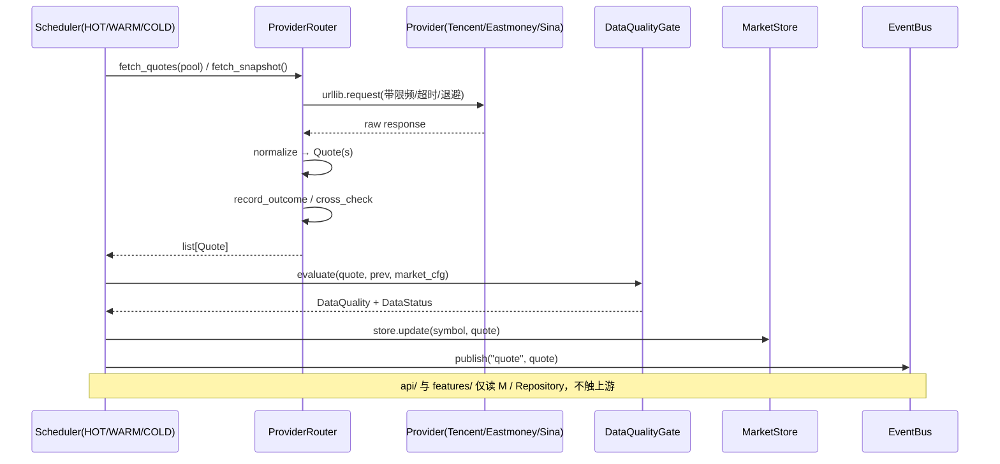
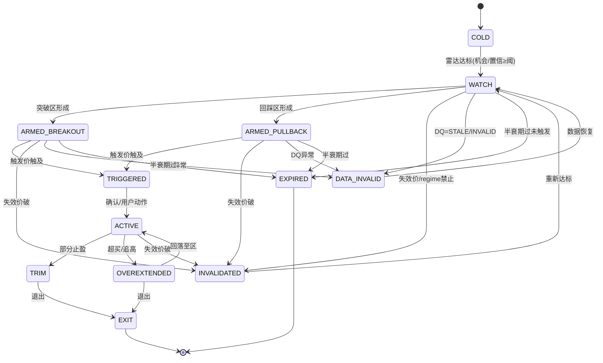

# Stock Tracker · Phase 1 架构设计 + 文件树 + 数据契约 + 有序任务清单

> 作者：架构师 高见远（software-architect）
> 版本：v0.1（Phase 1 设计基线，为 Phase 2–5 预留接口）
> 依据：最高优先级 `docs/PRD-股票辅助判断与交易参考网站.md`（v0.3）。本文未重述 PRD，仅引用章节号。
> 技术选型（已定，不可更改）：后端 **纯 Python 3.13 标准库**（零第三方依赖）；前端 **纯静态 HTML/JS/CSS** 由后端 `http.server` 托管；配置用 `config/*.toml` + 标准库 `tomllib` 只读；存储 `sqlite3`。

---

## 0. Phase 1 范围与定位

Phase 1 目标：**先打通"真实数据骨架"**，让工程师在无任何 `pip install` 的情况下，用纯标准库跑起来一个能拉真实行情、算特征、出信号、推前端的系统。Phase 2–5（概率模型、回测、组合、高级研究）只在此阶段预留接口与占位，不做深实现。

Phase 1 必须可运行的能力：
1. 三个免费公开源（腾讯 / 东财 / 新浪）真实直连，返回并归一化为统一 `Quote`。
2. HOT / WARM / COLD 三级采集线程，页面只读本地最新状态。
3. Data Quality Gate：新鲜度 / 完整性 / 跨源偏差 / 停牌 / 时间戳异常 / **future-leak 阻断**。
4. 特征骨架：技术指标（纯函数）+ 五大**独立证据族**聚合 + Market Regime 五态 + Sector 生命周期。
5. 四分数（Opportunity / Timing / Risk / Confidence）+ ≥3 策略（S1/S2/S3）+ 信号状态机 + 风险闸门（含追高惩罚）。
6. REST + SSE 接口；所有行情响应带 `data_status` 与 `observed_age_ms`，明确区分真实/测试数据。
7. 交易驾驶舱前端（玻璃拟态深色升级版），订阅 SSE 实时刷新。
8. `start.bat/stop.bat/restart.bat/status.bat` 一键启动。

**优先级链（必须体现在架构里）**：
`数据质量 > 市场/板块 > 策略 > 风险收益 > 概率校准 > 信号数量 > UI`
即：任一层不达标，下游信号被降级/阻断，而非被覆盖。详见 §2 与 §7。

---

## 1. 总体架构（分层与优先级）

```
┌──────────────────────────────────────────────────────────────────────┐
│  web/ 交易驾驶舱（纯静态）  fetch REST + EventSource /api/stream        │
└───────────────▲───────────────────────────────────┐                   │
                │ REST / SSE                          │ 读本地状态        │
┌───────────────┴───────────────────────────────────▼──────────────────┐
│  api/  ThreadingHTTPServer  →  handlers / sse / serializers           │
│         （只读 MarketStore + Repository；不触上游）                      │
└───────────────▲───────────────────────────────────┐                   │
                │ publish/subscribe (core.eventbus)   │                   │
┌───────────────┴───────────────────────────────────▼──────────────────┐
│  signals/  SignalManager                                                │
│   strategies → scoring(四分数) → risk_gate → state_machine → 持久化+推送 │
│       ▲ 优先级链：DQ 不达标→阻断强信号；regime 禁止→不触发；risk_gate 拦截 │
└───────▲───────────────────────────▲───────────────────▲──────────────┘
        │ ScanContext                 │                    │
┌───────┴──────────┐  ┌──────────────┴───────┐  ┌────────┴─────────────┐
│ features/        │  │ data_quality/         │  │ storage/             │
│ indicators/证据族 │  │ Gate + ProviderHealth │  │ SQLite 仓储 + 恢复    │
│ regime / sector  │  └───────────────────────┘  └─────────────────────┘
└───────▲──────────┘
        │ 读最新 Quote + 近期 Bars（来自 MarketStore / SQLite）
┌───────┴──────────────────────────────────────────────────────────────┐
│  collector/  HOT / WARM / COLD 三线程（唯一上游访问者）                  │
│   Provider(Tencent/Eastmoney/Sina) → ProviderRouter(主备/熔断/退避/跨源) │
└───────────────────────────────────────────────────────────────────────┘
```

**关键不变量**：
- `Collector` 是**唯一**调用上游行情源的组件；`api/`、`features/`、`signals/` 一律只读 `MarketStore`（进程内最新状态）与 `Repository`（SQLite）。
- 所有对外行情数据必须过 `DataQualityGate` 后才进入特征/信号计算；`STALE`/`INVALID` 状态阻止强信号（§7）。
- 所有时间戳遵守 Point-in-Time（PRD #5.4），`computed_at >= quote.timestamp`，违者 future-leak 阻断。

---

## 2. 目录结构与文件职责

根目录 `D:\Projects\stock-tracker`。包名 `stock_tracker/`，前端 `web/`，配置 `config/`，测试 `tests/`，部署 `scripts/`。

| 路径 | 职责（一句话） |
|---|---|
| `config/app.toml` | 全局：服务端口、日志、HOT/WARM/COLD 刷新周期与池大小、启用的市场、SQLite 路径 |
| `config/markets.toml` | 三市场参数：代码前缀、涨跌停规则版本、交易时段、DELAYED/STALE 阈值、时区 |
| `config/strategies.toml` | 策略开关与阈值（S1/S2/S3 的启用、最小机会分/置信、专属参数） |
| `config/providers.toml` | Provider 列表、主备顺序、超时、限频（max_rps）、退避基数/上限 |
| `config/risk.toml` | 风险阈值：追高惩罚、最小 R 倍数、组合热度上限、regime 禁触发、DQ 最低分 |
| `stock_tracker/__init__.py` | 包标记 |
| `stock_tracker/__main__.py` | 入口 `python -m stock_tracker`：装配各模块并启动 server + scheduler |
| `stock_tracker/cli.py` | 轻量命令行参数（--port / --config-dir / --once 自检） |
| `stock_tracker/core/config.py` | `tomllib` 只读加载 5 个 TOML → 配置 dataclass；缺省值兜底 |
| `stock_tracker/core/logging.py` | 统一日志（标准库 `logging`），按 app.toml 配级别/轮转 |
| `stock_tracker/core/clock.py` | 交易时段判定（按市场/时区），`is_trading_now(market)`、`session_of()` |
| `stock_tracker/core/types.py` | **全部数据契约 dataclass + 枚举**（§3） |
| `stock_tracker/core/store.py` | `MarketStore`：进程内最新 Quote/Signal/Regime/Sector 共享存储（带读写锁） |
| `stock_tracker/core/eventbus.py` | 进程内发布/订阅，供 SSE 推送（quote/signal/regime/sector/health 事件） |
| `stock_tracker/collector/provider.py` | `MarketDataProvider` 抽象基类 + `normalize()` 契约 + 限频/重试 |
| `stock_tracker/collector/tencent.py` | `TencentProvider`：`qt.gtimg.cn` GBK 解析与归一化 |
| `stock_tracker/collector/eastmoney.py` | `EastmoneyProvider`：`push2` JSON 解析与归一化（含批量快照） |
| `stock_tracker/collector/sina.py` | `SinaProvider`：`hq.sinajs.cn` CSV 解析（带 Referer）与归一化 |
| `stock_tracker/collector/router.py` | `ProviderRouter`：主备选择、健康评分、熔断、退避、跨源偏差检测 |
| `stock_tracker/collector/scheduler.py` | HOT/WARM/COLD 三线程循环编排；维护热/温/冷池 |
| `stock_tracker/data_quality/gate.py` | `DataQualityGate`：新鲜度/完整性/重复/跨源/停牌/时间戳/future-leak |
| `stock_tracker/data_quality/health.py` | `ProviderHealth` 计算 + 熔断状态机（CLOSED/OPEN/HALF_OPEN） |
| `stock_tracker/storage/db.py` | `sqlite3` 连接（线程本地单连接）、幂等建表、迁移占位 |
| `stock_tracker/storage/repository.py` | 仓储 CRUD：quotes_cache/watchlist/positions/signals/signal_history/instruments/bars/provider_state/events |
| `stock_tracker/storage/schema.sql` | DDL（也可在 `db.py` 内联，二选一；本文采用独立文件便于审阅） |
| `stock_tracker/features/indicators.py` | 纯函数指标：MA/EMA/MACD/ADX/ATR/RSI + 滚动分位 |
| `stock_tracker/features/evidence.py` | 五大**独立证据族**聚合（Trend/Momentum/RS/VolumeLiquidity/PriceStructure），输出 0–100 |
| `stock_tracker/features/regime.py` | Market Regime 五态分类器（PRD #6） |
| `stock_tracker/features/sector.py` | Sector 评分 + 生命周期状态机（PRD #7） |
| `stock_tracker/features/engine.py` | `FeatureEngine`：Quote+Bars→证据族→regime→sector→`ScanContext` |
| `stock_tracker/strategies/base.py` | `Strategy` 基类 + `evaluate(ctx)->Optional[SignalCandidate]` |
| `stock_tracker/strategies/s1_breakout.py` | S1 放量突破延续（PRD #10.1） |
| `stock_tracker/strategies/s2_pullback.py` | S2 趋势回踩（PRD #10.2） |
| `stock_tracker/strategies/s3_event.py` | S3 事件驱动延续——Phase 1 轻量占位（仅注入/占位事件，PRD #9/#17.5 约束） |
| `stock_tracker/signals/scoring.py` | 四分数聚合（证据族→Opportunity/Timing/Risk/Confidence，PRD #11） |
| `stock_tracker/signals/risk_gate.py` | 风险闸门：追高惩罚（PRD #14.3）、最小 R、组合热度（PRD #23）、regime 禁止 |
| `stock_tracker/signals/state_machine.py` | `Signal` 状态机 + Next Trigger（PRD #15/#24.2）+ What Changed（PRD #24.3） |
| `stock_tracker/signals/manager.py` | `SignalManager`：编排扫描→评分→闸门→状态机→持久化→推送 |
| `stock_tracker/api/server.py` | `ThreadingHTTPServer` + `BaseHTTPRequestHandler` 路由分发 |
| `stock_tracker/api/handlers.py` | REST 端点实现（§9 表） |
| `stock_tracker/api/sse.py` | `/api/stream` SSE 长连，按 eventbus 推送 |
| `stock_tracker/api/serializers.py` | dataclass→dict，**强制附加** `data_status` + `observed_age_ms` |
| `web/index.html` | 交易驾驶舱入口（玻璃拟态深色，网格布局） |
| `web/css/base.css` | 玻璃拟态深色基底（沿用 `web_style_sample` 风格升级） |
| `web/css/cockpit.css` | 驾驶舱布局（概览/雷达/信号/持仓卡片网格） |
| `web/js/api.js` | `fetch` REST 封装（带超时与 data_status 透传） |
| `web/js/sse.js` | `EventSource` 封装，按事件类型分发 |
| `web/js/format.js` | 数字/百分比/颜色/数据年龄格式化 |
| `web/js/components.js` | 卡片、机会雷达、信号详情、Why-Not-Buy 卡渲染 |
| `web/js/app.js` | 启动、页面路由、SSE 订阅、状态刷新 |
| `web/start.bat` | 前端便捷启动（可选，与后端分离） |
| `tests/conftest.py` | fixtures：MockProvider、样例 Quote/Bars、种子 instruments |
| `tests/test_indicators.py` | 指标正确性（已知序列对照） |
| `tests/test_scoring.py` | 四分数聚合与单调性 |
| `tests/test_regime.py` | 五态分类（合成市场序列） |
| `tests/test_sector.py` | 板块生命周期状态机迁移 |
| `tests/test_strategies.py` | S1/S2 规则触发；S3 占位 |
| `tests/test_risk_gate.py` | 追高拦截、最小 R、组合热度 |
| `tests/test_state_machine.py` | 合法迁移、半衰期过期、失效 |
| `tests/test_provider_normalize.py` | 三源 `normalize()` 从原始样例→正确 `Quote` |
| `tests/test_data_quality.py` | STALE/DELAYED/INVALID 判定、future-leak 阻断 |
| `tests/test_integration.py` | 全链路（MockProvider→feature→signal→db）、failover、收盘/延迟行为 |
| `scripts/start.py` | 跨平台启动入口（被 *.bat 调用） |
| `scripts/start.bat` | 一键启动（Windows） |
| `scripts/stop.bat` | 停止（按 pid 文件） |
| `scripts/restart.bat` | 重启 |
| `scripts/status.bat` | 进程/端口状态检查 |

---

## 3. 数据契约（dataclass + 枚举）

> 实现方式：`core/types.py` 用 `@dataclass(slots=True)` 定义；枚举用 `enum.Enum`/`StrEnum`。
> **符号规范**：`symbol` 采用规范码 `CODE.MK`，`MK∈{SH,SZ,HK,US}`（如 `600519.SH`、`00700.HK`、`AAPL.US`）；`market` 枚举由后缀推导。`provider` 查询码由 `to_provider_symbol(symbol, provider)` 在 provider 基类派生（腾讯 `sh600519`/东财 `1.600519`/新浪 `sh600519`）。

### 3.1 枚举

| 枚举 | 取值 |
|---|---|
| `Market` | `A`, `HK`, `US` |
| `DataStatus` | `LIVE`, `DELAYED`, `STALE`, `UNKNOWN` |
| `QualityStatus` | `VALID`, `DEGRADED`, `STALE`, `INVALID` |
| `SignalState` | `COLD`, `WATCH`, `ARMED_BREAKOUT`, `ARMED_PULLBACK`, `TRIGGERED`, `ACTIVE`, `TRIM`, `EXIT`, `OVEREXTENDED`, `INVALIDATED`, `DATA_INVALID`, `EXPIRED` |
| `CircuitState` | `CLOSED`, `OPEN`, `HALF_OPEN` |
| `RegimeState` | `RISK_ON_TREND`, `ROTATION`, `RISK_OFF`, `PANIC_REBOUND`, `OVERHEATED` |
| `SectorStage` | `EARLY`, `ACCUMULATION`, `LEADING`, `PEAK`, `DIVERGENCE`, `DECLINE` |

### 3.2 Quote（实时行情，归一化后唯一形态）

| 字段 | 类型 | 说明 |
|---|---|---|
| `symbol` | `str` | 规范码 `CODE.MK` |
| `market` | `Market` | 市场 |
| `timestamp` | `datetime` | **源**行情时间（交易所时间，PRD #5.4 Point-in-Time） |
| `open` / `high` / `low` / `close` / `last` | `float` | 开/高/低/收/最新价 |
| `volume` | `int` | 成交量（股） |
| `amount` | `float` | 成交额（元/本币） |
| `turnover` | `float` | 换手率（%） |
| `source` | `str` | provider 名（tencent/eastmoney/sina） |
| `received_at` | `datetime` | 本系统收到响应的时间 |
| `computed_at` | `datetime` | 计算完成时间（须 ≥ `timestamp`） |
| `displayed_at` | `datetime` | 推送给前端时间 |
| `observed_age_ms` | `int` | `received_at - timestamp`（毫秒），数据观察年龄 |
| `quality` | `DataQuality` | 质量对象（§3.4） |
| `latency` | `float` | 本次请求往返毫秒 |
| `data_status` | `DataStatus` | 数据状态（LIVE/DELAYED/STALE/UNKNOWN） |

### 3.3 Bar（K 线，COLD/历史入库）

| 字段 | 类型 | 说明 |
|---|---|---|
| `symbol` | `str` | 规范码 |
| `market` | `Market` | 市场 |
| `timestamp` | `datetime` | Bar 开始时间 |
| `interval` | `str` | `1d`/`5m`/… |
| `open`/`high`/`low`/`close` | `float` | OHLC |
| `volume` | `int` | 成交量 |
| `amount` | `float` | 成交额 |
| `turnover` | `float` | 换手率 |
| `source` | `str` | provider |
| `adjustment_factor` | `float` | 复权因子（PRD #5.3） |
| `quality_status` | `DataStatus` | 该 Bar 数据状态 |

### 3.4 DataQuality / ProviderHealth

**DataQuality**

| 字段 | 类型 | 说明 |
|---|---|---|
| `status` | `QualityStatus` | VALID/DEGRADED/STALE/INVALID |
| `score` | `int` | 0–100 |
| `reasons` | `list[str]` | 触发原因（人话，供 Why-Not-Buy 卡，PRD #24.1） |

**ProviderHealth**

| 字段 | 类型 | 说明 |
|---|---|---|
| `provider` | `str` | 名称 |
| `latency_p50` / `latency_p95` | `float` | 延迟分位（ms） |
| `error_rate` / `timeout_rate` / `stale_ratio` | `float` | 比率 0–1 |
| `rate_limit_hits` | `int` | 触发限频次数 |
| `last_success_at` | `datetime` | 最近成功时间 |
| `cross_source_deviation` | `float` | 与备源偏差（价格 %） |
| `circuit_state` | `CircuitState` | 熔断状态 |

### 3.5 ScoreSet（四分数）

| 字段 | 类型 | 说明 |
|---|---|---|
| `opportunity` | `int` | 机会质量 0–100 |
| `timing` | `int` | 入场时机 0–100 |
| `risk` | `int` | 风险 0–100（越高越危险） |
| `confidence` | `int` | 置信度 0–100 |
| `success_probability` | `Optional[float]` | 成功概率；**Phase 1 = None** |
| `positive_reasons` / `negative_reasons` | `list[str]` | 正负理由（人话） |

### 3.6 Signal / ScanContext

**Signal**

| 字段 | 类型 | 说明 |
|---|---|---|
| `signal_id` | `str` | 唯一 ID（`symbol+strategy+ts` 或 uuid） |
| `symbol` | `str` | 规范码 |
| `market` | `Market` | 市场 |
| `strategy_id` | `str` | S1/S2/S3 |
| `state` | `SignalState` | 当前状态（§7.4 状态机） |
| `state_changed_at` | `datetime` | 状态变更时间 |
| `previous_state` | `Optional[SignalState]` | 上一状态 |
| `reason` | `str` | 当前状态人话原因 |
| `entry_low` / `entry_high` | `float` | 入场区间（PRD #16.4，非单点） |
| `trigger_price` | `float` | 触发价 |
| `invalidation_price` | `float` | 失效价（结构化止损，PRD #16.3） |
| `target_1` / `target_2` | `float` | 目标位 |
| `reward_risk` | `float` | 风险收益 R 倍数（PRD #14.2） |
| `freshness` | `float` | 新鲜度 0–1（半衰期，PRD #15.2） |
| `market_regime` | `str` | 当时 regime |
| `sector_stage` | `str` | 当时板块阶段 |
| `next_trigger` | `str` | 下一触发条件（人话，PRD #24.2） |
| `what_changed` | `list[str]` | 相对上次扫描变化（PRD #24.3） |
| `data_status` | `DataStatus` | 数据状态 |

**ScanContext**（传递给策略/评分的只读上下文）

| 字段 | 类型 | 说明 |
|---|---|---|
| `symbol`, `market` | `str`,`Market` | 标的 |
| `quote` | `Quote` | 最新行情（已 DQ 校验） |
| `recent_bars` | `list[Bar]` | 近期 K 线（来自 storage） |
| `regime` | `MarketRegime` | 当前市场态 |
| `sector` | `Optional[SectorSnapshot]` | 所属板块快照 |
| `watch` / `position` | `Optional` | 自选/持仓（如有） |
| `dq` | `DataQuality` | 质量结论 |
| `cfg` | 配置快照 | 策略/风险阈值 |

### 3.7 WatchlistItem / Position / MarketRegime / SectorSnapshot

| 类型 | 字段 |
|---|---|
| `WatchlistItem` | `symbol`, `market`, `added_at`, `note:Optional[str]` |
| `Position` | `id`, `symbol`, `market`, `shares:float`, `cost:float`, `added_at`, `closed_at:Optional[datetime]` |
| `MarketRegime` | `regime:RegimeState`, `market_score:float(0–100)`, `sub_factors:dict`（breadth/trend/vol/momentum…） |
| `SectorSnapshot` | `sector:str`, `score:float`, `stage:SectorStage`, `relative_strength:float`, `breadth:float`, `volume:float`, `leader_quality:float`, `catalyst:str(轻量)`, `persistence:float`, `crowding:float` |

---

## 4. Provider 抽象

### 4.1 基类契约 `MarketDataProvider`

```
class MarketDataProvider(ABC):
    name: str
    markets: list[Market]                      # 该源可服务的市场
    def fetch_quotes(self, symbols: list[str]) -> list[Quote]   # HOT/WARM 用
    def fetch_snapshot(self) -> list[Quote]                     # COLD 用（全市场/批量）
    @abstractmethod
    def normalize(self, raw, market) -> Quote   # 原始响应 → 统一 Quote
    # 基类提供：限频(token bucket, max_rps)、重试+指数退避、超时、请求计时(latency)
```

三源实现要点（均属设计，**不在此写实现**）：
- **TencentProvider**：`https://qt.gtimg.cn/q=sh600519,...`（GBK 解码；`v_sh600519="1~名称~代码~当前~昨收~今开~...~量~额~...~日期时间~涨跌~涨幅~高~低~..."`，`~` 分隔；港股 `hk00700`、美股 `usAAPL`）。`normalize` 按位置映射字段，`timestamp` 取末尾日期时间，`turnover` 由量/流通股推算（缺失则 None）。
- **EastmoneyProvider**：`push2.eastmoney.com/api/qt/stock/get?secid=1.600519&fields=f43,...`（JSON，价格×100 整数：f43 当前/f44 高/f45 低/f46 开/f57 代码/f58 名称/f60 昨收/f169 涨跌×100/f170 涨幅×100；A 股 `1.`/`0.`、港股 `116.`、美股 `105.`/`100.`）。批量快照用 `clist/get?pn=1&pz=2000&fs=m:0+t:6,m:0+t:80,m:1+t:2,m:1+t:23&fields=f12,f13,f14,f2,f3,...`。`normalize` 除以 100 还原价格。
- **SinaProvider**：`https://hq.sinajs.cn/list=sh600519`（需 `Referer` 头；CSV 逗号分隔 `名称,今开,昨收,当前,最高,最低,...,量,额,日期,时间,...`）。`normalize` 按列映射。

### 4.2 ProviderRouter（主备 / 健康 / 熔断 / 退避 / 跨源偏差）

```
class ProviderRouter:
    providers: list[MarketDataProvider]        # 按 providers.toml 排序
    health: dict[str, ProviderHealth]
    def select(self, market, op: "quote"|"snapshot") -> MarketDataProvider
        # 1) 过滤 markets 匹配且 circuit_state != OPEN
        # 2) 按 health 评分（error_rate↓, latency_p50↓, stale_ratio↓）取主
        # 3) COLD snapshot 优先选支持批量者（eastmoney）
    def fetch_quotes(self, symbols):            # 主源；失败→次源；记录 deviation
    def fetch_snapshot(self):                   # 主快照源；失败→次源
    def record_outcome(provider, ok, latency, status)  # 更新 health + 熔断状态机
    def cross_check(symbol, q_primary, q_secondary)    # 跨源偏差→health.cross_source_deviation
```

- **熔断**：连续失败超阈值（`providers.toml` 配）→ `OPEN`（暂停该源 N 秒）→ `HALF_OPEN`（试探）→ 成功回 `CLOSED`。
- **退避**：指数退避 `backoff_base_sec * 2**n`，封顶 `backoff_max_sec`。
- **跨源偏差**：同标的双源价格偏差 > 容忍度（risk/data_quality 配）→ 标记 `DEGRADED`，下游降级。

---

## 5. HOT / WARM / COLD 调度

`scheduler.py` 启动 3 个 `threading.Thread`（守护），各自独立循环；三池由 `SignalManager` 与配置共同维护。

| 池 | 标的来源 | 刷新间隔（默认） | 数据通道 |
|---|---|---|---|
| **HOT** | 触发/活跃/armed 信号标的 + 用户置顶 | A 股 2–5s，HK/US 依 markets.toml | `router.fetch_quotes(hot_pool)` |
| **WARM** | 自选 + 雷达候选 + 板块龙头 | 5–15s | `router.fetch_quotes(warm_pool)` |
| **COLD** | 全市场快照（一次拉全，东财批量） | 30–60s | `router.fetch_snapshot()` → 更新 instruments / sector / regime / 候选池 |

**循环契约（每 tick）**：
1. 取池 → `router.fetch_*` → 逐条 `DataQualityGate.evaluate` → 写 `MarketStore`（带锁）。
2. HOT/WARM：仅更新 `MarketStore` 中对应 `Quote`；COLD：批量更新并触发 `features/regime`、`features/sector` 重算（低频，主线程外）。
3. 异常不入上游重试风暴：失败由 router 退避/熔断吸收，池内其余标的继续。
4. 计算结果经 `core.eventbus` 发布，`api/sse` 订阅推送。

**页面只读本地**：`api/` 与 `features/` 读取 `MarketStore` + `Repository`，**绝不**在此调用 provider。



---

## 6. Data Quality Gate（§5.2 / §26.10 优先级链第一关）

`DataQualityGate.evaluate(quote, prev, market_cfg) -> DataQuality`，规则（按严重度）：

| 规则 | 判定 | 结果 |
|---|---|---|
| **时间戳异常** | `timestamp` 在未来（>`now`+漂移）或远早于上一笔 | `INVALID` / `DEGRADED` |
| **重复** | 连续多 tick `timestamp` 不变且 `last` 不变 | `DEGRADED`（疑似停更） |
| **新鲜度** | `observed_age_ms` > `STALE` 阈值 → `STALE`；> `DELAYED` 阈值 → `DELAYED` | `STALE`/`DELAYED` |
| **完整性** | 必填字段缺失/`last<=0` | `INVALID` |
| **停牌/特殊** | `volume==0` 且 `last==prev` 持续 → 停牌态 | `DEGRADED`（标记 HALTED） |
| **跨源偏差** | 与备源偏差 > 容忍度 | `DEGRADED` + 下游降级 |
| **future-leak 阻断** | `computed_at < quote.timestamp` 或使用了未来 Bar | `INVALID`（硬阻断，PRD #5.4） |

- `score`：从 100 按命中规则扣分；`INVALID` 强制 0–40。
- **下游阻断**：`status ∈ {STALE, INVALID}` → 禁止产生/升级为强信号（`TRIGGERED/ACTIVE`）；仅允许维持 `WATCH`/`DATA_INVALID`（§7.3）。
- `ProviderHealth`（§4.2 / `data_quality/health.py`）：滚动统计延迟/错误/超时/陈旧/限频，驱动熔断与跨源偏差。

---

## 7. 特征 / 引擎骨架（为 Phase 2–5 留接口）

### 7.1 技术指标（纯函数，`features/indicators.py`）
`ma`, `ema`, `macd`(dif/dea/hist), `adx`(+DI/-DI), `atr`, `rsi`, 及滚动分位/标准差。**仅作为原始输入，不直接当"共振证据"。**

### 7.2 五大独立证据族（`features/evidence.py`，PRD #8 去相关）
PRD #8.2 严禁 MA/MACD/RSI 重复当独立共振 → 必须按**证据族**聚合：

| 证据族 | 聚合内容（示例） | 输出 0–100 |
|---|---|---|
| `Trend` | 价格 vs MA 结构、ADX、高低点台阶 | trend_score |
| `Momentum` | RSI 区间、ROC、MACD 柱状方向（**族内聚合，不单列**） | momentum_score |
| `RelativeStrength` | 个股 vs 指数/板块相对强弱（PRD #8.4 重于绝对涨幅） | rs_score |
| `VolumeLiquidity` | 量比、换手、成交额分位 | vol_score |
| `PriceStructure` | 更高高低点、突破/回踩区、密集成交区 | structure_score |

每族输出单一 0–100 分 + 简短理由；四分数由族聚合而来（§7.3），避免重复计数。

### 7.3 四分数（`signals/scoring.py`，PRD #11）
`ScoreSet = aggregate(evidence_families, regime, sector, dq)`：
- **Opportunity**（机会质量）：RS + Structure + Sector stage + Regime 友好度。
- **Timing**（入场时机）：Trend + Momentum + PriceStructure 进入区。
- **Risk**（风险，越高越危险）：波动率(ATR 占比)、Regime 风险、Overextension、crowding。
- **Confidence**（置信度）：DQ.score + 证据族一致性 + Regime 与工作策略匹配度。
- `success_probability`：Phase 1 = `None`（留 Phase 2 概率模型接口，PRD #11.5/#13）。

### 7.4 信号状态机（`signals/state_machine.py`，PRD #15 / #24.2 / #24.3）



- 每次迁移记录 `signal_history`（from/to/at/reason/what_changed JSON）。
- `next_trigger`：由当前态派生人话（如 "突破 18.20 且量能放大则触发"）。
- `what_changed`：与上次 `ScanContext` 的差异列表（PRD #24.3）。
- **半衰期/过期**：`freshness` 随距 `state_changed_at` 衰减；armed 超时→`EXPIRED`。

### 7.5 策略（`strategies/`，PRD #10）
基类 `Strategy.applies_to(market)` + `evaluate(ctx)->Optional[SignalCandidate]`。Phase 1 实现：
- **S1 放量突破延续**（#10.1）：结构突破 + 量能放大 + regime 友好 → `ARMED_BREAKOUT`。
- **S2 趋势回踩**（#10.2）：上升趋势中回踩支撑区 → `ARMED_PULLBACK`。
- **S3 事件驱动延续**（#10.3 / #9）：**Phase 1 轻量占位**——仅接受注入/占位事件；**绝不**使用盘中实时北向净流入作强信号（PRD #17.5，见 §11）。

### 7.6 风险闸门（`signals/risk_gate.py`，PRD #14 / #23）
- **追高惩罚 OverextensionPenalty**（#14.3）：`last` 高于近期低点或入场区超阈 → 降级/阻断，禁止 `TRIGGERED`。
- **最小 R**（#14.2）：`reward_risk < min_r_multiple` → 不触发或标记低优先级。
- **组合热度 Portfolio Heat**（#23.2）：单股/主题集中度 + 总热度 > 上限 → 拦截新增 `ACTIVE`。
- **Regime 禁止**：`regime ∈ blocked_states`（risk.toml 配）→ 不触发。
- **DQ 闸门**（§6）：`STALE/INVALID` → 阻断强信号。

### 7.7 SignalManager 编排（`signals/manager.py`）
```
loop(由 COLD/WARM 触发或定时):
  ctx = FeatureEngine.build(symbol, quote, bars, regime, sector, dq, cfg)
  for s in strategies if s.applies_to(market):
      cand = s.evaluate(ctx)
      if cand: score = scoring.score(ctx); risk_gate.check(cand, score, ctx)
               state_machine.transition(existing, cand) → persist + publish
```
所有产出经 `Repository` 入库 + `EventBus` 推送 → SSE。

---

## 8. Market Regime & Sector（PRD #6 / #7，接口预留）

- `features/regime.py`：`MarketRegime` 五态分类（RISK_ON_TREND/ROTATION/RISK_OFF/PANIC_REBOUND/OVERHEATED），由市场级特征（宽度/趋势/波动/动量）聚合，`market_score` 0–100，`sub_factors` 字典。Phase 1 用规则分类，留 Phase 2 模型接口。
- `features/sector.py`：`SectorSnapshot` 评分 + 生命周期状态机（EARLY→ACCUMULATION→LEADING→PEAK→DIVERGENCE→DECLINE）。`crowding` 供追高/拥挤仪表（PRD #24.6）。COLD 周期更新。
- **优先级体现**：`regime`/`sector` 在 `scoring` 与 `risk_gate` 之前评估；regime 禁止或 sector 衰退会压低 Opportunity 并阻止触发（链式：数据质量 > 市场/板块 > 策略）。

---

## 9. API + SSE（§4 信息架构 / §26）

`api/server.py`：`ThreadingHTTPServer`（端口取自 `app.toml`）；`BaseHTTPRequestHandler` 按路径分发；静态文件从 `web/` 托管。

### 9.1 REST 端点

| 方法 | 路径 | 说明 | 主要返回 |
|---|---|---|---|
| GET | `/api/overview` | 驾驶舱首页 | regime + 组合热度 + Top 机会 + 数据模式(meta) |
| GET | `/api/watchlist` | 自选 | 每项：最新 Quote + ScoreSet + Signal 摘要 |
| GET | `/api/positions` | 持仓 | 每项：盈亏 + 关联 Signal |
| GET | `/api/radar` | 机会雷达 | 全部候选/信号按分数排序 + 过滤 |
| GET | `/api/signal/<id>` | 信号详情 | 完整 Signal + what_changed + next_trigger + Why-Not-Buy |
| GET | `/api/markets` | 市场概览 | 每市场 data_status / 延迟 / 涨跌分布 |
| GET | `/api/provider_health` | 源健康 | `ProviderHealth[]` + 熔断态 |
| GET | `/api/config` | 配置回显 | 非敏感配置（阈值/开关） |
| GET | `/api/sectors` | 板块 | `SectorSnapshot[]` |
| GET | `/api/stream` | SSE | 实时推送（见下） |

**强制契约**（`serializers.py`）：所有行情/信号响应 `dict` 必含 `data_status` 与 `observed_age_ms`；`/api/overview` 顶层含 `meta:{data_mode:"LIVE"|"DEGRADED"|"DEMO", providers:[...], last_update, market_open:{a,hk,us}}`，前端据此显示"真实/测试数据"横幅（PRD #26 延迟降级可见性）。

### 9.2 SSE 事件（`/api/stream`，`text/event-stream`）
事件类型（`event:` 字段）：`quote` / `signal` / `regime` / `sector` / `provider_health`。`data:` 为 JSON（同样带 `data_status`/`observed_age_ms`）。前端 `EventSource` 订阅，`app.js` 按类型增量更新卡片。

---

## 10. 配置 Schema（`config/*.toml`，`tomllib` 只读）

### 10.1 `app.toml`
| 段/键 | 类型 | 说明 |
|---|---|---|
| `[server] host` | str | 绑定地址，`LOCAL_ONLY/HYBRID_PRIVATE` 默认 `127.0.0.1`；非 loopback 必须显式 `--allow-non-loopback` |
| `[server] port` | int | 默认 `8080` |
| `[logging] level` | str | DEBUG/INFO/WARNING |
| `[logging] file` / `max_bytes` / `backup` | str/int/int | 日志轮转 |
| `[collector] hot_interval_sec` | float | HOT 间隔（A 股默认 3） |
| `[collector] warm_interval_sec` | float | WARM 间隔（默认 10） |
| `[collector] cold_interval_sec` | float | COLD 间隔（默认 45） |
| `[collector] hot_pool_size` / `warm_pool_size` | int | 池上限 |
| `[collector] max_workers` | int | 采集线程数（默认 3） |
| `[markets] a` / `hk` / `us` | bool | 启用市场 |
| `[store] sqlite_path` | str | SQLite 文件路径，默认 `data/stock_tracker.db` |

### 10.2 `markets.toml`
| 段/键 | 说明 |
|---|---|
| `[a] prefixes` | `["sh","sz"]` |
| `[a] limit_up_pct` / `limit_down_pct` | 涨跌停（主板 0.10；STAR/ChiNext 0.20 按 `price_limit_rules.version` 区分） |
| `[a] trading_hours` | `[[9,30,11,30],[13,0,15,0]]` |
| `[a] delayed_ms` / `stale_ms` | DELAYED/STALE 阈值 |
| `[a] timezone` | `Asia/Shanghai` |
| `[hk]...` / `[us]...` | 同类（港股无涨跌停；美股 `America/New_York`，盘前盘后阈值） |
| `[price_limit_rules] version` | 涨跌停规则版本号（可配置升级） |

### 10.3 `strategies.toml`
`[s1]`/`[s2]`/`[s3]`：每策略 `enabled:bool`、`min_opportunity:int`、`min_confidence:int`、`params = { ... }`（如 s1: `breakout_lookback`, `vol_ratio_min`；s2: `pullback_depth_pct`, `ma_period`；s3: `event_min_weight`）。

### 10.4 `providers.toml`
```
[[providers]]
name = "tencent" | "eastmoney" | "sina"
cls  = "TencentProvider" | ...
markets = ["a","hk","us"]
primary = true            # 同市场主源（每市场一个 primary）
supports_snapshot = true  # 仅 eastmoney 默认 true
timeout_ms = 3000
max_rps = 5               # 限频（§26.7 自适应限频保护）
backoff_base_sec = 1.0
backoff_max_sec = 60.0
circuit_fail_threshold = 5
```
多源按数组顺序作主备；`supports_snapshot` 决定 COLD 主源。

### 10.5 `risk.toml`
| 段/键 | 说明 |
|---|---|
| `[overextension] max_gain_from_low_pct` | 禁止追高：现价高于近期低点超此比例则不触发（PRD #14.3） |
| `[overextension] max_above_entry_pct` | 高于入场区上限超此比例则惩罚 |
| `[reward_risk] min_r_multiple` | 最小 R（默认 2.0，PRD #14.2） |
| `[portfolio_heat] max_heat_pct` / `max_single_pct` / `max_theme_pct` | 组合热度上限（PRD #23） |
| `[regime_block] blocked_states` | 禁止触发的 regime 列表 |
| `[data_quality] min_score_to_strong` | 强信号最低 DQ 分（默认 60） |
| `[data_quality] block_if_stale` | `true`：STALE/INVALID 阻断强信号 |

---

## 11. 关键约束落点（不可违反）

- **优先级链**：数据质量 > 市场/板块 > 策略 > 风险收益 > 概率校准 > 信号数量 > UI，已在 §1 架构、§6 DQ 阻断、§7.6 risk_gate、§8 regime 前置中强制。
- **北向资金（PRD #17.5）**：**禁止**使用盘中实时净流入作强信号。Phase 1 **不接入**北向实时流；S3 事件仅用占位/注入事件；若未来引入，仅作盘后/季度披露的弱因子，绝不进入 `TRIGGERED/ACTIVE` 决策。
- **证据族去相关（PRD #8）**：MA/MACD/RSI 不得各自独立计分，必须归入 Trend/Momentum 等族（§7.2）。
- **future-leak 阻断（PRD #5.4）**：`computed_at >= quote.timestamp`，禁用未来 Bar（§6）。
- **真实可运行优先**：零第三方依赖，纯标准库；无网络安装即可 `python -m stock_tracker` 起服务。所有源默认 **真实数据**；`data_mode` 元信息明确标注真实/降级，绝不伪造测试数据冒充真实。

---

## 12. 存储 Schema（`storage/schema.sql`，SQLite）

| 表 | 主键 | 关键索引 | 说明 |
|---|---|---|---|
| `instruments` | `symbol` | `market` | 标的字典（名称/板块/上市日/活跃），COLD 更新 |
| `bars` | `(symbol, interval, timestamp)` | `(symbol, timestamp)` | K 线（COLD/历史入库） |
| `quotes_cache` | `symbol` | `market` | 最新 Quote 快照（onset 由 HOT/WARM 写） |
| `watchlist` | `symbol` | — | 自选 |
| `positions` | `id` | `symbol` | 持仓 |
| `signals` | `signal_id` | `(state)`, `(symbol)` | 信号当前态 |
| `signal_history` | `id` | `signal_id` | 状态迁移记录（what_changed JSON） |
| `provider_state` | `provider` | — | 熔断态/健康滚动值 |
| `events` | `id` | `symbol`,`ts` | 事件占位（S3 用） |

- **索引目的**：`signals(state)` 加速雷达扫描；`bars(symbol,timestamp)` 加速特征回溯；`quotes_cache(market)` 加速按市场聚合。
- **重启恢复**：加载 `watchlist`、`positions`、`signals`（仅 `WATCH/ARMED_*/ACTIVE/TRIM/OVEREXTENDED`）、`provider_state`（熔断重置为 `HALF_OPEN` 试探）、`instruments`。`quotes_cache` 由 HOT/WARM/COLD 启动后即时回填；`bars` 持久保留供特征回溯。`signal_history` 全量保留用于战绩/复盘（PRD #24.4/#24.5）。

---

## 13. 测试清单（`tests/`，生产默认真实、测试用 Mock）

**Fixtures（`conftest.py`）**：`MockProvider`（可控返回 Quote/快照，模拟主源故障/延迟/偏差）、样例 `Quote`/`Bar`、种子 `instruments`。所有 fail-safe 用 mock 验证；生产路径默认真实源。

| 类型 | 文件 | 覆盖 |
|---|---|---|
| 单测 | `test_indicators.py` | MA/EMA/MACD/ADX/ATR/RSI 已知序列对照 |
| 单测 | `test_scoring.py` | 四分数聚合、单调性、证据族→分数 |
| 单测 | `test_regime.py` | 五态分类（合成市场序列） |
| 单测 | `test_sector.py` | 板块生命周期状态机迁移 |
| 单测 | `test_strategies.py` | S1/S2 规则触发；S3 占位不误触发 |
| 单测 | `test_risk_gate.py` | 追高拦截、最小 R、组合热度 |
| 单测 | `test_state_machine.py` | 合法迁移、半衰期过期、失效、DATA_INVALID 恢复 |
| 单测 | `test_provider_normalize.py` | 三源 `normalize()` 从原始样例→正确字段 |
| 单测 | `test_data_quality.py` | STALE/DELAYED/INVALID、future-leak 阻断 |
| 集成 | `test_integration.py` | MockProvider→feature→signal→db 全链路写库 |
| 集成 | `test_integration.py` | Provider failover（主源 down→备用、熔断开启） |
| 集成 | `test_integration.py` | 收盘/延迟/STALE 下 DQ 与 API `data_status` 透传 |

---

## 14. 工程师有序任务清单（按依赖，可逐个文件实现）

> 每个任务标注**产出文件路径**；工程师无需重新设计，按契约与文件职责实现即可。依赖指"需先完成"。

### T1 · 项目骨架 + 配置与核心（基础设施）
- **产出**：`stock_tracker/__init__.py`、`stock_tracker/__main__.py`、`stock_tracker/cli.py`、`stock_tracker/core/{config,logging,clock,store,eventbus}.py`、`stock_tracker/core/types.py`、`config/{app,markets,strategies,providers,risk}.toml`、`scripts/{start.py,start.bat,stop.bat,restart.bat,status.bat}`
- **依赖**：无（起点）
- **要点**：`tomllib` 只读加载 5 个 TOML→配置 dataclass；`MarketStore` 带锁；`types.py` 落地 §3 全部 dataclass/枚举；`scripts` 一键启停（写 pid 文件）。

### T2 · 存储层（SQLite 仓储）
- **产出**：`stock_tracker/storage/{db,repository}.py`、`stock_tracker/storage/schema.sql`
- **依赖**：T1
- **要点**：幂等建表（§12）；线程本地单连接；仓储 CRUD；重启恢复逻辑（§12）。

### T3 · Provider 抽象 + 三源 + Router + Health
- **产出**：`stock_tracker/collector/{provider,tencent,eastmoney,sina,router}.py`、`stock_tracker/data_quality/health.py`
- **依赖**：T1
- **要点**：三源 `normalize()` 映射（§4.1）；`ProviderRouter` 主备/健康评分/熔断/退避/跨源偏差（§4.2）；`ProviderHealth` 滚动统计与熔断状态机。

### T4 · Data Quality Gate
- **产出**：`stock_tracker/data_quality/gate.py`
- **依赖**：T1、T3
- **要点**：§6 七类规则；`STALE/INVALID` 阻断强信号；future-leak 硬阻断；输出 `DataQuality`+`DataStatus`。

### T5 · 采集调度（HOT/WARM/COLD）
- **产出**：`stock_tracker/collector/scheduler.py`
- **依赖**：T1、T3、T4
- **要点**：三守护线程（§5）；热/温/冷池维护；每 tick：fetch→DQ→写 `MarketStore`→发布 eventbus；异常不触发上游重试风暴。

### T6 · 特征引擎骨架
- **产出**：`stock_tracker/features/{indicators,evidence,regime,sector,engine}.py`
- **依赖**：T1、T2
- **要点**：指标纯函数；**五大证据族聚合**（§7.2，严禁指标重复计分）；Regime 五态（§8）；Sector 生命周期（§8）；`FeatureEngine.build→ScanContext`。

### T7 · 评分 + 策略 + 信号管线
- **产出**：`stock_tracker/signals/{scoring,risk_gate,state_machine,manager}.py`、`stock_tracker/strategies/{base,s1_breakout,s2_pullback,s3_event}.py`
- **依赖**：T4、T6
- **要点**：四分数（§7.3）；S1/S2/S3（§7.5，S3 占位，#17.5 禁北向实时）；风险闸门含追高惩罚/最小 R/组合热度/regime 禁止（§7.6）；信号状态机 + NextTrigger + WhatChanged（§7.4）；`SignalManager` 编排→入库+推送。

### T8 · API + SSE
- **产出**：`stock_tracker/api/{server,handlers,sse,serializers}.py`
- **依赖**：T2、T7
- **要点**：`ThreadingHTTPServer` 路由 + 静态托管（§9.1）；SSE 推送（§9.2）；`serializers` **强制**附 `data_status`+`observed_age_ms`；`/api/overview` 含 `meta.data_mode` 真实/降级标识。

### T9 · 前端交易驾驶舱
- **产出**：`web/{index.html}`、`web/css/{base,cockpit}.css`、`web/js/{api,sse,format,components,app}.js`、`web/start.bat`
- **依赖**：T8（契约对齐）
- **要点**：玻璃拟态深色升级驾驶舱；`fetch` REST + `EventSource` 订阅；卡片/雷达/信号详情/Why-Not-Buy/NextTrigger/WhatChanged 渲染；真实/测试数据横幅。

### T10 · 测试
- **产出**：`tests/conftest.py` + `tests/test_*.py`（§13）
- **依赖**：T1–T9
- **要点**：MockProvider/fixtures 验证 fail-safe；集成全链路+failover+收盘/延迟行为。

### T11 · 部署联调与文档收尾
- **产出**：更新 `scripts/*.bat` 最终版、`README.md`（启动说明）、`docs/architecture.md` 复核、冒烟测试记录
- **依赖**：T8、T9、T10
- **要点**：`start.bat` 一键起服务并验证 `/api/provider_health` 返回真实源 LIVE；确认无 `pip install` 即可运行；`data_mode` 正确显示。

---

## 15. 验收自检（Phase 1 出口）

1. `scripts/start.bat` 后访问 `http://localhost:8080`，`/api/provider_health` 显示真实源 `circuit_state=CLOSED`、`last_success_at` 非空。
2. `/api/overview` 的 `meta.data_mode="LIVE"`，行情带 `data_status=LIVE` 与 `observed_age_ms`。
3. 制造主源故障（改 `providers.toml` 指向错误 host）→ 熔断 `OPEN`→`HALF_OPEN`→备用接管；前端横幅显示 `DEGRADED`。
4. 停牌/收盘标的 → `data_status=STALE/DELAYED`，无 `TRIGGERED/ACTIVE` 强信号产生。
5. 追高价位 → `risk_gate` 拦截，信号不进入 `ACTIVE`（#14.3）。
6. 全部 `tests/` 通过，含 future-leak 阻断与 failover 用例。
7. 零第三方依赖：`python -m stock_tracker` 在无网安装环境可起。

---
*本文为 Phase 1 设计基线。Phase 2–5（概率模型/回测/组合/高级研究）的接口已在 `success_probability=None`、`events` 占位表、`regime`/`sector` 规则分类器、`ProviderRouter` 可插拔、证据族可扩展等处预留。*
