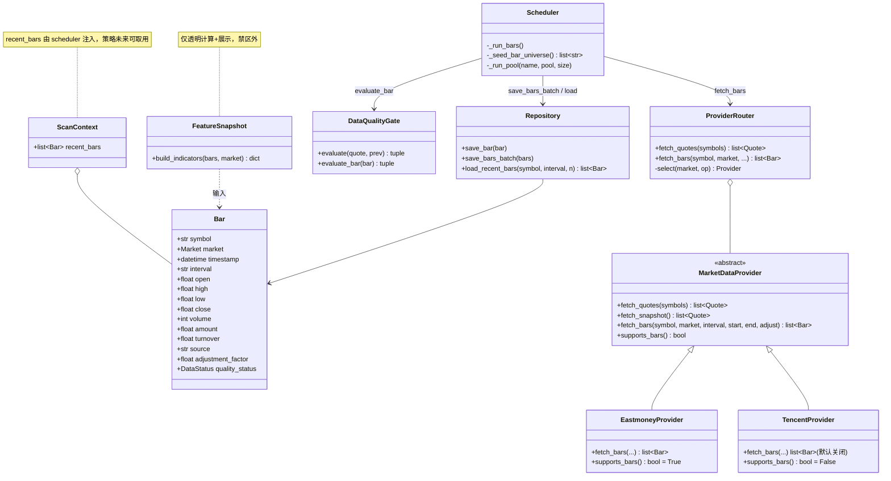
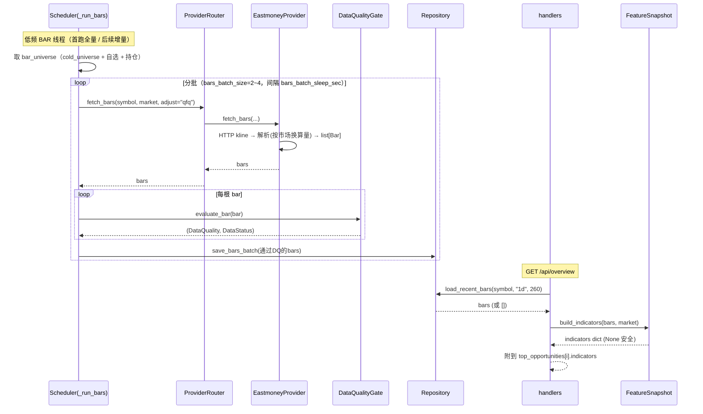
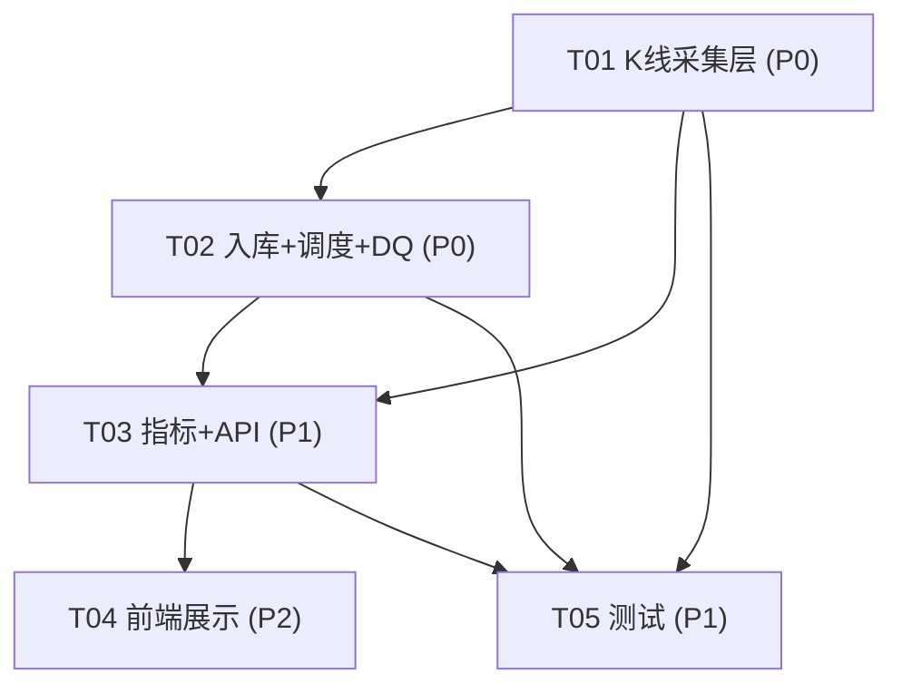

# 系统设计 + 任务分解 —— 数据基建：K 线采集 + 指标链路（A/HK/US）

> 负责人：高见远（架构师 / Bob）　|　上游：齐活林（主理人）　|　实现：寇豆（工程师）
> 范围：**仅** Provider / 采集调度 / Bar 入库 / 指标快照（透明计算+展示）/ API / 前端指标展示 / 测试。
> **禁区（不触碰）**：`stock_tracker/quant/*`、核心 `scoring`/`risk_gate`/`sector` 算法、策略 `applies_to` 跨市场扩展、`label`/`backtest`/`model`/`calibration`。

---

## 一、方案概述

1. **采集**：用**东财历史 K 线**（`push2his.eastmoney.com`，实测 A/HK/US 三市场 + 港股指数均可达）作为 K 线**主源**；腾讯 `web.ifzq.gtimg.cn` K 线端点在本环境实测持续返回 `bad params`（不可用），仅作为**文档化备用**（默认关闭）。
2. **落库**：复用现有 `Repository.save_bar` / `load_recent_bars`（SQLite `bars` 表已建），新增低频 `BAR` 线程做**首跑全量回填 + 后续增量追加**，严格节流分批。
3. **质量**：新增轻量 `evaluate_bar`（future-leak 硬阻断 + 完整性），**不改**现有 Quote DQ。
4. **指标**：新增 `features/feature_snapshot.py::build_indicators`，仅用现有 `indicators.py` 纯函数做**透明计算 + 展示**，不写任何打分/证据去相关（禁区）。
5. **曝光**：`/api/overview` 每条机会卡附 `indicators`；新增 `/api/quote/{symbol}` 详情端点；前端机会卡/详情 sheet 紧凑展示 MA/MACD/RSI/量比/52周位置/振幅。

---

## 二、关键实测结论（K 线源可达性）⚠ —— 设计成立前提

### 2.1 东财（主源）`push2his.eastmoney.com/api/qt/stock/kline/get`
| 标的 | secid | 可达 | 返回结构样例（fields2=f51..f58） |
|---|---|---|---|
| 茅台 A | `1.600519` | ✅ | `2024-01-02,1580.66,1550.67,1583.85,1543.76,32156,5440082548.00,2.52` |
| 腾讯 HK | `116.00700` | ✅ | `...,283.400,...,23354069,6962383872.000,3.78` |
| 苹果 US | `105.AAPL` | ✅ | `...,182.820,...,82488674,15330141952.000,2.40` |
| 恒指 | `100.HSI` | ✅ | ✅（**指数须用 `100.` 前缀，不能用 `116.HSI`**） |
| 纳指 | `100.IXIC` | ❌ `rc:100,data:null`（东财未暴露综合指数） | 建议用 `100.NDX`（纳指100，可达）或直接跳过 US 指数 K 线（**非阻塞**） |

- **字段顺序（关键）**：`日期, 开, 收, 高, 低, 成交量, 成交额, 换手率` —— 注意**收在开之后、高/低之前**。
- **成交量单位（按市场换算）**：
  - A 股：`手`（×100 → 股），与 `Quote.volume`（股）对齐；
  - 港股 / 美股：`股`（不换算）。
  - 成交额：本币（元 / HKD / USD），原样保留。
- **全量回测**：`beg=0&end=20500101` 可拉全部历史（AAPL 回到 1984，前复权后 Pre-IPO 价为负属正常）。免费源下**不建议一次性全量**——请求窗口用 `today-400 自然日` 起、保留最近 ~260 交易日即可。
- **错误处理**：`rc!=0` 或 `data is None` → 返回 `[]`（不抛）。
- 注：东财**实时报价**（`push2.eastmoney.com`）在本环境被远端断开（已有注释），但**历史 K 线**（`push2his`）独立域名、实测正常，故可作 K 线主源。

### 2.2 腾讯（备用，默认关闭）`web.ifzq.gtimg.cn/appstock/app/fqkline/get`
- 实测 `param=sh600519,day,2024-01-01,2024-01-15,640`（含/不含 count、加 Referer、换 `proxy.finance.qq.com` 域名、`usAAPL.OQ` 后缀）**全部返回 `{"code":1,"msg":"bad params"}`**。
- 结论：**本环境该端点不可用**。设计仍提供 `TencentProvider.fetch_bars` 实现（按文档 `qfqday/day` 数组解析），但经 `providers.toml` 的 `kline_enabled=false` 默认关闭，避免上线即熔断。待端点恢复后开启。

### 2.3 新浪：A 股报价备份，**无 K 线**，不参与本链路。

---

## 三、系统详细设计

### 3.1 实现路径
- 复用 `MarketDataProvider` 的 `_request`（SSL 跳过 + UA）与 `RateLimiter`（免费源节流）。
- 新增 `fetch_bars` 抽象方法（与 `fetch_quotes` 同风格：**失败上抛，不由 provider 内部重试风暴**，由 Router 健康/熔断吸收）。
- `to_kline_secid(symbol)` 处理指数符号（`100.` 前缀），股票沿用 `to_provider_symbol(...,"eastmoney")`。
- 调度：新增 `Scheduler._run_bars`（独立低频线程），首跑对 ~37 只个股 + 指数分批回填；之后每 tick 仅对「最新 bar 比今天旧」的标的增量追加当日 bar。
- 指标：纯函数组装，不足长度返回 `None`，绝不抛；与 `ScanContext.recent_bars` 解耦（策略层未来可取用，本次不改策略）。

### 3.2 文件清单

| 文件 | 改动 | 职责 | 依赖 |
|---|---|---|---|
| `stock_tracker/collector/provider.py` | 修改 | `MarketDataProvider` 增加抽象 `fetch_bars` + `supports_bars()` 默认 False | — |
| `stock_tracker/collector/eastmoney.py` | 修改 | 实现 `fetch_bars`（kline 解析、按市场换算量、指数 secid）、`supports_bars()=True` | provider.py, types.py |
| `stock_tracker/collector/tencent.py` | 修改 | 实现 `fetch_bars`（文档化 `qfqday` 解析，默认关闭） | provider.py, types.py |
| `stock_tracker/collector/router.py` | 修改 | `ProviderRouter.fetch_bars(symbol, market, ...)` 按市场+健康选源（主 eastmoney，次 tencent） | provider.py |
| `stock_tracker/core/types.py` | 修改 | 新增 `to_kline_secid(symbol)`（指数 `100.` 前缀） | — |
| `config/app.toml` | 修改 | `[collector]` 新增 `bars_enabled`/`bars_interval_sec`/`bars_backfill_lookback_days`/`bars_batch_size`/`bars_batch_sleep_sec` | — |
| `config/providers.toml` | 修改 | eastmoney `markets` 增加 `hk`/`us`（仅用于 bar 路由；quote 主源仍是 tencent） | — |
| `stock_tracker/collector/scheduler.py` | 修改 | 新增 `_run_bars` + `_seed_bar_universe` + 增量判定；`_run_pool` 的 `load_recent_bars` 改取 `n=260` | router, repository, gate |
| `stock_tracker/storage/repository.py` | 修改 | `save_bars_batch`；`load_recent_bars` 默认 `n` 提升到 260（向后兼容） | — |
| `stock_tracker/data_quality/gate.py` | 修改 | 新增 `evaluate_bar(bar) -> (DataQuality, DataStatus)`（future-leak 硬阻断 + 完整性） | types.py |
| `stock_tracker/features/feature_snapshot.py` | **新增** | `build_indicators(bars, market) -> dict`（透明指标计算） | indicators.py, types.py |
| `stock_tracker/api/handlers.py` | 修改 | `_top_opportunities` 附 `indicators`；新增 `get_quote_detail(symbol)` | repository, feature_snapshot |
| `stock_tracker/api/serializers.py` | 修改 | 新增 `serialize_indicators(ind)`、`serialize_bar` 精简 | types.py |
| `web/js/components.js` | 修改 | 新增 `renderIndicators(ind)`；机会卡 + 详情 sheet 注入指标条 | — |
| `web/css/cockpit.css` | 修改 | `.opp-ind` / 指标 chip 紧凑样式 | — |
| `web/js/app.js` | 修改 | 机会卡点击/详情按需拉 `/api/quote/{symbol}`（可选增强） | api.js |
| `tests/test_provider_bars.py` | **新增** | mock HTTP 测 tencent/eastmoney 解析（A/HK/US 各一）+ 单位换算 | — |
| `tests/test_feature_snapshot.py` | **新增** | 合成 bars 验证数值 + 不足长度返回 None | — |
| `tests/test_bar_dq.py` | **新增** | future-leak 硬阻断 + 完整性 | — |
| `tests/test_scheduler_bars.py` | **新增** | mock router 验证首跑全量 / 后续增量 | — |
| `tests/test_api_indicators.py` | **新增** | overview 含 indicators + quote 详情端点 | — |

### 3.3 数据结构与接口（classDiagram）



### 3.4 调用流程（sequenceDiagram）



### 3.5 待明确 / 假设
- `adjust="qfq"` 对应东财 `fqt=1`（前复权）；`adjustment_factor` 字段置 `1.0`（qfq 已内含复权，因子隐式），保留字段供未来 hfq 扩展。
- 指数 K 线：HSI 用 `100.HSI`（已验证）；IXIC 东财返回 null，**建议二选一**：(a) 用 `100.NDX` 替代；(b) 跳过 US 指数 K 线（非阻塞，仅影响指数卡无指标）。默认采用 (b)，记录待确认。
- `load_recent_bars` 默认 `n` 由 120 提升到 260（覆盖 MA60/ROC60/52周），向后兼容（调用方可传 n）。

---

## 四、任务分解（有序 + 依赖 + 负责层）

### 4.1 依赖包（第三方）
- **无新增第三方依赖**。全部复用标准库 `urllib` + 现有 `json`/`datetime`。东财/腾讯均为 HTTP + JSON/GBK，已在 `provider.py` 实现。

### 4.2 任务列表（按实现顺序，≤5 个，按层分组）

> 负责层标注：采集层 / 入库调度层 / 指标层 / API 层 / 前端测试层。

**T01 · K 线采集层（采集层）**　Priority P0　Dependencies: 无
- 文件：`provider.py`、`eastmoney.py`、`tencent.py`、`router.py`、`types.py`、`config/app.toml`、`config/providers.toml`
- 交付：`fetch_bars` 抽象 + 东财实现（解析/换算/指数 secid）+ 腾讯实现（默认关）+ Router 路由 + `to_kline_secid` + 配置项。

**T02 · 入库 + 调度接入 + Bar DQ（入库调度层）**　Priority P0　Dependencies: T01
- 文件：`scheduler.py`、`repository.py`、`data_quality/gate.py`
- 交付：`_run_bars` 低频线程 + 分批节流 + 首跑全量/增量追加逻辑；`save_bars_batch`；`load_recent_bars` 默认 n=260；`evaluate_bar`。

**T03 · 指标快照 + API 暴露（指标层 + API 层）**　Priority P1　Dependencies: T01, T02
- 文件：`features/feature_snapshot.py`、`api/handlers.py`、`api/serializers.py`
- 交付：`build_indicators`（透明计算，绝不抛）；overview 附 `indicators`；`/api/quote/{symbol}` 详情端点；序列化。

**T04 · 前端指标展示（前端层）**　Priority P2　Dependencies: T03
- 文件：`web/js/components.js`、`web/css/cockpit.css`、`web/js/app.js`
- 交付：`renderIndicators(ind)` + 机会卡/详情 sheet 注入；紧凑 chip 样式；可选卡片点击拉详情。

**T05 · 测试（测试层）**　Priority P1　Dependencies: T01, T02, T03
- 文件：`tests/test_provider_bars.py`、`tests/test_feature_snapshot.py`、`tests/test_bar_dq.py`、`tests/test_scheduler_bars.py`、`tests/test_api_indicators.py`
- 交付：5 个测试文件；**必须 `pytest` 全绿且不破坏现有 145+ 用例**。

### 4.3 共享知识（给工程师）
- 所有 K 线时间用**交易所当地日期**（东财返回 `YYYY-MM-DD`，按 `datetime` 解析为 00:00 当地；不强行 UTC 转换，避免跨市场错位）。
- 三市场**通用**指标逻辑，**禁止写死 A 股规则**；`build_indicators` 不碰 `scoring`/`evidence` 去相关。
- DQ 失败 bar **丢弃**（不入库），绝不伪造。
- 免费源节流：Provider 自带 `RateLimiter`；调度再叠加批量间隔，禁止并发打爆。
- `Bar.volume` 统一为**股**（A 股已 ×100）；`amount` 为本币。

### 4.4 任务依赖图



---

## 五、关键接口签名

```python
# provider.py —— 抽象方法（与 fetch_quotes 同错误上抛风格）
def fetch_bars(self, symbol: str, market: T.Market,
               interval: str = "1d",
               start: datetime | None = None,
               end: datetime | None = None,
               adjust: str = "qfq") -> list[T.Bar]: ...
def supports_bars(self) -> bool: return False   # 子类覆盖

# eastmoney.py —— 主源实现（核心）
def fetch_bars(self, symbol, market, interval="1d", start=None, end=None, adjust="qfq") -> list[T.Bar]:
    secid = T.to_kline_secid(symbol)                 # 指数→100. 前缀
    fqt = {"qfq": 1, "hfq": 2, "raw": 0}.get(adjust, 1)
    beg = start.strftime("%Y%m%d") if start else "0"
    end = end.strftime("%Y%m%d") if end else "20500101"
    url = f"{self.KLINE}?secid={secid}&fields1=f1,f2,f3,f4,f5,f6" \
          f"&fields2=f51,f52,f53,f54,f55,f56,f57,f58&klt=101&fqt={fqt}&beg={beg}&end={end}"
    raw = self._request(url).decode("utf-8")
    data = json.loads(raw).get("data") or {}
    if not data or "klines" not in data: return []    # rc!=0 / 无数据 → []
    # 每行: 日期,开,收,高,低,量,额,换手 → Bar（A股量×100→股）
    ...

# types.py —— 指数 secid 辅助
def to_kline_secid(symbol: str) -> str:
    if is_index_symbol(symbol):
        mk = market_from_symbol(symbol); code = symbol.split(".")[0]
        return "100." + code if mk in (Market.HK, Market.US) \
                         else to_provider_symbol(symbol, "eastmoney")
    return to_provider_symbol(symbol, "eastmoney")

# data_quality/gate.py
def evaluate_bar(self, bar: T.Bar) -> tuple[T.DataQuality, T.DataStatus]:
    # future-leak: bar.timestamp > now + _FUTURE_DRIFT → INVALID(丢弃)
    # 完整性: o/h/l/c/volume 缺失或 <=0 → INVALID/DEGRADED
    # adjustment_factor <=0 → INVALID

# features/feature_snapshot.py
def build_indicators(bars: list[T.Bar], market: T.Market) -> dict:
    # 返回 {ma5,ma10,ma20,ma60,ema12,ema26,macd_dif,macd_dea,macd_hist,
    #        rsi14,atr14,roc20,roc60,ann_vol,pos52w,vol_ratio,amplitude}
    # 任一不足长度 → 该字段 None；绝不抛

# API 字段（/api/overview 的 top_opportunities[i] 新增）
"indicators": { "ma5":..., "macd_hist":..., "rsi14":...,
                "vol_ratio":..., "pos52w":..., "amplitude":... }

# /api/quote/{symbol} 返回
{ "symbol","market","name","quote":{...},
  "indicators":{...}, "recent_bars":[ {ts,o,h,l,c,v,amount}, ... 最近≤30条 ] }
```

---

## 六、数据新鲜度 / 增量策略

- **首跑（全量回填）**：进程启动时 `_run_bars` 对 `bar_universe`（cold_universe 37 只个股 + 指数 + 自选 + 持仓）各拉一次，请求窗口 `today - bars_backfill_lookback_days(默认400自然日)`，解析后**仅保留最近 260 个交易日**入库。约 40 次请求，分 2~4 只/批、批间 `bars_batch_sleep_sec`（默认 1.5s），避免打爆免费源。
- **后续（增量追加）**：`BAR` 线程按 `bars_interval_sec`（默认 6h，收盘后为主）循环；每轮仅对「`load_recent_bars` 最新一根的日期 < 今天」的标的调用 `fetch_bars`（同日则跳过）。解析结果按 `(symbol, timestamp)` 去重（`REPLACE INTO bars` 天然幂等），增量追加当日 bar。
- **降级**：某源熔断 → Router 自动回退；东财不可用且无备用 → 该轮跳过，保留已有 bars（不丢历史）。
- **时效展示**：前端指标卡注明 `data_status`（沿用现有 age 阈值逻辑），K 线数据天然为 EOD，绝不伪装 LIVE。

---

## 七、待确认 / 待明确事项

1. **⚠ 策略 `applies_to` 是否仅 A 股 —— 已验证结论**：`s1_breakout.py` / `s2_pullback.py` / `s3_event.py` 的 `applies_to(market)` **均返回 `True`**（基类中也是 `True`）。**因此港/美机会列表为空并非 `applies_to` 过滤所致**。真实根因更可能是：**此前 bars 从未采集 → `load_recent_bars` 永远 `[]` → `compute_evidence` 缺历史 → 趋势/动能/结构/相对强度等族分为 0 → 机会分低于阈值 → 列表为空**（A 股同理，只是 A 股当时可能有别的覆盖）。**本任务的 bar 采集 + 指标链路正是该根因的修复**；修复后（因 `applies_to=True`）港/美将自然产出机会。
2. **港/美信号是否留作后续**：本次**不改** `applies_to`、不扩展策略跨市场逻辑（属禁区边界）。建议另开 follow-up 单排查「港/美机会分是否仍过低」（可能涉及 `scoring` 阈值/证据对港美适用性，属禁区，不由本车道处理）。
3. **US 指数 K 线**：东财 `100.IXIC` 返回 null。待确认用 `100.NDX` 替代，还是跳过 US 指数 K 线（默认跳过，非阻塞）。
4. **腾讯 K 线端点**：本环境不可用，已默认关闭；待端点恢复后由配置开启，无需改代码。

---

## 八、风险与边界（禁区声明）

- **未触碰**：`stock_tracker/quant/*`（label/backtest/model/calibration）、核心 `scoring.py` / `risk_gate.py` / `sector.py` 算法、策略 `applies_to` 跨市场扩展、`evidence.py` 去相关。
- **指标仅展示**：`build_indicators` 只算值、供前端透明展示；**不做**证据去相关、权重打分、scoring。与 `ScanContext.recent_bars` 仅「未来可被策略取用」的关系，本次不改策略层。
- **向后兼容**：`load_recent_bars` 默认 n 提升不影响旧调用（可传参）；Quote DQ 逻辑未改；现有 145+ 测试必须保持全绿。
- **节流/熔断**：免费源 + 本地，严格分批 + Provider 自带限频，杜绝并发打爆与重试风暴。
- **数据真实性**：不伪造实时性，K 线为 EOD，前端如实标注 `data_status`。
